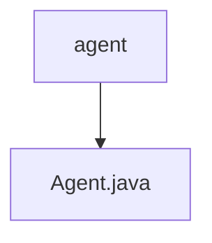

# 基础信息

|      |      |
|------|------|
| 名称 | agent |
| 编码语言 | .java |
| 代码路径 | spring-ai-alibaba/spring-ai-alibaba-core/src/main/java/com/alibaba/cloud/ai/agent |
| 包名 | spring-ai-alibaba.spring-ai-alibaba-core.src.main.java.com.alibaba.cloud.ai.agent |
| 概述说明 | 抽象类Agent定义了与聊天模型交互的call和stream方法。 |

# 说明

抽象类Agent定义了两个核心方法，call和stream，用于与聊天模型进行交互。call方法用于同步调用聊天模型，stream方法则用于异步流式处理与聊天模型的交互。这两个方法为开发者提供了灵活的方式来处理与聊天模型的通信，无论是需要即时响应还是持续的数据流。通过抽象类的设计，Agent类为具体的实现提供了统一的接口，便于扩展和定制。

### 包内部结构视图

该流程图展示了`spring-ai-alibaba`项目中的一个简单层级关系。`agent`文件夹是路径的根节点，包含一个名为`Agent.java`的Java文件。这个结构清晰地反映了文件夹与文件之间的直接关系，符合路径信息的层级描述。

# 文件列表 File List

| 名称   | 类型  | 说明 |
|-------|------|-------------|
| [Agent.java](Agent.md) | file | 抽象类Agent定义了与聊天模型交互的call和stream方法。 |

