# 基础信息

|      |      |
|------|------|
| 名称 | dashscope |
| 编码语言 | .java |
| 代码路径 | spring-ai-alibaba/spring-ai-alibaba-core/src/main/java/com/alibaba/cloud/ai/dashscope |
| 包名 | spring-ai-alibaba.spring-ai-alibaba-core.src.main.java.com.alibaba.cloud.ai.dashscope |
| 概述说明 | 该代码模块实现DashScope Agent功能，涵盖知识库检索、会话管理、API请求处理等，支持高效请求处理与响应生成。 |

# 说明

## 概述

该代码模块是一个基于阿里云DashScope服务的多功能AI工具集，涵盖了语音合成、音频转录、图像生成、文档管理、聊天模型、嵌入模型、文档重排序等多种功能。模块通过多个核心类和配置选项，提供了灵活且高效的API调用机制，支持REST和WebSocket等多种通信方式。模块的设计目标是实现与DashScope API的无缝集成，确保在各种复杂的AI应用场景中能够高效处理请求和响应。

## 主要业务场景

1. **语音合成与音频转录**：
   - 通过`DashScopeSpeechSynthesisModel`和`DashScopeAudioTranscriptionModel`类，支持语音合成和音频转录功能，适用于实时语音输出和大规模音频数据处理的场景。
   - 配置选项包括模型选择、音量调节、语速设置、词汇ID、短语ID等，确保转录和合成的精确性。

2. **图像生成**：
   - `DashScopeImageModel`类支持通过外部API生成图像，用户可以通过`DashScopeImageOptions`类配置图像数量、尺寸、艺术风格等参数。
   - 内置重试机制，确保API调用的稳定性。

3. **文档管理与检索**：
   - `DashScopeDocumentRetriever`和`DashScopeDocumentRetrievalAdvisor`类负责文档的存储、检索和引用操作，支持同步与异步调用。
   - `DashScopeDocumentTransformer`类提供文档分割功能，支持块大小、重叠大小等参数的配置。

4. **聊天模型与复杂对话管理**：
   - `DashScopeChatModel`类实现了聊天模型的核心功能，支持工具调用和重试模板，确保在多轮对话和复杂任务中的稳定性和可靠性。
   - `DashScopeChatModelObservationConvention`类增强了默认的观察约定，能够根据预设条件自动终止请求序列。

5. **嵌入模型与向量化处理**：
   - `DashScopeEmbeddingModel`类提供了将数据转换为向量表示的嵌入功能，支持多种数据类型的处理。
   - `DashScopeEmbeddingOptions`类允许用户配置模型类型、文本类型和维度等属性。

6. **文档重排序**：
   - `DashScopeRerankModel`类通过调用DashScope API对文档进行重新排序，支持模型参数配置和返回文档数量的指定。
   - 内置重试机制，确保在API调用失败时能够自动重试。

7. **WebSocket通信与实时数据处理**：
   - `DashScopeWebSocketClient`类负责管理WebSocket通信的各个环节，支持文本和二进制数据的传输，适用于实时聊天、在线协作等场景。

8. **API调用与响应管理**：
   - `DashScopeApi`类支持聊天、嵌入、文件上传、文档分割等多种功能，提供灵活的API调用方式。
   - `DashScopeResponseFormat`类支持文本或JSON对象类型的响应格式，确保API返回数据的灵活性和可读性。

这些业务场景共同构成了一个完整的AI工具集，适用于需要高效处理语音、图像、文档等多种数据类型的应用场景。

### 包内部结构视图

```mermaid
graph TD
    dashscope --> agent
    dashscope --> rag
    dashscope --> common
    dashscope --> observation
    dashscope --> audio
    dashscope --> api
    dashscope --> protocol
    dashscope --> metadata
    dashscope --> chat
    dashscope --> image
    dashscope --> embedding
    dashscope --> rerank
    agent --> DashScopeAgentRagOptions.java
    agent --> DashScopeAgentOptions.java
    agent --> DashScopeAgent.java
    rag --> DashScopeCloudStore.java
    rag --> DashScopeDocumentCloudReader.java
    rag --> DashScopeDocumentRetriever.java
    rag --> DashScopeDocumentCloudReaderOptions.java
    rag --> DashScopeDocumentTransformer.java
    rag --> DashScopeDocumentRetrieverOptions.java
    rag --> DashScopeDocumentTransformerOptions.java
    rag --> DashScopeDocumentRetrievalAdvisor.java
    rag --> DashScopeStoreOptions.java
    common --> IdGenerator.java
    common --> RequestIdGenerator.java
    common --> ErrorCodeEnum.java
    common --> DashScopeException.java
    common --> DashScopeApiConstants.java
    observation --> conventions
    conventions --> AiProvider.java
    audio --> DashScopeSpeechSynthesisOptions.java
    audio --> DashScopeAudioTranscriptionModel.java
    audio --> DashScopeSpeechSynthesisModel.java
    audio --> transcription
    audio --> synthesis
    transcription --> AudioTranscriptionModel.java
    audio --> DashScopeAudioTranscriptionOptions.java
    synthesis --> SpeechSynthesisOutput.java
    synthesis --> SpeechSynthesisPrompt.java
    synthesis --> SpeechSynthesisResult.java
    synthesis --> SpeechSynthesisMessage.java
    synthesis --> SpeechSynthesisOptions.java
    synthesis --> SpeechSynthesisResultMetadata.java
    synthesis --> SpeechSynthesisResponseMetadata.java
    synthesis --> SpeechSynthesisModel.java
    synthesis --> SpeechSynthesisResponse.java
    api --> DashScopeSpeechSynthesisApi.java
    api --> ApiUtils.java
    api --> DashScopeAudioTranscriptionApi.java
    api --> DashScopeResponseFormat.java
    api --> DashScopeImageApi.java
    api --> DashScopeApi.java
    api --> DashScopeAgentApi.java
    api --> DashScopeAiStreamFunctionCallingHelper.java
    protocol --> DashScopeWebSocketClientOptions.java
    protocol --> DashScopeWebSocketClient.java
    metadata --> audio
    audio --> DashScopeAudioTranscriptionMetadata.java
    audio --> DashScopeAudioTranscriptionResponseMetadata.java
    audio --> DashScopeAudioSpeechResponseMetadata.java
    metadata --> DashScopeAiUsage.java
    chat --> MessageFormat.java
    chat --> observation
    observation --> DashScopeChatModelObservationConvention.java
    observation --> package-info.java
    chat --> DashScopeChatOptions.java
    chat --> DashScopeChatModel.java
    image --> DashScopeImageModel.java
    image --> DashScopeImageOptions.java
    embedding --> DashScopeEmbeddingModel.java
    embedding --> DashScopeEmbeddingOptions.java
    rerank --> DashScopeRerankOptions.java
    rerank --> DashScopeRerankModel.java
```

该流程图展示了 `dashscope` 目录下的层级结构，包含了多个子目录和文件。每个子目录下都有相应的文件，如 `agent` 目录下包含 `DashScopeAgentRagOptions.java` 等文件，`rag` 目录下包含 `DashScopeCloudStore.java` 等文件。整个结构清晰地展示了各个模块及其相关文件的层级关系。

# 文件列表 File List

| 名称   | 类型  | 说明 |
|-------|------|-------------|
| [observation](observation/_module.md) | package | 信息为空，无法生成概要描述。 |
| [rerank](rerank/_module.md) | package | DashScopeRerankOptions类配置模型参数，DashScopeRerankModel类实现重排序，具备重试和选项合并功能。 |
| [embedding](embedding/_module.md) | package | DashScopeEmbeddingModel继承AbstractEmbeddingModel，具备配置、重试、API、元数据、监控和嵌入功能。DashScopeEmbeddingOptions用于配置模型选项，支持链式调用。 |
| [image](image/_module.md) | package | DashScopeImageModel类实现图像生成，包含默认模型、API调用、重试和响应处理。DashScopeImageOptions类配置生成参数，控制图像特性。 |
| [chat](chat/_module.md) | package | 该代码模块优化聊天模型请求处理，增强复杂对话管理和任务控制，提升灵活性和可靠性。 |
| [metadata](metadata/_module.md) | package | 该模块管理音频转录和语音合成的元数据，支持速率限制和字符串格式化，适用于语音识别和合成系统。 |
| [protocol](protocol/_module.md) | package | DashScopeWebSocketClientOptions类配置WebSocket客户端，DashScopeWebSocketClient类实现WebSocket通信。 |
| [api](api/_module.md) | package | DashScope API提供语音合成、音频转写、图像生成等功能，支持多种格式和调用方式，适用于多种应用场景。 |
| [audio](audio/_module.md) | package | DashScope提供语音合成和音频转录功能，支持模型选择、音量调节、流式处理和重试机制，满足多样化应用需求。 |
| [common](common/_module.md) | package | RequestIdGenerator类通过UUID生成唯一ID，DashScopeException用于捕获运行时错误，DashScopeApiConstants定义API关键信息。 |
| [rag](rag/_module.md) | package | DashScope类实现文档存储、读取、检索和分割功能，依赖API和配置选项。 |
| [agent](agent/_module.md) | package | DashScopeAgentRagOptions类配置知识库检索选项，支持构建器模式。DashScopeAgentOptions类管理代理功能模块。DashScopeAgent类处理API请求并生成响应。 |

