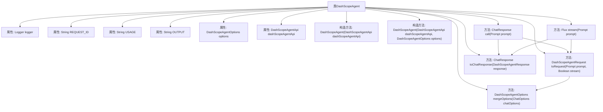

# 基础信息

|      |      |
|------|------|
| 名称 | DashScopeAgent |
| 编码语言 | .java |
| 代码路径 | spring-ai-alibaba/spring-ai-alibaba-core/src/main/java/com/alibaba/cloud/ai/dashscope/agent/DashScopeAgent.java |
| 包名 | com.alibaba.cloud.ai.dashscope.agent |
| 依赖项 | ['com.alibaba.cloud.ai.agent.Agent', 'com.alibaba.cloud.ai.dashscope.api.DashScopeAgentApi', 'com.alibaba.cloud.ai.dashscope.api.DashScopeAgentApi.DashScopeAgentRequest', 'com.alibaba.cloud.ai.dashscope.api.DashScopeAgentApi.DashScopeAgentResponse', 'com.alibaba.cloud.ai.dashscope.api.DashScopeAgentApi.DashScopeAgentRequest.DashScopeAgentRequestInput.DashScopeAgentRequestMessage', 'com.alibaba.cloud.ai.dashscope.api.DashScopeAgentApi.DashScopeAgentRequest.DashScopeAgentRequestParameters.DashScopeAgentRequestRagOptions', 'org.slf4j.Logger', 'org.slf4j.LoggerFactory', 'org.springframework.ai.chat.messages.AssistantMessage', 'org.springframework.ai.chat.metadata.ChatGenerationMetadata', 'org.springframework.ai.chat.model.ChatResponse', 'org.springframework.ai.chat.model.Generation', 'org.springframework.ai.chat.prompt.ChatOptions', 'org.springframework.ai.chat.prompt.Prompt', 'org.springframework.ai.model.ModelOptionsUtils', 'org.springframework.http.ResponseEntity', 'reactor.core.publisher.Flux', 'reactor.core.scheduler.Schedulers', 'java.util.HashMap', 'java.util.List', 'java.util.Map'] |
| 概述说明 | DashScopeAgent类负责API请求处理、响应生成及选项管理。 |

# 说明

DashScopeAgent类负责处理API请求，生成相应的响应，并管理相关选项。该类的核心功能包括接收和处理外部请求，根据请求内容生成合适的响应，以及管理和配置处理过程中的各种选项和参数。通过这一系列操作，DashScopeAgent确保API请求的高效处理和响应的准确性。

# 类列表 Class Summary

| 名称   | 类型  | 说明 |
|-------|------|-------------|
| DashScopeAgent | class | DashScopeAgent类处理API请求，生成响应并管理选项。 |


## 类 DashScopeAgent

|      |      |
|------|------|
| 访问范围 | public final |
| 类型 | class |
| 名称 | DashScopeAgent |
| 说明 | DashScopeAgent类处理API请求，生成响应并管理选项。 |


### UML类图

```mermaid
classDiagram
    class Agent {
        <<Interface>>
        +ChatResponse call(Prompt prompt)
        +Flux~ChatResponse~ stream(Prompt prompt)
    }

    class DashScopeAgent {
        -Logger logger
        -DashScopeAgentOptions options
        -DashScopeAgentApi dashScopeAgentApi
        +DashScopeAgent(DashScopeAgentApi dashScopeAgentApi)
        +DashScopeAgent(DashScopeAgentApi dashScopeAgentApi, DashScopeAgentOptions options)
        +ChatResponse call(Prompt prompt)
        +Flux~ChatResponse~ stream(Prompt prompt)
        -DashScopeAgentRequest toRequest(Prompt prompt, Boolean stream)
        -ChatResponse toChatResponse(DashScopeAgentResponse response)
        -DashScopeAgentOptions mergeOptions(ChatOptions chatOptions)
    }

    class DashScopeAgentApi {
        <<Interface>>
        +ResponseEntity~DashScopeAgentResponse~ call(DashScopeAgentRequest request)
        +Flux~DashScopeAgentResponse~ stream(DashScopeAgentRequest request)
    }

    class DashScopeAgentOptions {
        +String appId
        +String sessionId
        +String memoryId
        +Boolean incrementalOutput
        +Boolean hasThoughts
        +List~String~ images
        +Map~String, Object~ bizParams
        +DashScopeAgentRagOptions ragOptions
        +static Builder builder()
    }

    class DashScopeAgentRequest {
        +String appId
        +DashScopeAgentRequestInput input
        +DashScopeAgentRequestParameters parameters
        class DashScopeAgentRequestInput {
            +String sessionId
            +String memoryId
            +List~DashScopeAgentRequestMessage~ messages
            +List~String~ images
            +Map~String, Object~ bizParams
        }
        class DashScopeAgentRequestParameters {
            +Boolean hasThoughts
            +Boolean incrementalOutput
            +DashScopeAgentRequestRagOptions ragOptions
        }
    }

    class DashScopeAgentResponse {
        +DashScopeAgentResponseOutput output
        +DashScopeAgentResponseUsage usage
        +String requestId
        class DashScopeAgentResponseOutput {
            +String text
            +String finishReason
        }
        class DashScopeAgentResponseUsage {
            +Integer totalTokens
            +Integer promptTokens
            +Integer completionTokens
        }
    }

    class ChatResponse {
        +List~Generation~ generations
    }

    class Generation {
        +AssistantMessage message
        +ChatGenerationMetadata metadata
    }

    class AssistantMessage {
        +String text
        +Map~String, Object~ metadata
    }

    class ChatGenerationMetadata {
        +String finishReason
        +static Builder builder()
    }

    class DashScopeAgentRagOptions {
        +List~String~ pipelineIds
        +List~String~ fileIds
        +Map~String, Object~ metadataFilter
        +List~String~ tags
        +Map~String, Object~ structuredFilter
        +List~String~ sessionFileIds
    }

    Agent <|.. DashScopeAgent
    DashScopeAgent --> DashScopeAgentApi : 依赖
    DashScopeAgent --> DashScopeAgentOptions : 依赖
    DashScopeAgent --> DashScopeAgentRequest : 依赖
    DashScopeAgent --> DashScopeAgentResponse : 依赖
    DashScopeAgent --> ChatResponse : 依赖
    DashScopeAgent --> Generation : 依赖
    DashScopeAgent --> AssistantMessage : 依赖
    DashScopeAgent --> ChatGenerationMetadata : 依赖
    DashScopeAgent --> DashScopeAgentRagOptions : 依赖
```

这段代码定义了一个 `DashScopeAgent` 类，它继承自 `Agent` 接口，并实现了 `call` 和 `stream` 方法。`DashScopeAgent` 依赖于 `DashScopeAgentApi` 来发送请求，并使用 `DashScopeAgentOptions` 来配置请求参数。`DashScopeAgentRequest` 和 `DashScopeAgentResponse` 分别表示请求和响应的数据结构。`ChatResponse` 和 `Generation` 用于封装聊天响应的生成结果，而 `AssistantMessage` 和 `ChatGenerationMetadata` 则用于存储消息和元数据。`DashScopeAgentRagOptions` 提供了与 RAG（Retrieval-Augmented Generation）相关的配置选项。整体设计旨在通过模块化的方式处理聊天请求和响应，并支持流式处理。


### 内部方法调用关系图



**描述：**  
`DashScopeAgent` 类是一个处理与 `DashScopeAgentApi` 交互的代理类。它包含两个构造方法，分别用于初始化 `dashScopeAgentApi` 和 `options`。类中的 `call` 方法用于同步调用 API，而 `stream` 方法用于异步流式调用。`toRequest` 方法将 `Prompt` 对象转换为 `DashScopeAgentRequest`，`toChatResponse` 方法将 `DashScopeAgentResponse` 转换为 `ChatResponse`，`mergeOptions` 方法用于合并 `ChatOptions` 和 `DashScopeAgentOptions`。

### 字段列表 Field List

| 名称  | 类型  | 说明 |
|-------|-------|------|
| REQUEST_ID = "request_id" | String | 定义常量REQUEST_ID，值为"request_id"。 |
| OUTPUT = "output" | String | 定义一个静态常量字符串，值为"output"。 |
| USAGE = "usage" | String | 定义静态常量字符串USAGE，值为"usage"。 |
| dashScopeAgentApi | DashScopeAgentApi | 私有变量dashScopeAgentApi为DashScopeAgentApi类型。 |
| logger = LoggerFactory.getLogger(DashScopeAgent.class) | Logger | DashScopeAgent类中定义了一个私有的静态日志记录器。 |
| options | DashScopeAgentOptions | 私有且不可变的DashScopeAgentOptions实例。 |

### 方法列表 Method List

| 名称  | 类型  | 说明 |
|-------|-------|------|
| mergeOptions | DashScopeAgentOptions | 合并ChatOptions与DashScopeAgentOptions生成新配置。 |
| call | ChatResponse | 重写call方法，处理请求并返回响应，若失败则记录日志。 |
| toRequest | DashScopeAgentRequest | 将Prompt转换为DashScopeAgentRequest，校验appId并合并选项，构造请求对象。 |
| stream | Flux<ChatResponse> | 重写方法实现流式处理，将请求转换为响应并并行发布。 |
| toChatResponse | ChatResponse | 将DashScopeAgentResponse转换为ChatResponse，包含文本、元数据和生成信息。 |


