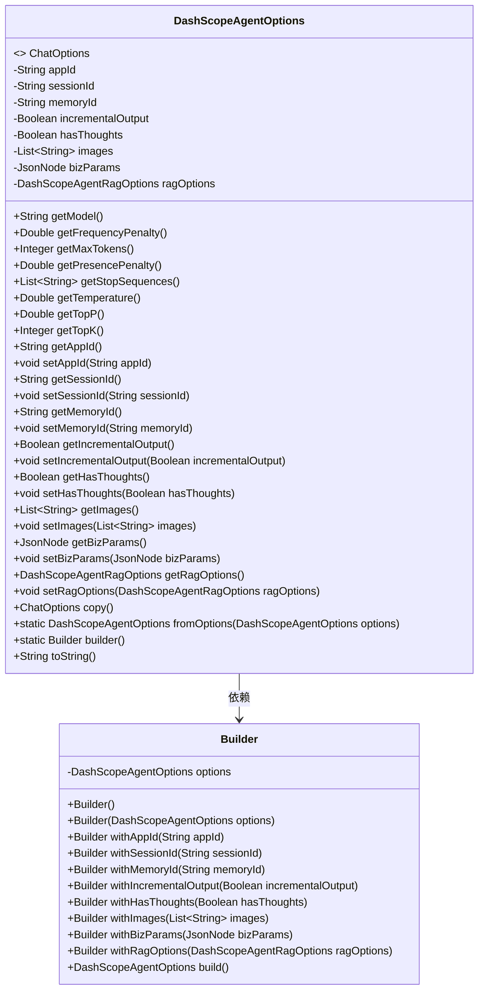

# 基础信息

|      |      |
|------|------|
| 名称 | DashScopeAgentOptions |
| 编码语言 | .java |
| 代码路径 | spring-ai-alibaba/spring-ai-alibaba-core/src/main/java/com/alibaba/cloud/ai/dashscope/agent/DashScopeAgentOptions.java |
| 包名 | com.alibaba.cloud.ai.dashscope.agent |
| 依赖项 | ['java.util.List', 'com.fasterxml.jackson.annotation.JsonProperty', 'com.fasterxml.jackson.databind.JsonNode', 'org.springframework.ai.chat.prompt.ChatOptions'] |
| 概述说明 | DashScopeAgentOptions类配置会话、内存、输出，支持构建和复制操作。 |

# 说明

DashScopeAgentOptions类提供了会话、内存、输出等多个配置项，支持构建和复制操作，用于灵活设置和管理代理的各个功能模块。

# 类列表 Class Summary

| 名称   | 类型  | 说明 |
|-------|------|-------------|
| DashScopeAgentOptions | class | DashScopeAgentOptions类包含会话、内存、输出等配置项，支持构建和复制操作。 |

## 类 DashScopeAgentOptions

|      |      |
|------|------|
| 访问范围 | public |
| 类型 | class |
| 名称 | DashScopeAgentOptions |
| 说明 | DashScopeAgentOptions类包含会话、内存、输出等配置项，支持构建和复制操作。 |

### UML类图

**描述：**
`DashScopeAgentOptions` 类实现了 `ChatOptions` 接口，包含多个配置项，如 `appId`、`sessionId`、`memoryId` 等。该类提供了对这些配置项的获取和设置方法，并通过 `Builder` 模式来构建对象。`Builder` 类用于逐步构建 `DashScopeAgentOptions` 对象，提供了链式调用的方法。

### 内部方法调用关系图

```mermaid
graph TD
    A["类DashScopeAgentOptions"]
    B["属性: String appId"]
    C["属性: String sessionId"]
    D["属性: String memoryId"]
    E["属性: Boolean incrementalOutput"]
    F["属性: Boolean hasThoughts"]
    G["属性: List<String> images"]
    H["属性: JsonNode bizParams"]
    I["属性: DashScopeAgentRagOptions ragOptions"]
    J["方法: String getModel()"]
    K["方法: Double getFrequencyPenalty()"]
    L["方法: Integer getMaxTokens()"]
    M["方法: Double getPresencePenalty()"]
    N["方法: List<String> getStopSequences()"]
    O["方法: Double getTemperature()"]
    P["方法: Double getTopP()"]
    Q["方法: Integer getTopK()"]
    R["方法: String getAppId()"]
    S["方法: void setAppId(String appId)"]
    T["方法: String getSessionId()"]
    U["方法: void setSessionId(String sessionId)"]
    V["方法: String getMemoryId()"]
    W["方法: void setMemoryId(String memoryId)"]
    X["方法: Boolean getIncrementalOutput()"]
    Y["方法: void setIncrementalOutput(Boolean incrementalOutput)"]
    Z["方法: Boolean getHasThoughts()"]
    AA["方法: void setHasThoughts(Boolean hasThoughts)"]
    AB["方法: List<String> getImages()"]
    AC["方法: void setImages(List<String> images)"]
    AD["方法: JsonNode getBizParams()"]
    AE["方法: void setBizParams(JsonNode bizParams)"]
    AF["方法: DashScopeAgentRagOptions getRagOptions()"]
    AG["方法: void setRagOptions(DashScopeAgentRagOptions ragOptions)"]
    AH["方法: ChatOptions copy()"]
    AI["方法: static DashScopeAgentOptions fromOptions(DashScopeAgentOptions options)"]
    AJ["方法: static DashScopeAgentOptions.Builder builder()"]
    AK["内部类: Builder"]
    AL["方法: Builder withAppId(String appId)"]
    AM["方法: Builder withSessionId(String sessionId)"]
    AN["方法: Builder withMemoryId(String memoryId)"]
    AO["方法: Builder withIncrementalOutput(Boolean incrementalOutput)"]
    AP["方法: Builder withHasThoughts(Boolean hasThoughts)"]
    AQ["方法: Builder withImages(List<String> images)"]
    AR["方法: Builder withBizParams(JsonNode bizParams)"]
    AS["方法: Builder withRagOptions(DashScopeAgentRagOptions ragOptions)"]
    AT["方法: DashScopeAgentOptions build()"]
    AU["方法: String toString()"]

    A --> B
    A --> C
    A --> D
    A --> E
    A --> F
    A --> G
    A --> H
    A --> I
    A --> J
    A --> K
    A --> L
    A --> M
    A --> N
    A --> O
    A --> P
    A --> Q
    A --> R
    A --> S
    A --> T
    A --> U
    A --> V
    A --> W
    A --> X
    A --> Y
    A --> Z
    A --> AA
    A --> AB
    A --> AC
    A --> AD
    A --> AE
    A --> AF
    A --> AG
    A --> AH
    A --> AI
    A --> AJ
    A --> AK
    AK --> AL
    AK --> AM
    AK --> AN
    AK --> AO
    AK --> AP
    AK --> AQ
    AK --> AR
    AK --> AS
    AK --> AT
    A --> AU
```

这段代码定义了一个名为 `DashScopeAgentOptions` 的类，该类实现了 `ChatOptions` 接口。类中包含多个属性，如 `appId`、`sessionId`、`memoryId` 等，并且提供了相应的 getter 和 setter 方法。此外，类中还定义了一个内部类 `Builder`，用于构建 `DashScopeAgentOptions` 对象。`Builder` 类提供了多个 `with` 方法，用于设置对象的属性，并通过 `build` 方法返回最终的对象。`DashScopeAgentOptions` 类还重写了 `toString` 方法，用于返回对象的字符串表示。

### 字段列表 Field List

| 名称  | 类型  | 说明 |
|-------|-------|------|
| memoryId | String | 属性memoryId用于存储内存ID。 |
| bizParams | JsonNode | 属性bizParams使用JsonProperty注解映射为biz_params。 |
| ragOptions | DashScopeAgentRagOptions | JSON属性"rag_options"对应私有变量DashScopeAgentRagOptions。 |
| appId | String | 属性appId用于映射JSON中的app_id字段。 |
| sessionId | String | sessionId字段通过JsonProperty注解映射为session_id。 |
| images | List<String> | JSON属性"images"对应私有字符串列表。 |
| hasThoughts | Boolean | 属性hasThoughts用于标识是否有想法。 |
| incrementalOutput | Boolean | 属性incrementalOutput用于控制增量输出。 |

### 方法列表 Method List

| 名称  | 类型  | 说明 |
|-------|-------|------|
| getFrequencyPenalty | Double | 该方法返回频率惩罚值为空。 |
| getImages | List<String> | 获取图像列表的方法。 |
| getMaxTokens | Integer | 该方法返回空值，未定义最大令牌数。 |
| getTopK | Integer | 重写getTopK方法，返回值为0。 |
| getSessionId | String | 获取sessionId的公共方法。 |
| getPresencePenalty | Double | 该方法返回空值作为存在惩罚参数。 |
| getMemoryId | String | 该方法返回内存ID。 |
| setIncrementalOutput | void | 设置增量输出布尔值的方法。 |
| getIncrementalOutput | Boolean | 该方法返回布尔值incrementalOutput。 |
| getStopSequences | List<String> | 重写getStopSequences方法，返回空值。 |
| getTopP | Double | 该方法返回一个值为0.0的Double类型数据。 |
| setBizParams | void | 设置业务参数为传入的JsonNode对象。 |
| fromOptions | DashScopeAgentOptions | 从给定选项创建DashScopeAgentOptions实例。 |
| getAppId | String | 获取应用ID的方法。 |
| getModel | String | 该方法返回模型名称，但当前返回值为空。 |
| getTemperature | Double | 重写getTemperature方法，返回0.0。 |
| setAppId | void | 设置应用ID的方法，将传入的appId赋值给当前对象的appId属性。 |
| setHasThoughts | void | 该方法用于设置对象中的布尔型变量hasThoughts的值。 |
| getRagOptions | DashScopeAgentRagOptions | 获取DashScopeAgentRagOptions的Rag选项。 |
| getHasThoughts | Boolean | 该方法返回布尔值，表示是否有想法。 |
| copy | ChatOptions | 重写ChatOptions的copy方法，返回DashScopeAgentOptions实例。 |
| builder | DashScopeAgentOptions.Builder | 定义静态方法，返回DashScopeAgentOptions.Builder实例。 |
| toString | String | 重写toString方法，返回DashScopeAgentOptions对象的字符串表示。 |
| setMemoryId | void | 设置内存ID的方法，将输入参数赋值给类的内存ID属性。 |
| setRagOptions | void | 设置RAG选项方法，接收参数并赋值给类变量。 |
| getBizParams | JsonNode | 获取业务参数的方法，返回JsonNode类型。 |
| setImages | void | 该方法用于设置图像列表。 |
| setSessionId | void | 设置会话ID的方法，将传入的sessionId赋值给当前对象的sessionId属性。 |

