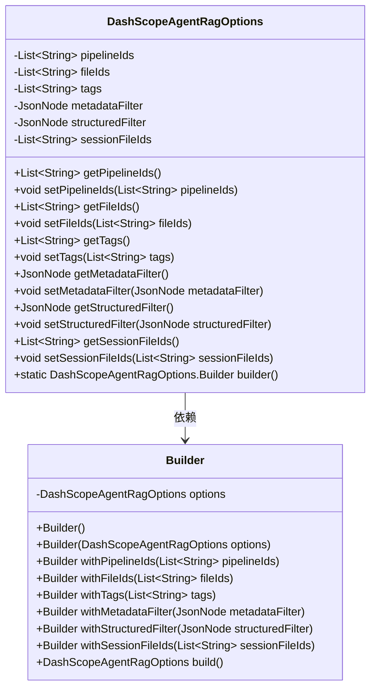

# 基础信息

|      |      |
|------|------|
| 名称 | DashScopeAgentRagOptions |
| 编码语言 | .java |
| 代码路径 | spring-ai-alibaba/spring-ai-alibaba-core/src/main/java/com/alibaba/cloud/ai/dashscope/agent/DashScopeAgentRagOptions.java |
| 包名 | com.alibaba.cloud.ai.dashscope.agent |
| 依赖项 | ['com.fasterxml.jackson.annotation.JsonProperty', 'com.fasterxml.jackson.databind.JsonNode', 'java.util.List'] |
| 概述说明 | DashScopeAgentRagOptions类含知识库ID等属性，支持构建器模式。 |

# 说明

DashScopeAgentRagOptions类是一个用于配置知识库检索选项的类，包含多个关键属性。这些属性包括知识库ID、文件ID、标签、元数据过滤器和结构化过滤器等。知识库ID用于指定特定的知识库，文件ID用于标识具体的文件，标签用于分类和检索，元数据过滤器用于根据元数据进行筛选，结构化过滤器则用于对结构化数据进行过滤。该类支持构建器模式，便于灵活地创建和配置实例。

# 类列表 Class Summary

| 名称   | 类型  | 说明 |
|-------|------|-------------|
| DashScopeAgentRagOptions | class | DashScopeAgentRagOptions类包含知识库ID、文件ID、标签、元数据过滤器和结构化过滤器等属性，支持构建器模式。 |

## 类 DashScopeAgentRagOptions

|      |      |
|------|------|
| 访问范围 | public |
| 类型 | class |
| 名称 | DashScopeAgentRagOptions |
| 说明 | DashScopeAgentRagOptions类包含知识库ID、文件ID、标签、元数据过滤器和结构化过滤器等属性，支持构建器模式。 |

### UML类图

这段代码定义了一个名为 `DashScopeAgentRagOptions` 的类，用于管理知识库查询的选项。类中包含多个私有字段，如 `pipelineIds`、`fileIds`、`tags` 等，并提供了相应的 getter 和 setter 方法。此外，该类还包含一个静态方法 `builder()`，用于创建 `Builder` 类的实例。`Builder` 类用于通过链式调用设置 `DashScopeAgentRagOptions` 的各个字段，并最终通过 `build()` 方法返回配置好的 `DashScopeAgentRagOptions` 实例。

### 内部方法调用关系图

```mermaid
graph TD
    A["类DashScopeAgentRagOptions"]
    B["属性: List<String> pipelineIds"]
    C["属性: List<String> fileIds"]
    D["属性: List<String> tags"]
    E["属性: JsonNode metadataFilter"]
    F["属性: JsonNode structuredFilter"]
    G["属性: List<String> sessionFileIds"]
    H["方法: List<String> getPipelineIds()"]
    I["方法: void setPipelineIds(List<String> pipelineIds)"]
    J["方法: List<String> getFileIds()"]
    K["方法: void setFileIds(List<String> fileIds)"]
    L["方法: List<String> getTags()"]
    M["方法: void setTags(List<String> tags)"]
    N["方法: JsonNode getMetadataFilter()"]
    O["方法: void setMetadataFilter(JsonNode metadataFilter)"]
    P["方法: JsonNode getStructuredFilter()"]
    Q["方法: void setStructuredFilter(JsonNode structuredFilter)"]
    R["方法: List<String> getSessionFileIds()"]
    S["方法: void setSessionFileIds(List<String> sessionFileIds)"]
    T["静态方法: Builder builder()"]
    U["内部类Builder"]
    V["属性: DashScopeAgentRagOptions options"]
    W["构造方法: Builder()"]
    X["构造方法: Builder(DashScopeAgentRagOptions options)"]
    Y["方法: Builder withPipelineIds(List<String> pipelineIds)"]
    Z["方法: Builder withFileIds(List<String> fileIds)"]
    AA["方法: Builder withTags(List<String> tags)"]
    AB["方法: Builder withMetadataFilter(JsonNode metadataFilter)"]
    AC["方法: Builder withStructuredFilter(JsonNode structuredFilter)"]
    AD["方法: Builder withSessionFileIds(List<String> sessionFileIds)"]
    AE["方法: DashScopeAgentRagOptions build()"]

    A --> B
    A --> C
    A --> D
    A --> E
    A --> F
    A --> G
    A --> H
    A --> I
    A --> J
    A --> K
    A --> L
    A --> M
    A --> N
    A --> O
    A --> P
    A --> Q
    A --> R
    A --> S
    A --> T
    T --> U
    U --> V
    U --> W
    U --> X
    U --> Y
    U --> Z
    U --> AA
    U --> AB
    U --> AC
    U --> AD
    U --> AE
```

这段代码定义了一个名为`DashScopeAgentRagOptions`的类，包含了多个属性和对应的getter/setter方法。此外，还定义了一个内部类`Builder`，用于构建`DashScopeAgentRagOptions`对象。`Builder`类提供了多个`with`方法，用于设置`DashScopeAgentRagOptions`对象的属性，并最终通过`build`方法返回构建好的对象。流程图展示了类的结构、属性和方法之间的关系，以及`Builder`类的内部构造和调用流程。

### 字段列表 Field List

| 名称  | 类型  | 说明 |
|-------|-------|------|
| fileIds | List<String> | 包含文件ID列表的属性定义。 |
| pipelineIds | List<String> | 属性pipelineIds存储管道ID列表。 |
| metadataFilter | JsonNode | 类中定义了一个私有JsonNode类型的metadataFilter属性。 |
| sessionFileIds | List<String> | 属性sessionFileIds存储会话文件ID列表。 |
| structuredFilter | JsonNode | 属性structuredFilter使用JsonProperty注解映射JSON节点。 |
| tags | List<String> | 定义了一个名为tags的私有列表属性，使用JsonProperty注解。 |

### 方法列表 Method List

| 名称  | 类型  | 说明 |
|-------|-------|------|
| setSessionFileIds | void | 设置会话文件ID列表的方法。 |
| getFileIds | List<String> | 获取文件ID列表的方法。 |
| getTags | List<String> | 该方法返回一个字符串列表tags。 |
| setStructuredFilter | void | 设置结构化过滤器的JSON节点。 |
| getStructuredFilter | JsonNode | 方法返回结构化过滤器对象。 |
| builder | DashScopeAgentRagOptions.Builder | 静态方法返回DashScopeAgentRagOptions.Builder实例。 |
| setPipelineIds | void | 设置管道ID列表的方法。 |
| getPipelineIds | List<String> | 该方法返回一个包含管道ID的字符串列表。 |
| setMetadataFilter | void | 方法设置元数据过滤器。 |
| setTags | void | 设置对象的标签列表。 |
| setFileIds | void | 该方法用于设置文件ID列表。 |
| getMetadataFilter | JsonNode | 获取元数据过滤器的方法，返回metadataFilter对象。 |
| getSessionFileIds | List<String> | 该方法返回会话文件ID列表。 |

