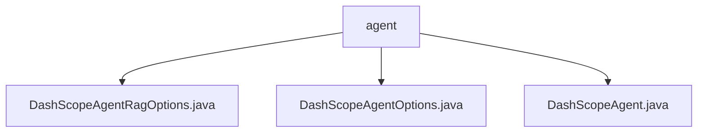

# 基础信息

|      |      |
|------|------|
| 名称 | agent |
| 编码语言 | .java |
| 代码路径 | spring-ai-alibaba/spring-ai-alibaba-core/src/main/java/com/alibaba/cloud/ai/dashscope/agent |
| 包名 | spring-ai-alibaba.spring-ai-alibaba-core.src.main.java.com.alibaba.cloud.ai.dashscope.agent |
| 概述说明 | DashScopeAgentRagOptions类配置知识库检索选项，支持构建器模式。DashScopeAgentOptions类管理代理功能模块。DashScopeAgent类处理API请求并生成响应。 |

# 说明

## 概述

该代码模块主要围绕DashScope Agent的实现展开，提供了与知识库检索、会话管理、API请求处理等相关的功能。模块包含三个核心类：`DashScopeAgentRagOptions`、`DashScopeAgentOptions` 和 `DashScopeAgent`，分别用于配置知识库检索选项、管理代理的会话和输出设置，以及处理API请求并生成响应。这些类通过构建器模式和灵活的配置机制，支持高效的请求处理和响应生成。

## 主要业务场景

1. **知识库检索配置**：  
   `DashScopeAgentRagOptions` 类用于配置知识库检索的相关选项，包括知识库ID、文件ID、标签、元数据过滤器和结构化过滤器等。这些配置项允许用户根据特定需求进行灵活的知识库检索，支持对知识库内容的分类、筛选和过滤。

2. **代理功能配置**：  
   `DashScopeAgentOptions` 类提供了会话、内存、输出等多个配置项，支持代理功能的灵活设置和管理。通过构建和复制操作，用户可以动态调整代理的行为，以满足不同场景下的需求。

3. **API请求处理与响应生成**：  
   `DashScopeAgent` 类负责接收和处理外部API请求，并根据请求内容生成合适的响应。该类管理相关选项和参数，确保API请求的高效处理和响应的准确性，适用于需要与DashScope API进行交互的业务场景。

### 包内部结构视图

该流程图展示了 `agent` 目录下的三个文件之间的层级关系。`DashScopeAgentRagOptions.java`、`DashScopeAgentOptions.java` 和 `DashScopeAgent.java` 都位于 `agent` 目录下，彼此之间没有进一步的子目录关系，直接归属于 `agent` 节点。

# 文件列表 File List

| 名称   | 类型  | 说明 |
|-------|------|-------------|
| [DashScopeAgent.java](DashScopeAgent.md) | file | DashScopeAgent类负责API请求处理、响应生成及选项管理。 |
| [DashScopeAgentOptions.java](DashScopeAgentOptions.md) | file | DashScopeAgentOptions类配置会话、内存、输出，支持构建和复制操作。 |
| [DashScopeAgentRagOptions.java](DashScopeAgentRagOptions.md) | file | DashScopeAgentRagOptions类含知识库ID等属性，支持构建器模式。 |

