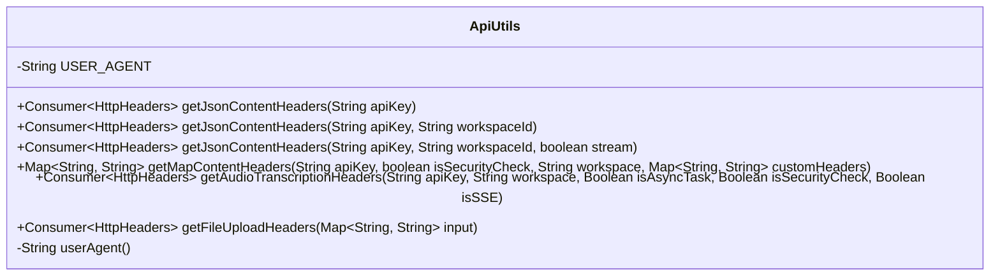
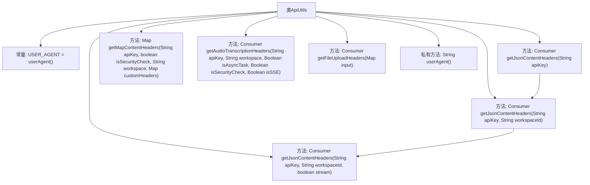

# 基础信息

|      |      |
|------|------|
| 名称 | ApiUtils |
| 编码语言 | .java |
| 代码路径 | spring-ai-alibaba/spring-ai-alibaba-core/src/main/java/com/alibaba/cloud/ai/dashscope/api/ApiUtils.java |
| 包名 | com.alibaba.cloud.ai.dashscope.api |
| 依赖项 | ['java.util.HashMap', 'java.util.Map', 'java.util.function.Consumer', 'org.springframework.http.HttpHeaders', 'org.springframework.http.MediaType', 'com.alibaba.cloud.ai.dashscope.common.DashScopeApiConstants'] |
| 概述说明 | ApiUtils类支持多种HTTP请求头生成，涵盖JSON、音频转录、文件上传等功能，包含认证和自定义头。 |

# 说明

ApiUtils类提供生成HTTP请求头的方法，适用于多种场景，如JSON处理、音频转录和文件上传。该类支持认证功能，允许设置内容类型，并支持自定义请求头，确保在不同应用场景中灵活使用。

# 类列表 Class Summary

| 名称   | 类型  | 说明 |
|-------|------|-------------|
| ApiUtils | class | ApiUtils类提供HTTP请求头生成方法，支持JSON、音频转录、文件上传等场景，包含认证、内容类型、自定义头等功能。 |

## 类 ApiUtils

|      |      |
|------|------|
| 访问范围 | public |
| 类型 | class |
| 名称 | ApiUtils |
| 说明 | ApiUtils类提供HTTP请求头生成方法，支持JSON、音频转录、文件上传等场景，包含认证、内容类型、自定义头等功能。 |

### UML类图

这段代码定义了一个名为 `ApiUtils` 的工具类，主要用于生成不同类型的HTTP请求头。类中包含多个静态方法，分别用于生成JSON内容头、映射内容头、音频转录头和文件上传头。每个方法根据传入的参数动态设置HTTP头信息，例如认证令牌、用户代理、内容类型等。`userAgent` 方法用于生成用户代理字符串。这些方法返回的 `Consumer<HttpHeaders>` 或 `Map<String, String>` 可以直接用于HTTP请求的配置。

### 内部方法调用关系图

这段代码定义了一个名为 `ApiUtils` 的工具类，主要用于生成不同类型的 HTTP 请求头。类中包含多个重载方法，用于根据不同的参数生成不同的请求头配置。其中，`getJsonContentHeaders` 方法用于生成 JSON 格式的请求头，`getMapContentHeaders` 方法用于生成 Map 格式的请求头，`getAudioTranscriptionHeaders` 方法用于生成音频转录任务的请求头，`getFileUploadHeaders` 方法用于生成文件上传的请求头。此外，`userAgent` 方法用于生成用户代理字符串。每个方法都根据传入的参数动态设置请求头的内容。

### 字段列表 Field List

| 名称  | 类型  | 说明 |
|-------|-------|------|
| USER_AGENT = userAgent() | String | 定义静态常量USER_AGENT并初始化为userAgent()返回值。 |

### 方法列表 Method List

| 名称  | 类型  | 说明 |
|-------|-------|------|
| getFileUploadHeaders | Consumer<HttpHeaders> | 生成方法用于设置文件上传的HTTP头信息。 |
| getMapContentHeaders | Map<String, String> | 生成包含API密钥、安全检查和自定义头的HTTP请求头映射。 |
| getJsonContentHeaders | Consumer<HttpHeaders> | 静态方法生成JSON内容头，可接受API密钥参数。 |
| getJsonContentHeaders | Consumer<HttpHeaders> | 静态方法`getJsonContentHeaders`返回设置HTTP头的消费者，接受API密钥和工作区ID参数。 |
| userAgent | String | 生成用户代理字符串，包含SDK版本、Java版本、操作系统和处理器架构信息。 |
| getAudioTranscriptionHeaders | Consumer<HttpHeaders> | 生成音频转录请求头，设置认证、用户代理、安全检查、工作空间、异步任务及SSE相关参数。 |
| getJsonContentHeaders | Consumer<HttpHeaders> | 方法生成HTTP头，含API密钥、工作区ID、内容类型及流式传输标志。 |

