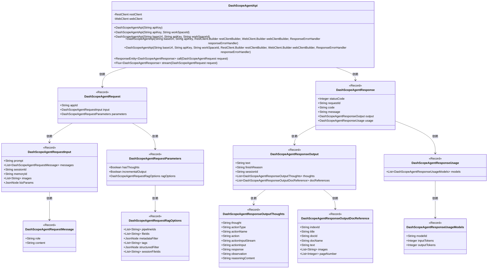
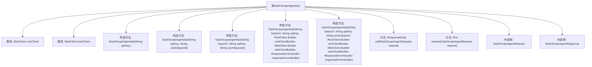

# 基础信息

|      |      |
|------|------|
| 名称 | DashScopeAgentApi |
| 编码语言 | .java |
| 代码路径 | spring-ai-alibaba/spring-ai-alibaba-core/src/main/java/com/alibaba/cloud/ai/dashscope/api/DashScopeAgentApi.java |
| 包名 | com.alibaba.cloud.ai.dashscope.api |
| 依赖项 | ['com.fasterxml.jackson.annotation.JsonInclude', 'com.fasterxml.jackson.annotation.JsonProperty', 'com.fasterxml.jackson.databind.JsonNode', 'org.springframework.ai.retry.RetryUtils', 'org.springframework.http.ResponseEntity', 'org.springframework.web.client.ResponseErrorHandler', 'org.springframework.web.client.RestClient', 'org.springframework.web.reactive.function.client.WebClient', 'reactor.core.publisher.Flux', 'reactor.core.publisher.Mono', 'com.alibaba.cloud.ai.dashscope.common.DashScopeApiConstants.DEFAULT_BASE_URL', 'java.util.List'] |
| 概述说明 | DashScopeAgentApi类封装API调用与流式请求，支持多种构造及响应处理。 |

# 说明

DashScopeAgentApi类是一个封装了API调用和流式请求的工具，支持多种构造方法，能够处理各种请求和响应。该类设计灵活，适用于多种场景，简化了API调用的复杂性，并提供了高效的流式请求处理能力。

# 类列表 Class Summary

| 名称   | 类型  | 说明 |
|-------|------|-------------|
| DashScopeAgentApi | class | DashScopeAgentApi类封装了API调用和流式请求，支持多种构造方法和请求响应处理。 |

## 类 DashScopeAgentApi

|      |      |
|------|------|
| 访问范围 | public |
| 类型 | class |
| 名称 | DashScopeAgentApi |
| 说明 | DashScopeAgentApi类封装了API调用和流式请求，支持多种构造方法和请求响应处理。 |

### UML类图

### 描述
`DashScopeAgentApi` 是一个用于与DashScope API进行交互的类，包含了多个构造函数以支持不同的配置方式。它依赖于`RestClient`和`WebClient`来发送HTTP请求，并提供了`call`和`stream`方法来处理请求和响应。`DashScopeAgentRequest`和`DashScopeAgentResponse`是用于封装请求和响应数据的记录类，其中包含了多个嵌套的记录类，如`DashScopeAgentRequestInput`、`DashScopeAgentRequestParameters`、`DashScopeAgentResponseOutput`等，用于进一步细化和组织数据。这些类之间的关系通过依赖关系图清晰地展示出来。

### 内部方法调用关系图

这段代码定义了一个名为 `DashScopeAgentApi` 的类，该类主要用于与某个API进行交互。类中包含两个主要属性 `RestClient` 和 `WebClient`，分别用于同步和异步的HTTP请求。类提供了多个构造方法，允许用户通过不同的参数配置 `RestClient` 和 `WebClient`。此外，类中还定义了两个主要方法 `call` 和 `stream`，分别用于发送同步和异步请求。代码中还包含了两个内部类 `DashScopeAgentRequest` 和 `DashScopeAgentResponse`，分别用于封装请求和响应的数据结构。

### 字段列表 Field List

| 名称  | 类型  | 说明 |
|-------|-------|------|
| restClient | RestClient | 私有且不可变的RestClient实例。 |
| webClient | WebClient | 私有且不可变的WebClient实例。 |

### 方法列表 Method List

| 名称  | 类型  | 说明 |
|-------|-------|------|
| call | ResponseEntity<DashScopeAgentResponse> | 该方法通过REST客户端发送POST请求，返回DashScopeAgentResponse实体。 |
| stream | Flux<DashScopeAgentResponse> | 流式处理DashScopeAgent请求并返回响应。 |

