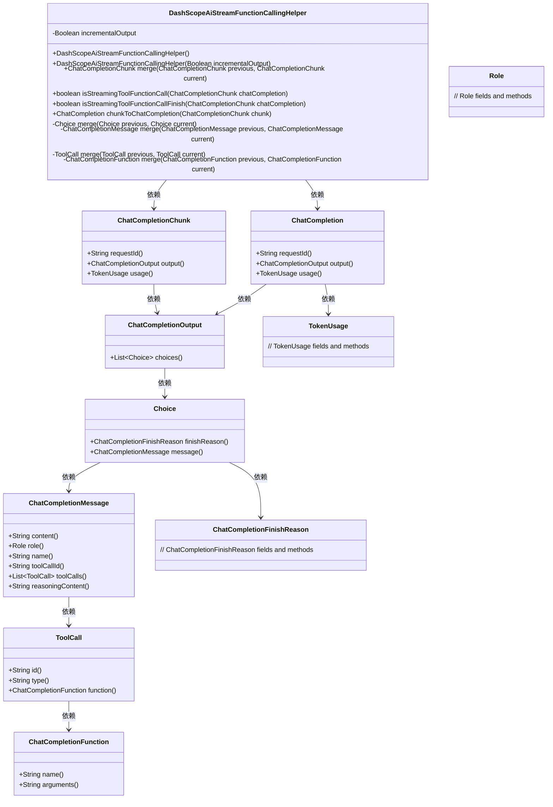

# 基础信息

|      |      |
|------|------|
| 名称 | DashScopeAiStreamFunctionCallingHelper |
| 编码语言 | .java |
| 代码路径 | spring-ai-alibaba/spring-ai-alibaba-core/src/main/java/com/alibaba/cloud/ai/dashscope/api/DashScopeAiStreamFunctionCallingHelper.java |
| 包名 | com.alibaba.cloud.ai.dashscope.api |
| 依赖项 | ['java.util.ArrayList', 'java.util.List', 'com.alibaba.cloud.ai.dashscope.api.DashScopeApi.ChatCompletion', 'com.alibaba.cloud.ai.dashscope.api.DashScopeApi.ChatCompletionOutput.Choice', 'com.alibaba.cloud.ai.dashscope.api.DashScopeApi.ChatCompletionOutput', 'com.alibaba.cloud.ai.dashscope.api.DashScopeApi.ChatCompletionChunk', 'com.alibaba.cloud.ai.dashscope.api.DashScopeApi.ChatCompletionFinishReason', 'com.alibaba.cloud.ai.dashscope.api.DashScopeApi.TokenUsage', 'com.alibaba.cloud.ai.dashscope.api.DashScopeApi.ChatCompletionMessage', 'com.alibaba.cloud.ai.dashscope.api.DashScopeApi.ChatCompletionMessage.ChatCompletionFunction', 'com.alibaba.cloud.ai.dashscope.api.DashScopeApi.ChatCompletionMessage.Role', 'com.alibaba.cloud.ai.dashscope.api.DashScopeApi.ChatCompletionMessage.ToolCall', 'org.springframework.util.CollectionUtils', 'org.springframework.util.StringUtils'] |
| 概述说明 | DashScopeAiStreamFunctionCallingHelper类用于合并和转换流式工具函数调用的ChatCompletionChunk对象。 |

# 说明

DashScopeAiStreamFunctionCallingHelper类的主要功能是合并和转换ChatCompletionChunk对象，以支持流式工具函数调用。该类的设计旨在处理连续的数据流，确保在流式处理过程中能够有效地整合和转换数据块，从而支持工具函数的调用。通过这种方式，它能够实现高效的数据处理和函数调用，适用于需要实时或连续数据处理的场景。

# 类列表 Class Summary

| 名称   | 类型  | 说明 |
|-------|------|-------------|
| DashScopeAiStreamFunctionCallingHelper | class | DashScopeAiStreamFunctionCallingHelper类用于合并和转换ChatCompletionChunk对象，支持流式工具函数调用。 |

## 类 DashScopeAiStreamFunctionCallingHelper

|      |      |
|------|------|
| 访问范围 | public |
| 类型 | class |
| 名称 | DashScopeAiStreamFunctionCallingHelper |
| 说明 | DashScopeAiStreamFunctionCallingHelper类用于合并和转换ChatCompletionChunk对象，支持流式工具函数调用。 |

### UML类图

这段代码定义了一个 `DashScopeAiStreamFunctionCallingHelper` 类，用于处理流式函数调用的合并与转换操作。该类包含多个私有方法用于合并不同类型的对象（如 `Choice`、`ChatCompletionMessage`、`ToolCall` 等），以及公有方法用于检查流式函数调用状态和将 `ChatCompletionChunk` 转换为 `ChatCompletion`。通过类图可以清晰地看到各个类之间的依赖关系及其成员方法。

### 内部方法调用关系图

```mermaid
graph TD
    A["类DashScopeAiStreamFunctionCallingHelper"]
    B["属性: Boolean incrementalOutput"]
    C["构造方法: DashScopeAiStreamFunctionCallingHelper()"]
    D["构造方法: DashScopeAiStreamFunctionCallingHelper(Boolean incrementalOutput)"]
    E["方法: ChatCompletionChunk merge(ChatCompletionChunk previous, ChatCompletionChunk current)"]
    F["方法: Choice merge(Choice previous, Choice current)"]
    G["方法: ChatCompletionMessage merge(ChatCompletionMessage previous, ChatCompletionMessage current)"]
    H["方法: ToolCall merge(ToolCall previous, ToolCall current)"]
    I["方法: ChatCompletionFunction merge(ChatCompletionFunction previous, ChatCompletionFunction current)"]
    J["方法: boolean isStreamingToolFunctionCall(ChatCompletionChunk chatCompletion)"]
    K["方法: boolean isStreamingToolFunctionCallFinish(ChatCompletionChunk chatCompletion)"]
    L["方法: ChatCompletion chunkToChatCompletion(ChatCompletionChunk chunk)"]

    A --> B
    A --> C
    A --> D
    A --> E
    A --> F
    A --> G
    A --> H
    A --> I
    A --> J
    A --> K
    A --> L
```

这段代码定义了一个名为`DashScopeAiStreamFunctionCallingHelper`的类，主要用于合并和处理流式函数调用的`ChatCompletionChunk`对象。类中包含多个构造方法和成员方法，用于处理不同的合并逻辑和判断条件。每个方法都有明确的职责，例如合并`ChatCompletionChunk`、`Choice`、`ChatCompletionMessage`、`ToolCall`和`ChatCompletionFunction`等对象。此外，还提供了判断是否为流式工具函数调用以及将`ChatCompletionChunk`转换为`ChatCompletion`的方法。整体设计旨在处理复杂的流式函数调用场景，确保数据的完整性和一致性。

### 字段列表 Field List

| 名称  | 类型  | 说明 |
|-------|-------|------|
| incrementalOutput = false | Boolean | 布尔变量incrementalOutput默认值为false。 |

### 方法列表 Method List

| 名称  | 类型  | 说明 |
|-------|-------|------|
| chunkToChatCompletion | ChatCompletion | 将ChatCompletionChunk转换为ChatCompletion对象。 |
| merge | Choice | 合并两个Choice对象，优先使用当前对象的finishReason和合并后的message。 |
| merge | ToolCall | 合并工具调用，优先使用当前值，保留ID和类型，合并函数。 |
| isStreamingToolFunctionCall | boolean | 判断聊天完成对象是否为流式工具调用。 |
| merge | ChatCompletionFunction | 合并ChatCompletionFunction，优先使用当前名称，拼接参数。 |
| merge | ChatCompletionMessage | 合并两个ChatCompletionMessage对象，优先使用当前消息内容，默认角色为ASSISTANT，支持工具调用合并。 |
| merge | ChatCompletionChunk | 合并两个ChatCompletionChunk对象，处理ID、使用情况和选择项，确保流式函数调用兼容性。 |
| isStreamingToolFunctionCallFinish | boolean | 检查流式工具函数调用是否完成，返回布尔值。 |

