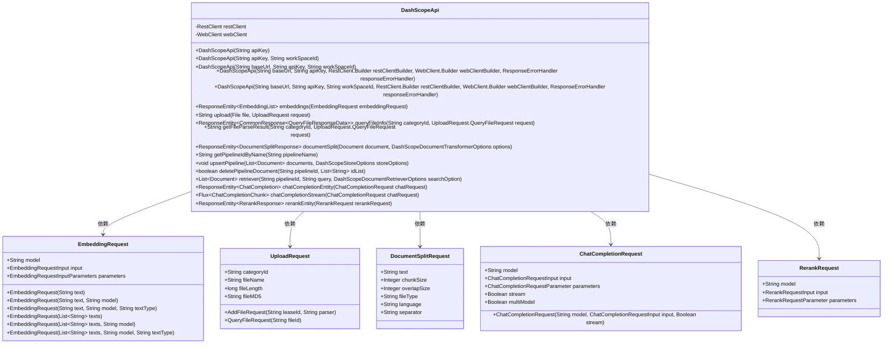

# 基础信息

|      |      |
|------|------|
| 名称 | DashScopeApi |
| 编码语言 | .java |
| 代码路径 | spring-ai-alibaba/spring-ai-alibaba-core/src/main/java/com/alibaba/cloud/ai/dashscope/api/DashScopeApi.java |
| 包名 | com.alibaba.cloud.ai.dashscope.api |
| 依赖项 | ['java.io.File', 'java.io.FileInputStream', 'java.net.URI', 'java.util.ArrayList', 'java.util.Arrays', 'java.util.List', 'java.util.Map', 'java.util.Objects', 'java.util.concurrent.atomic.AtomicBoolean', 'java.util.function.Predicate', 'java.util.stream.Collectors', 'com.alibaba.cloud.ai.dashscope.common.DashScopeException', 'com.alibaba.cloud.ai.dashscope.common.ErrorCodeEnum', 'com.alibaba.cloud.ai.dashscope.rag.DashScopeDocumentRetrieverOptions', 'com.alibaba.cloud.ai.dashscope.rag.DashScopeDocumentTransformerOptions', 'com.alibaba.cloud.ai.dashscope.rag.DashScopeStoreOptions', 'com.fasterxml.jackson.annotation.JsonIgnore', 'com.fasterxml.jackson.annotation.JsonIgnoreProperties', 'com.fasterxml.jackson.annotation.JsonInclude', 'com.fasterxml.jackson.annotation.JsonProperty', 'reactor.core.publisher.Flux', 'reactor.core.publisher.Mono', 'org.springframework.ai.chat.metadata.Usage', 'org.springframework.ai.document.Document', 'org.springframework.ai.model.ModelOptionsUtils', 'org.springframework.ai.retry.RetryUtils', 'org.springframework.core.ParameterizedTypeReference', 'org.springframework.core.io.InputStreamResource', 'org.springframework.http.HttpEntity', 'org.springframework.http.HttpHeaders', 'org.springframework.http.HttpMethod', 'org.springframework.http.MediaType', 'org.springframework.http.ResponseEntity', 'org.springframework.util.Assert', 'org.springframework.util.CollectionUtils', 'org.springframework.web.client.ResponseErrorHandler', 'org.springframework.web.client.RestClient', 'org.springframework.web.client.RestTemplate', 'org.springframework.web.reactive.function.client.WebClient', 'com.alibaba.cloud.ai.dashscope.common.DashScopeApiConstants.DEFAULT_BASE_URL'] |
| 概述说明 | DashScopeApi类支持聊天、嵌入、文件上传、文档分割等功能，兼容多种模型和配置。 |

# 说明

DashScopeApi类是一个多功能API工具，提供包括聊天、嵌入、文件上传和文档分割等多种功能。它支持多种模型和配置，能够满足不同场景下的需求。该类的设计旨在为用户提供灵活且高效的API调用体验，适用于各种复杂的应用场景。

# 类列表 Class Summary

| 名称   | 类型  | 说明 |
|-------|------|-------------|
| DashScopeApi | class | DashScopeApi类提供多种API功能，包括聊天、嵌入、文件上传、文档分割等，支持多种模型和配置。 |

## 类 DashScopeApi

|      |      |
|------|------|
| 访问范围 | public |
| 类型 | class |
| 名称 | DashScopeApi |
| 说明 | DashScopeApi类提供多种API功能，包括聊天、嵌入、文件上传、文档分割等，支持多种模型和配置。 |

### UML类图

**描述**：  
`DashScopeApi` 类是一个用于与 DashScope API 进行交互的核心类，提供了多种功能，如嵌入生成、文件上传、文档分割、聊天完成和重排序等。它依赖于多个请求类（如 `EmbeddingRequest`、`UploadRequest`、`DocumentSplitRequest`、`ChatCompletionRequest` 和 `RerankRequest`）来构造请求，并通过 `RestClient` 和 `WebClient` 发送请求。该类支持同步和异步操作，适用于复杂的 API 调用场景。

### 内部方法调用关系图

```mermaid
graph TD
    A["类DashScopeApi"]
    B["属性: Predicate<String> SSE_DONE_PREDICATE"]
    C["属性: String DEFAULT_CHAT_MODEL"]
    D["属性: String DEFAULT_EMBEDDING_MODEL"]
    E["属性: String DEFAULT_EMBEDDING_TEXT_TYPE"]
    F["属性: String DEFAULT_PARSER_NAME"]
    G["属性: RestClient restClient"]
    H["属性: WebClient webClient"]
    I["构造方法: DashScopeApi(String apiKey)"]
    J["构造方法: DashScopeApi(String apiKey, String workSpaceId)"]
    K["构造方法: DashScopeApi(String baseUrl, String apiKey, String workSpaceId)"]
    L["构造方法: DashScopeApi(String baseUrl, String apiKey, RestClient.Builder restClientBuilder, WebClient.Builder webClientBuilder, ResponseErrorHandler responseErrorHandler)"]
    M["构造方法: DashScopeApi(String baseUrl, String apiKey, String workSpaceId, RestClient.Builder restClientBuilder, WebClient.Builder webClientBuilder, ResponseErrorHandler responseErrorHandler)"]
    N["方法: ResponseEntity<EmbeddingList> embeddings(EmbeddingRequest embeddingRequest)"]
    O["方法: String upload(File file, UploadRequest request)"]
    P["方法: ResponseEntity<CommonResponse<QueryFileResponseData>> queryFileInfo(String categoryId, UploadRequest.QueryFileRequest request)"]
    Q["方法: String getFileParseResult(String categoryId, UploadRequest.QueryFileRequest request)"]
    R["方法: String addFile(String leaseId, UploadRequest request)"]
    S["方法: void uploadFile(File file, UploadLeaseResponse uploadLeaseResponse)"]
    T["方法: ResponseEntity<UploadLeaseResponse> uploadLease(UploadRequest request)"]
    U["方法: ResponseEntity<DocumentSplitResponse> documentSplit(Document document, DashScopeDocumentTransformerOptions options)"]
    V["方法: String getPipelineIdByName(String pipelineName)"]
    W["方法: void upsertPipeline(List<Document> documents, DashScopeStoreOptions storeOptions)"]
    X["方法: boolean deletePipelineDocument(String pipelineId, List<String> idList)"]
    Y["方法: List<Document> retriever(String pipelineId, String query, DashScopeDocumentRetrieverOptions searchOption)"]
    Z["方法: ResponseEntity<ChatCompletion> chatCompletionEntity(ChatCompletionRequest chatRequest)"]
    AA["方法: Flux<ChatCompletionChunk> chatCompletionStream(ChatCompletionRequest chatRequest)"]
    AB["方法: ResponseEntity<RerankResponse> rerankEntity(RerankRequest rerankRequest)"]

    A --> B
    A --> C
    A --> D
    A --> E
    A --> F
    A --> G
    A --> H
    A --> I
    A --> J
    A --> K
    A --> L
    A --> M
    A --> N
    A --> O
    A --> P
    A --> Q
    A --> R
    A --> S
    A --> T
    A --> U
    A --> V
    A --> W
    A --> X
    A --> Y
    A --> Z
    A --> AA
    A --> AB
```

**流程图描述：**  
该流程图展示了`DashScopeApi`类的结构，包括其属性、构造方法和主要方法。`DashScopeApi`类主要用于处理与DashScope API的交互，包括文件上传、嵌入请求、文档分割、管道管理等操作。每个方法都通过箭头指向其对应的功能，展示了类内部的调用关系。该类的核心功能是通过`RestClient`和`WebClient`与API进行通信，并处理各种请求和响应。

### 字段列表 Field List

| 名称  | 类型  | 说明 |
|-------|-------|------|
| DEFAULT_EMBEDDING_TEXT_TYPE = EmbeddingTextType.DOCUMENT.getValue() | String | 默认嵌入文本类型为文档类型值。 |
| restClient | RestClient | 私有且不可变的RestClient实例。 |
| DEFAULT_CHAT_MODEL = ChatModel.QWEN_PLUS.getModel() | String | 默认聊天模型设置为QWEN_PLUS。 |
| DEFAULT_EMBEDDING_MODEL = EmbeddingModel.EMBEDDING_V2.getValue() | String | 默认嵌入模型为EMBEDDING_V2的值。 |
| webClient | WebClient | 私有且不可变的WebClient实例。 |
| DEFAULT_PARSER_NAME = "DASHSCOPE_DOCMIND" | String | 定义常量DEFAULT_PARSER_NAME，值为"DASHSCOPE_DOCMIND"。 |
| SSE_DONE_PREDICATE = "[DONE]"::equals | Predicate<String> | 定义静态最终谓词，判断字符串是否为"[DONE]"。 |

### 方法列表 Method List

| 名称  | 类型  | 说明 |
|-------|-------|------|
| getTextContent | String | 提取文本内容并拼接返回。 |
| upload | String | 上传文件并处理响应，失败时抛出异常。 |
| deletePipelineDocument | boolean | 删除指定流水线文档，成功返回true，失败返回false。 |
| retriever | List<Document> | 方法通过API检索文档，处理请求并返回文档列表。 |
| chatCompletionEntity | ResponseEntity<ChatCompletion> | 处理聊天请求，根据模型类型选择URI，返回响应实体。 |
| queryFileInfo | ResponseEntity<CommonResponse<QueryFileResponseData>> | 通过REST客户端查询指定分类和文件ID的文件信息。 |
| getPipelineIdByName | String | 通过管道名称获取管道ID，若响应为空则返回null。 |
| rerankEntity | ResponseEntity<RerankResponse> | 方法rerankEntity处理RerankRequest请求，调用API进行文本重排序并返回响应。 |
| embeddings | ResponseEntity<EmbeddingList> | 处理嵌入请求，验证输入非空且文本不超过25条，调用API返回结果。 |
| addFile | String | 方法通过REST API添加文件，处理响应并返回文件ID，异常时抛出错误。 |
| uploadFile | void | 上传文件方法，配置请求头并发送PUT请求，异常时抛出DashScopeException。 |
| chatCompletionStream | Flux<ChatCompletionChunk> | 流式聊天完成方法，验证请求非空且为流式，处理增量输出，调用API返回结果。 |
| upsertPipeline | void | upsertPipeline方法用于更新或插入文档管道，配置嵌入、解析和检索组件，并处理请求响应。 |
| uploadLease | ResponseEntity<UploadLeaseResponse> | 私有方法上传租赁数据，通过REST客户端POST请求，返回响应实体。 |
| documentSplit | ResponseEntity<DocumentSplitResponse> | 该方法通过REST API将文档分割，并返回响应实体。 |
| getFileParseResult | String | 通过REST API获取文件解析结果，处理响应并返回解析数据。 |

