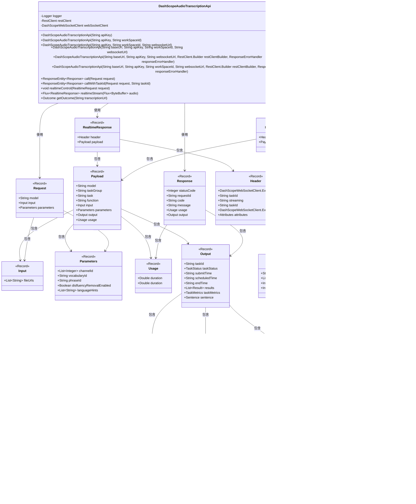

# 基础信息

|      |      |
|------|------|
| 名称 | DashScopeAudioTranscriptionApi |
| 编码语言 | .java |
| 代码路径 | spring-ai-alibaba/spring-ai-alibaba-core/src/main/java/com/alibaba/cloud/ai/dashscope/api/DashScopeAudioTranscriptionApi.java |
| 包名 | com.alibaba.cloud.ai.dashscope.api |
| 依赖项 | ['com.alibaba.cloud.ai.dashscope.audio.DashScopeAudioTranscriptionOptions', 'com.alibaba.cloud.ai.dashscope.common.DashScopeApiConstants', 'com.alibaba.cloud.ai.dashscope.common.DashScopeException', 'com.alibaba.cloud.ai.dashscope.protocol.DashScopeWebSocketClient', 'com.alibaba.cloud.ai.dashscope.protocol.DashScopeWebSocketClientOptions', 'com.fasterxml.jackson.annotation.JsonInclude', 'com.fasterxml.jackson.annotation.JsonProperty', 'com.fasterxml.jackson.core.JsonProcessingException', 'com.fasterxml.jackson.databind.ObjectMapper', 'org.slf4j.Logger', 'org.slf4j.LoggerFactory', 'org.springframework.ai.retry.RetryUtils', 'org.springframework.http.ResponseEntity', 'org.springframework.web.client.ResponseErrorHandler', 'org.springframework.web.client.RestClient', 'reactor.core.publisher.Flux', 'java.io.InputStream', 'java.nio.ByteBuffer', 'java.util.List', 'java.net.URL', 'com.alibaba.cloud.ai.dashscope.common.DashScopeApiConstants.DEFAULT_BASE_URL'] |
| 概述说明 | DashScope音频转写API支持REST和WebSocket调用，具备实时控制和流处理功能。 |

# 说明

DashScope音频转写API类提供了REST和WebSocket两种调用方式，具备实时控制和流处理功能，适用于多种音频转写场景。

# 类列表 Class Summary

| 名称   | 类型  | 说明 |
|-------|------|-------------|
| DashScopeAudioTranscriptionApi | class | DashScope音频转写API类，支持REST和WebSocket调用，包含实时控制和流处理功能。 |

## 类 DashScopeAudioTranscriptionApi

|      |      |
|------|------|
| 访问范围 | public |
| 类型 | class |
| 名称 | DashScopeAudioTranscriptionApi |
| 说明 | DashScope音频转写API类，支持REST和WebSocket调用，包含实时控制和流处理功能。 |

### UML类图

### 描述
`DashScopeAudioTranscriptionApi` 类是一个用于处理音频转录的API类，它通过REST客户端和WebSocket客户端与后端服务进行交互。该类提供了多种构造函数以适应不同的配置需求，并包含了多个内部记录类（Record）用于表示请求、响应、实时请求和响应等数据结构。这些记录类之间通过嵌套关系组织，形成了一个复杂的数据模型，用于处理音频转录的各个阶段和结果。

### 内部方法调用关系图

这段代码定义了一个名为`DashScopeAudioTranscriptionApi`的类，用于处理音频转录相关的API调用。类中包含多个构造方法，用于初始化`RestClient`和`DashScopeWebSocketClient`对象，并提供了多个方法用于发送请求、处理实时控制和流式传输音频数据。此外，类中还定义了多个内部类和枚举，用于封装请求、响应和任务状态等信息。代码结构清晰，功能模块化，便于扩展和维护。

### 字段列表 Field List

| 名称  | 类型  | 说明 |
|-------|-------|------|
| restClient | RestClient | 私有且不可变的RestClient实例。 |
| webSocketClient | DashScopeWebSocketClient | 私有且不可变的DashScopeWebSocketClient实例。 |
| logger = LoggerFactory.getLogger(DashScopeAudioTranscriptionApi.class) | Logger | DashScopeAudioTranscriptionApi类中定义了一个私有的静态日志记录器。 |

### 方法列表 Method List

| 名称  | 类型  | 说明 |
|-------|-------|------|
| callWithTaskId | ResponseEntity<Response> | 调用任务ID的音频转录API，返回响应实体。 |
| realtimeControl | void | 实时控制方法通过WebSocket发送JSON格式请求，处理异常时抛出运行时错误。 |
| realtimeStream | Flux<RealtimeResponse> | 实时流处理音频数据，返回响应并处理JSON异常。 |
| call | ResponseEntity<Response> | 调用DashScope音频转录API，发送POST请求并返回响应实体。 |
| getOutcome | Outcome | 通过URL获取转录结果并返回Outcome对象，失败时抛出异常。 |

