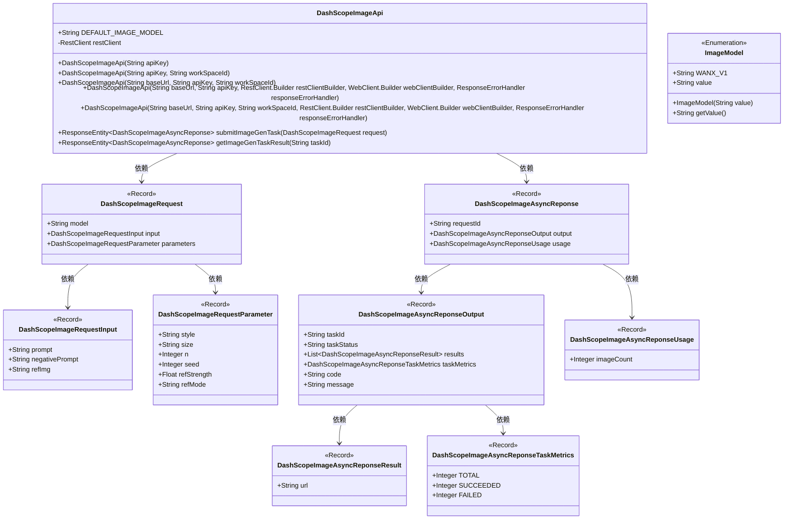

# 基础信息

|      |      |
|------|------|
| 名称 | DashScopeImageApi |
| 编码语言 | .java |
| 代码路径 | spring-ai-alibaba/spring-ai-alibaba-core/src/main/java/com/alibaba/cloud/ai/dashscope/api/DashScopeImageApi.java |
| 包名 | com.alibaba.cloud.ai.dashscope.api |
| 依赖项 | ['java.util.List', 'com.fasterxml.jackson.annotation.JsonInclude', 'com.fasterxml.jackson.annotation.JsonProperty', 'org.springframework.ai.retry.RetryUtils', 'org.springframework.http.ResponseEntity', 'org.springframework.web.client.ResponseErrorHandler', 'org.springframework.web.client.RestClient', 'org.springframework.web.reactive.function.client.WebClient', 'com.alibaba.cloud.ai.dashscope.common.DashScopeApiConstants.DEFAULT_BASE_URL'] |
| 概述说明 | DashScopeImageApi类用于图像生成，支持异步提交和结果查询，包含请求和响应结构。 |

# 说明

DashScopeImageApi类专门用于处理图像生成任务，提供了异步提交和结果查询的功能。该类定义了请求和响应的数据结构，确保用户可以高效地管理和处理图像生成过程中的数据交互。通过异步机制，用户可以在不阻塞主线程的情况下提交任务，并在任务完成后查询结果，从而提升系统的整体性能和用户体验。

# 类列表 Class Summary

| 名称   | 类型  | 说明 |
|-------|------|-------------|
| DashScopeImageApi | class | DashScopeImageApi类用于图像生成任务，支持异步提交和结果查询，包含请求和响应数据结构。 |

## 类 DashScopeImageApi

|      |      |
|------|------|
| 访问范围 | public |
| 类型 | class |
| 名称 | DashScopeImageApi |
| 说明 | DashScopeImageApi类用于图像生成任务，支持异步提交和结果查询，包含请求和响应数据结构。 |

### UML类图

**描述**：`DashScopeImageApi` 类是一个用于处理图像生成任务的API客户端，提供了提交图像生成任务和获取任务结果的方法。它依赖于多个记录类（如 `DashScopeImageRequest` 和 `DashScopeImageAsyncReponse`）来封装请求和响应的数据结构。`ImageModel` 枚举类定义了支持的图像模型。整个类图展示了API客户端与其相关数据结构之间的依赖关系。

### 内部方法调用关系图

```mermaid
graph TD
    A["类DashScopeImageApi"]
    B["常量: DEFAULT_IMAGE_MODEL = ImageModel.WANX_V1.getValue()"]
    C["属性: RestClient restClient"]
    D["构造方法: DashScopeImageApi(String apiKey)"]
    E["构造方法: DashScopeImageApi(String apiKey, String workSpaceId)"]
    F["构造方法: DashScopeImageApi(String baseUrl, String apiKey, String workSpaceId)"]
    G["构造方法: DashScopeImageApi(String baseUrl, String apiKey, RestClient.Builder restClientBuilder, WebClient.Builder webClientBuilder, ResponseErrorHandler responseErrorHandler)"]
    H["构造方法: DashScopeImageApi(String baseUrl, String apiKey, String workSpaceId, RestClient.Builder restClientBuilder, WebClient.Builder webClientBuilder, ResponseErrorHandler responseErrorHandler)"]
    I["方法: ResponseEntity<DashScopeImageAsyncReponse> submitImageGenTask(DashScopeImageRequest request)"]
    J["方法: ResponseEntity<DashScopeImageAsyncReponse> getImageGenTaskResult(String taskId)"]
    K["枚举: ImageModel"]
    L["记录: DashScopeImageRequest"]
    M["记录: DashScopeImageAsyncReponse"]
    N["记录: DashScopeImageRequestInput"]
    O["记录: DashScopeImageRequestParameter"]
    P["记录: DashScopeImageAsyncReponseOutput"]
    Q["记录: DashScopeImageAsyncReponseTaskMetrics"]
    R["记录: DashScopeImageAsyncReponseUsage"]
    S["记录: DashScopeImageAsyncReponseResult"]

    A --> B
    A --> C
    A --> D
    A --> E
    A --> F
    A --> G
    A --> H
    A --> I
    A --> J
    A --> K
    A --> L
    A --> M
    L --> N
    L --> O
    M --> P
    M --> R
    P --> Q
    P --> S
```

这段代码定义了一个名为 `DashScopeImageApi` 的类，主要用于处理图像生成任务。类中包含多个构造方法，用于初始化 `RestClient` 实例，以及两个核心方法 `submitImageGenTask` 和 `getImageGenTaskResult`，分别用于提交图像生成任务和获取任务结果。此外，代码还定义了多个记录类（Record）和枚举类，用于封装请求和响应的数据结构。整个类的设计旨在通过 REST API 与图像生成服务进行交互，并处理异步任务的结果。

### 字段列表 Field List

| 名称  | 类型  | 说明 |
|-------|-------|------|
| DEFAULT_IMAGE_MODEL = ImageModel.WANX_V1.getValue() | String | 定义默认图像模型为WANX_V1。 |
| restClient | RestClient | 声明一个私有的不可变的RestClient实例变量。 |

### 方法列表 Method List

| 名称  | 类型  | 说明 |
|-------|-------|------|
| getImageGenTaskResult | ResponseEntity<DashScopeImageAsyncReponse> | 获取指定任务ID的图像生成结果。 |
| submitImageGenTask | ResponseEntity<DashScopeImageAsyncReponse> | 提交图像生成任务，启用异步模式，返回响应实体。 |

