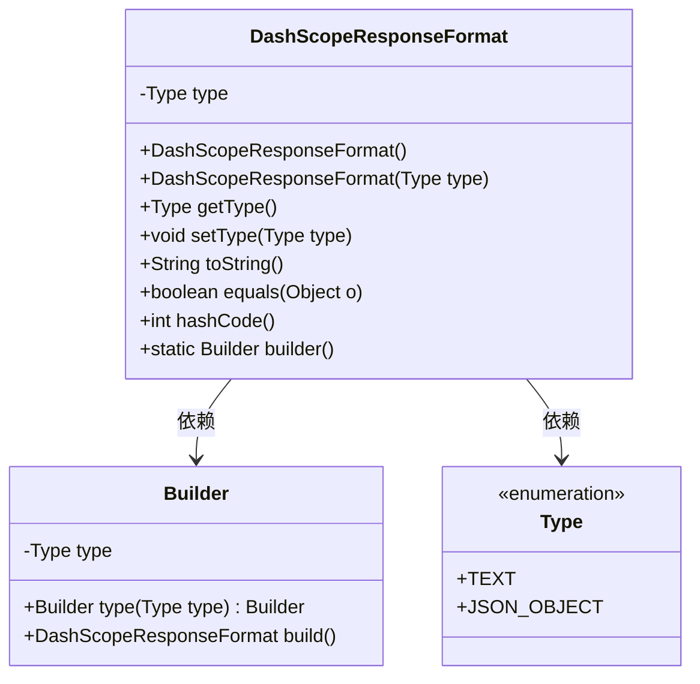
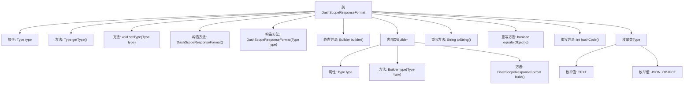

# 基础信息

|      |      |
|------|------|
| 名称 | DashScopeResponseFormat |
| 编码语言 | .java |
| 代码路径 | spring-ai-alibaba/spring-ai-alibaba-core/src/main/java/com/alibaba/cloud/ai/dashscope/api/DashScopeResponseFormat.java |
| 包名 | com.alibaba.cloud.ai.dashscope.api |
| 依赖项 | ['java.util.Objects', 'com.fasterxml.jackson.annotation.JsonInclude', 'com.fasterxml.jackson.annotation.JsonProperty'] |
| 概述说明 | DashScopeResponseFormat类定义响应格式，支持文本或JSON对象。 |

# 说明

DashScopeResponseFormat类用于定义响应格式，支持文本或JSON对象类型。该类的主要功能是确保响应数据能够以用户指定的格式进行返回，无论是纯文本还是结构化的JSON对象。通过使用该类，开发者可以灵活地控制API返回的数据形式，从而满足不同的应用场景需求。

# 类列表 Class Summary

| 名称   | 类型  | 说明 |
|-------|------|-------------|
| DashScopeResponseFormat | class | DashScopeResponseFormat类定义响应格式，支持文本或JSON对象类型。 |

## 类 DashScopeResponseFormat

|      |      |
|------|------|
| 访问范围 | @JsonInclude(JsonInclude.Include.NON_NULL);public |
| 类型 | class |
| 名称 | DashScopeResponseFormat |
| 说明 | DashScopeResponseFormat类定义响应格式，支持文本或JSON对象类型。 |

### UML类图

**描述：**  
`DashScopeResponseFormat` 类用于定义响应格式，包含一个 `Type` 枚举类型的属性，表示响应格式的类型（`text` 或 `json_object`）。该类提供了构造函数、getter 和 setter 方法，以及 `toString`、`equals` 和 `hashCode` 方法。`Builder` 类用于构建 `DashScopeResponseFormat` 实例，支持链式调用。`Type` 枚举定义了两种响应格式类型。类图展示了 `DashScopeResponseFormat` 与 `Builder` 和 `Type` 之间的依赖关系。

### 内部方法调用关系图

**描述**：该流程图展示了`DashScopeResponseFormat`类的结构及其内部关系。类中包含属性`type`、多个构造方法、getter和setter方法、一个内部`Builder`类用于构建对象，以及重写的`toString`、`equals`和`hashCode`方法。此外，类中还定义了一个枚举`Type`，包含`TEXT`和`JSON_OBJECT`两个枚举值，用于指定响应格式的类型。

### 字段列表 Field List

| 名称  | 类型  | 说明 |
|-------|-------|------|
| type | Type | JSON属性映射类型字段。 |

### 方法列表 Method List

| 名称  | 类型  | 说明 |
|-------|-------|------|
| builder | Builder | 静态方法`builder()`返回`Builder`类的新实例。 |
| toString | String | 重写toString方法，返回包含类型信息的JSON字符串。 |
| hashCode | int | 重写hashCode方法，使用type属性生成哈希值。 |
| setType | void | 设置对象类型的方法。 |
| getType | Type | 方法 `getType` 返回 `type` 变量的值。 |
| equals | boolean | 重写equals方法，比较对象类型是否相同。 |

