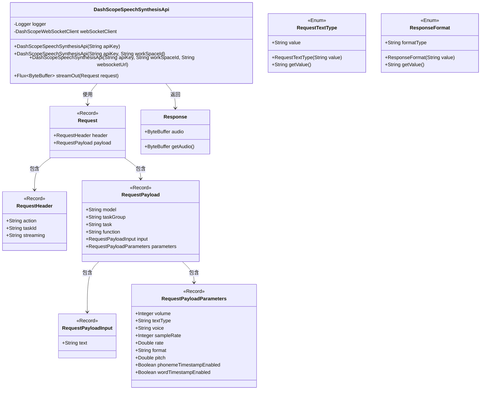
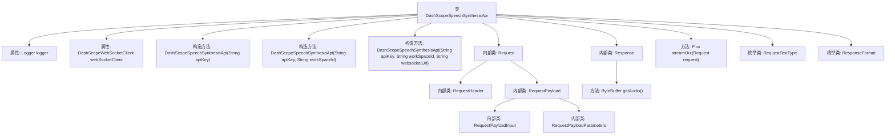

# 基础信息

|      |      |
|------|------|
| 名称 | DashScopeSpeechSynthesisApi |
| 编码语言 | .java |
| 代码路径 | spring-ai-alibaba/spring-ai-alibaba-core/src/main/java/com/alibaba/cloud/ai/dashscope/api/DashScopeSpeechSynthesisApi.java |
| 包名 | com.alibaba.cloud.ai.dashscope.api |
| 依赖项 | ['com.fasterxml.jackson.annotation.JsonInclude', 'com.fasterxml.jackson.annotation.JsonProperty', 'com.fasterxml.jackson.core.JsonProcessingException', 'com.fasterxml.jackson.databind.ObjectMapper', 'org.slf4j.Logger', 'org.slf4j.LoggerFactory', 'com.alibaba.cloud.ai.dashscope.protocol.DashScopeWebSocketClient', 'com.alibaba.cloud.ai.dashscope.protocol.DashScopeWebSocketClientOptions', 'java.nio.ByteBuffer', 'reactor.core.publisher.Flux', 'com.alibaba.cloud.ai.dashscope.common.DashScopeApiConstants'] |
| 概述说明 | DashScope语音合成API支持WebSocket连接，处理多种文本和音频格式的请求和响应。 |

# 说明

DashScope语音合成API类提供了基于WebSocket的连接方式，能够高效处理语音合成的请求和响应。该API支持多种文本和音频格式，确保用户能够灵活选择适合的输入和输出类型，适用于各种语音合成应用场景。

# 类列表 Class Summary

| 名称   | 类型  | 说明 |
|-------|------|-------------|
| DashScopeSpeechSynthesisApi | class | DashScope语音合成API类，支持WebSocket连接，处理请求和响应，支持多种文本和音频格式。 |

## 类 DashScopeSpeechSynthesisApi

|      |      |
|------|------|
| 访问范围 | public |
| 类型 | class |
| 名称 | DashScopeSpeechSynthesisApi |
| 说明 | DashScope语音合成API类，支持WebSocket连接，处理请求和响应，支持多种文本和音频格式。 |

### UML类图

这段代码定义了一个`DashScopeSpeechSynthesisApi`类，用于通过WebSocket进行语音合成。该类包含多个构造函数，允许通过不同的参数初始化WebSocket客户端。`Request`和`Response`类分别用于封装请求和响应数据。`Request`类内部嵌套了多个记录类，用于描述请求的头部、负载、输入和参数。`RequestTextType`和`ResponseFormat`枚举类定义了请求文本类型和响应格式的选项。整体设计通过嵌套记录类实现了复杂请求数据的结构化封装。

### 内部方法调用关系图

该流程图展示了`DashScopeSpeechSynthesisApi`类的结构及其内部组件的关系。类中包含多个构造方法、内部类、方法和枚举类型。构造方法用于初始化`webSocketClient`，内部类`Request`及其嵌套类用于定义请求的数据结构，`Response`类用于处理音频数据，`streamOut`方法用于将请求转换为二进制流并发送。枚举类`RequestTextType`和`ResponseFormat`定义了文本类型和响应格式的枚举值。

### 字段列表 Field List

| 名称  | 类型  | 说明 |
|-------|-------|------|
| webSocketClient | DashScopeWebSocketClient | 私有终端的DashScopeWebSocketClient实例。 |
| logger = LoggerFactory.getLogger(DashScopeSpeechSynthesisApi.class) | Logger | DashScopeSpeechSynthesisApi类中定义了私有的静态日志记录器。 |

### 方法列表 Method List

| 名称  | 类型  | 说明 |
|-------|-------|------|
| streamOut | Flux<ByteBuffer> | 将请求对象转换为JSON并通过WebSocket客户端发送二进制流。 |

