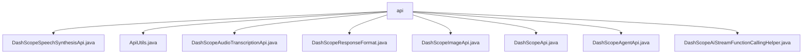

# 基础信息

|      |      |
|------|------|
| 名称 | api |
| 编码语言 | .java |
| 代码路径 | spring-ai-alibaba/spring-ai-alibaba-core/src/main/java/com/alibaba/cloud/ai/dashscope/api |
| 包名 | spring-ai-alibaba.spring-ai-alibaba-core.src.main.java.com.alibaba.cloud.ai.dashscope.api |
| 概述说明 | DashScope API提供语音合成、音频转写、图像生成等功能，支持多种格式和调用方式，适用于多种应用场景。 |

# 说明

## 概述
该代码模块是一个基于Spring框架的AI工具集，主要用于与阿里云的DashScope API进行交互。模块提供了多种API类，涵盖了语音合成、音频转写、图像生成、聊天、嵌入、文件上传、文档分割等多种功能。这些API类支持多种调用方式（如REST、WebSocket），并提供了灵活的数据处理机制，能够高效地处理请求和响应。模块的核心设计目标是提供灵活、高效且易于集成的API调用体验，适用于各种复杂的AI应用场景。

## 主要业务场景
1. **语音合成**：通过`DashScopeSpeechSynthesisApi`类，支持基于WebSocket的语音合成请求和响应，适用于需要高效处理语音合成任务的场景。
2. **音频转写**：通过`DashScopeAudioTranscriptionApi`类，支持REST和WebSocket两种调用方式，适用于实时音频转写和流处理场景。
3. **图像生成**：通过`DashScopeImageApi`类，提供异步提交和结果查询功能，适用于需要高效管理和处理图像生成任务的场景。
4. **多功能API调用**：通过`DashScopeApi`类，支持聊天、嵌入、文件上传、文档分割等多种功能，适用于需要多功能集成的复杂应用场景。
5. **流式请求处理**：通过`DashScopeAgentApi`和`DashScopeAiStreamFunctionCallingHelper`类，支持流式请求处理和工具函数调用，适用于需要实时或连续数据处理的场景。
6. **响应格式控制**：通过`DashScopeResponseFormat`类，支持文本或JSON对象类型的响应格式，适用于需要灵活控制API返回数据格式的场景。
7. **HTTP请求生成**：通过`ApiUtils`类，提供生成HTTP请求头的方法，适用于多种场景，如JSON处理、音频转录和文件上传。

该模块通过提供丰富的API类和工具类，能够满足不同场景下的需求，并确保系统的高效性和灵活性。

### 包内部结构视图

该流程图展示了 `spring-ai-alibaba-core` 项目中 `dashscope/api` 目录下的文件结构。`api` 是根节点，包含了多个与 DashScope 相关的 API 文件，如语音合成、音频转录、图像处理等功能的实现类。这些文件均直接依赖于 `api` 目录，反映了模块化的设计思路。

# 文件列表 File List

| 名称   | 类型  | 说明 |
|-------|------|-------------|
| [DashScopeAgentApi.java](DashScopeAgentApi.md) | file | DashScopeAgentApi类封装API调用与流式请求，支持多种构造及响应处理。 |
| [DashScopeImageApi.java](DashScopeImageApi.md) | file | DashScopeImageApi类用于图像生成，支持异步提交和结果查询，包含请求和响应结构。 |
| [ApiUtils.java](ApiUtils.md) | file | ApiUtils类支持多种HTTP请求头生成，涵盖JSON、音频转录、文件上传等功能，包含认证和自定义头。 |
| [DashScopeAiStreamFunctionCallingHelper.java](DashScopeAiStreamFunctionCallingHelper.md) | file | DashScopeAiStreamFunctionCallingHelper类用于合并和转换流式工具函数调用的ChatCompletionChunk对象。 |
| [DashScopeApi.java](DashScopeApi.md) | file | DashScopeApi类支持聊天、嵌入、文件上传、文档分割等功能，兼容多种模型和配置。 |
| [DashScopeResponseFormat.java](DashScopeResponseFormat.md) | file | DashScopeResponseFormat类定义响应格式，支持文本或JSON对象。 |
| [DashScopeAudioTranscriptionApi.java](DashScopeAudioTranscriptionApi.md) | file | DashScope音频转写API支持REST和WebSocket调用，具备实时控制和流处理功能。 |
| [DashScopeSpeechSynthesisApi.java](DashScopeSpeechSynthesisApi.md) | file | DashScope语音合成API支持WebSocket连接，处理多种文本和音频格式的请求和响应。 |

