# 基础信息

|      |      |
|------|------|
| 名称 | DashScopeAudioTranscriptionModel |
| 编码语言 | .java |
| 代码路径 | spring-ai-alibaba/spring-ai-alibaba-core/src/main/java/com/alibaba/cloud/ai/dashscope/audio/DashScopeAudioTranscriptionModel.java |
| 包名 | com.alibaba.cloud.ai.dashscope.audio |
| 依赖项 | ['com.alibaba.cloud.ai.dashscope.common.DashScopeException', 'com.alibaba.cloud.ai.dashscope.protocol.DashScopeWebSocketClient', 'org.springframework.ai.audio.transcription', 'com.alibaba.cloud.ai.dashscope.api.DashScopeAudioTranscriptionApi', 'com.alibaba.cloud.ai.dashscope.audio.transcription.AudioTranscriptionModel', 'org.slf4j.Logger', 'org.slf4j.LoggerFactory', 'org.springframework.ai.model.ModelOptionsUtils', 'org.springframework.ai.retry.RetryUtils', 'org.springframework.core.io.Resource', 'org.springframework.core.io.buffer.DataBufferUtils', 'org.springframework.core.io.buffer.DefaultDataBufferFactory', 'org.springframework.http.ResponseEntity', 'org.springframework.retry.support.RetryTemplate', 'reactor.core.publisher.Flux', 'reactor.core.scheduler.Schedulers', 'java.io.IOException', 'java.nio.ByteBuffer', 'java.util.List', 'java.util.Objects', 'java.util.UUID', 'java.time.Duration'] |
| 概述说明 | DashScope音频转录模型支持异步调用、任务获取、实时流处理和响应转换。 |

# 说明

DashScope音频转录模型实现了异步调用、任务获取、实时流处理及响应转换功能。该模型支持通过异步方式进行音频转录，用户可提交任务后获取转录结果。同时，模型具备实时流处理能力，能够即时处理音频数据并生成转录文本。此外，模型还提供了响应转换功能，确保转录结果以用户所需的格式输出。这些特性使得DashScope音频转录模型在处理大规模音频数据时表现出色，满足多样化的应用需求。

# 类列表 Class Summary

| 名称   | 类型  | 说明 |
|-------|------|-------------|
| DashScopeAudioTranscriptionModel | class | DashScope音频转录模型实现，支持异步调用、任务获取、实时流处理及响应转换。 |

## 类 DashScopeAudioTranscriptionModel

|      |      |
|------|------|
| 访问范围 | public |
| 类型 | class |
| 名称 | DashScopeAudioTranscriptionModel |
| 说明 | DashScope音频转录模型实现，支持异步调用、任务获取、实时流处理及响应转换。 |

### UML类图

```mermaid
classDiagram
    class DashScopeAudioTranscriptionModel {
        -Logger logger
        -DashScopeAudioTranscriptionApi api
        -DashScopeAudioTranscriptionOptions options
        -RetryTemplate retryTemplate
        +DashScopeAudioTranscriptionModel(DashScopeAudioTranscriptionApi api)
        +DashScopeAudioTranscriptionModel(DashScopeAudioTranscriptionApi api, DashScopeAudioTranscriptionOptions options)
        +DashScopeAudioTranscriptionModel(DashScopeAudioTranscriptionApi api, DashScopeAudioTranscriptionOptions options, RetryTemplate retryTemplate)
        +AudioTranscriptionResponse asyncCall(AudioTranscriptionPrompt prompt)
        +AudioTranscriptionResponse fetch(String taskId)
        +AudioTranscriptionResponse call(AudioTranscriptionPrompt prompt)
        +Flux~AudioTranscriptionResponse~ stream(AudioTranscriptionPrompt prompt)
        -DashScopeAudioTranscriptionApi.Request createRequest(AudioTranscriptionPrompt prompt)
        -DashScopeAudioTranscriptionApi.RealtimeRequest createRealtimeRequest(AudioTranscriptionPrompt prompt, DashScopeWebSocketClient.EventType action)
        -DashScopeAudioTranscriptionOptions mergeOptions(AudioTranscriptionPrompt prompt)
        -AudioTranscriptionResponse toResponse(DashScopeAudioTranscriptionApi.Response apiResponse)
        -AudioTranscriptionResponse toResponse(DashScopeAudioTranscriptionApi.RealtimeResponse apiResponse)
    }

    class DashScopeAudioTranscriptionApi {
        <<Interface>>
        +ResponseEntity~Response~ call(Request request)
        +ResponseEntity~Response~ callWithTaskId(Request request, String taskId)
        +void realtimeControl(RealtimeRequest request)
        +Flux~RealtimeResponse~ realtimeStream(Flux~ByteBuffer~ audio)
        +Outcome getOutcome(String transcriptionUrl)
    }

    class DashScopeAudioTranscriptionOptions {
        +String getModel()
        +String getChannelId()
        +String getVocabularyId()
        +String getPhraseId()
        +boolean getDisfluencyRemovalEnabled()
        +List~String~ getLanguageHints()
        +int getSampleRate()
        +String getFormat()
        +static Builder builder()
    }

    class RetryTemplate {
        <<Interface>>
        +T execute(RetryCallback~T, E~ retryCallback)
    }

    class AudioTranscriptionPrompt {
        +Resource getInstructions()
        +AudioTranscriptionOptions getOptions()
    }

    class AudioTranscriptionResponse {
        +AudioTranscription getResult()
        +AudioTranscriptionResponseMetadata getMetadata()
    }

    class AudioTranscriptionResponseMetadata {
        +void put(String key, Object value)
    }

    class AudioTranscription {
        +String getText()
    }

    class DashScopeException {
        +DashScopeException(String message, Throwable cause)
    }

    DashScopeAudioTranscriptionModel --> DashScopeAudioTranscriptionApi : 依赖
    DashScopeAudioTranscriptionModel --> DashScopeAudioTranscriptionOptions : 依赖
    DashScopeAudioTranscriptionModel --> RetryTemplate : 依赖
    DashScopeAudioTranscriptionModel --> AudioTranscriptionPrompt : 依赖
    DashScopeAudioTranscriptionModel --> AudioTranscriptionResponse : 依赖
    DashScopeAudioTranscriptionModel --> DashScopeException : 依赖
```

这段代码定义了一个 `DashScopeAudioTranscriptionModel` 类，用于处理音频转录任务。它依赖于 `DashScopeAudioTranscriptionApi` 接口来进行实际的 API 调用，并使用了 `DashScopeAudioTranscriptionOptions` 来配置转录选项。该类提供了异步调用、任务状态查询、实时流处理等功能，并通过 `RetryTemplate` 实现了重试机制。代码中还定义了多个辅助类和接口，如 `AudioTranscriptionPrompt`、`AudioTranscriptionResponse` 等，用于处理请求和响应数据。

### 内部方法调用关系图

```mermaid
graph TD
    A["类DashScopeAudioTranscriptionModel"]
    B["属性: Logger logger"]
    C["属性: DashScopeAudioTranscriptionApi api"]
    D["属性: DashScopeAudioTranscriptionOptions options"]
    E["属性: RetryTemplate retryTemplate"]
    F["构造方法: DashScopeAudioTranscriptionModel(DashScopeAudioTranscriptionApi api)"]
    G["构造方法: DashScopeAudioTranscriptionModel(DashScopeAudioTranscriptionApi api, DashScopeAudioTranscriptionOptions options)"]
    H["构造方法: DashScopeAudioTranscriptionModel(DashScopeAudioTranscriptionApi api, DashScopeAudioTranscriptionOptions options, RetryTemplate retryTemplate)"]
    I["方法: AudioTranscriptionResponse asyncCall(AudioTranscriptionPrompt prompt)"]
    J["方法: AudioTranscriptionResponse fetch(String taskId)"]
    K["方法: AudioTranscriptionResponse call(AudioTranscriptionPrompt prompt)"]
    L["方法: Flux<AudioTranscriptionResponse> stream(AudioTranscriptionPrompt prompt)"]
    M["方法: DashScopeAudioTranscriptionApi.Request createRequest(AudioTranscriptionPrompt prompt)"]
    N["方法: DashScopeAudioTranscriptionApi.RealtimeRequest createRealtimeRequest(AudioTranscriptionPrompt prompt, DashScopeWebSocketClient.EventType action)"]
    O["方法: DashScopeAudioTranscriptionOptions mergeOptions(AudioTranscriptionPrompt prompt)"]
    P["方法: AudioTranscriptionResponse toResponse(DashScopeAudioTranscriptionApi.Response apiResponse)"]
    Q["方法: AudioTranscriptionResponse toResponse(DashScopeAudioTranscriptionApi.RealtimeResponse apiResponse)"]

    A --> B
    A --> C
    A --> D
    A --> E
    A --> F
    A --> G
    A --> H
    A --> I
    A --> J
    A --> K
    A --> L
    A --> M
    A --> N
    A --> O
    A --> P
    A --> Q
```

这段代码定义了一个名为 `DashScopeAudioTranscriptionModel` 的类，该类用于处理音频转录任务。它包含多个构造方法和成员方法，用于初始化对象、处理异步调用、获取任务状态、执行任务、流式处理音频数据等。类中的方法通过调用 `DashScopeAudioTranscriptionApi` 的接口来实现具体的功能，并将结果转换为 `AudioTranscriptionResponse` 对象返回。流程图展示了类中各个方法的调用关系及其依赖关系。

### 字段列表 Field List

| 名称  | 类型  | 说明 |
|-------|-------|------|
| TASK_ID = "task_id" | String | TASK_ID为静态常量字符串，值为"task_id"。 |
| STATUS_CODE = "status_code" | String | 定义静态常量字符串STATUS_CODE，值为"status_code"。 |
| logger = LoggerFactory.getLogger(DashScopeAudioTranscriptionModel.class) | Logger | 在DashScopeAudioTranscriptionModel类中定义了一个静态的Logger实例。 |
| REQUEST_ID = "request_id" | String | 定义了一个公共静态常量字符串REQUEST_ID，值为"request_id"。 |
| api | DashScopeAudioTranscriptionApi | 私有且不可变的DashScope音频转录API实例。 |
| options | DashScopeAudioTranscriptionOptions | 私有不可变的DashScope音频转录选项对象。 |
| MESSAGE = "message" | String | 定义静态常量MESSAGE，值为"message"。 |
| retryTemplate | RetryTemplate | 私有且不可变的RetryTemplate实例。 |
| CODE = "code" | String | 定义常量字符串变量CODE，值为"code"。 |
| OUTPUT = "output" | String | 定义了一个名为OUTPUT的静态常量字符串，值为"output"。 |
| USAGE = "usage" | String | 定义了一个静态不可变的字符串常量USAGE，值为"usage"。 |

### 方法列表 Method List

| 名称  | 类型  | 说明 |
|-------|-------|------|
| fetch | AudioTranscriptionResponse | 通过任务ID获取音频转录结果并返回响应。 |
| toResponse | AudioTranscriptionResponse | 将API响应转换为音频转录结果，包含状态码、请求ID等信息。 |
| call | AudioTranscriptionResponse | 音频转录任务调用API，轮询任务状态，失败或成功时返回响应。 |
| asyncCall | AudioTranscriptionResponse | 异步调用音频转录，处理请求并返回响应。 |
| mergeOptions | DashScopeAudioTranscriptionOptions | 合并音频转录选项，优先使用运行时配置。 |
| stream | Flux<AudioTranscriptionResponse> | 方法实时处理音频转录，发送任务请求并读取音频数据，完成后发送结束请求。 |
| toResponse | AudioTranscriptionResponse | 将API响应转换为音频转录响应，提取任务ID和文本，并构建元数据。 |
| createRealtimeRequest | DashScopeAudioTranscriptionApi.RealtimeRequest | 创建实时语音转录请求，包含头部和负载信息。 |
| createRequest | DashScopeAudioTranscriptionApi.Request | 创建请求方法，合并选项，获取文件URL，处理异常，返回转录请求。 |

