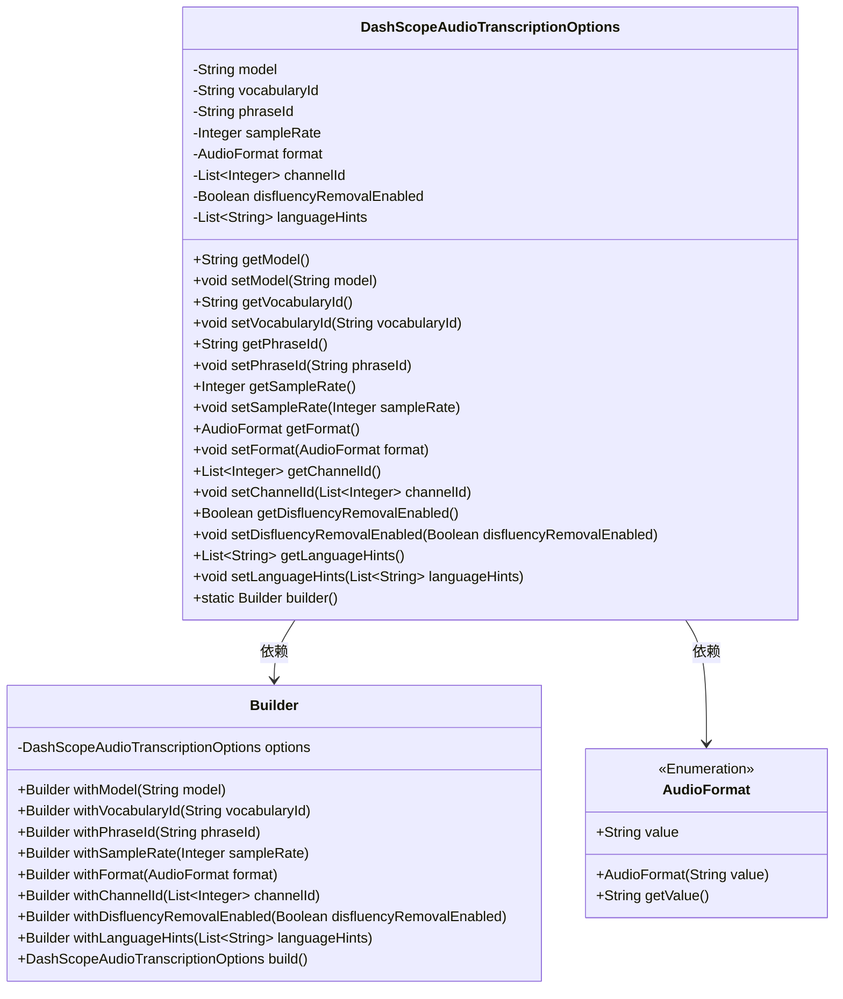

# 基础信息

|      |      |
|------|------|
| 名称 | DashScopeAudioTranscriptionOptions |
| 编码语言 | .java |
| 代码路径 | spring-ai-alibaba/spring-ai-alibaba-core/src/main/java/com/alibaba/cloud/ai/dashscope/audio/DashScopeAudioTranscriptionOptions.java |
| 包名 | com.alibaba.cloud.ai.dashscope.audio |
| 依赖项 | ['java.util.List', 'com.fasterxml.jackson.annotation.JsonProperty', 'org.springframework.ai.audio.transcription.AudioTranscriptionOptions'] |
| 概述说明 | DashScope音频转录类提供模型、词汇、短语、采样率、格式、声道和语言提示等配置选项。 |

# 说明

DashScope音频转录选项类提供了一系列配置参数，用于控制音频转录的各个方面。这些参数包括模型选择、词汇ID、短语ID、采样率、音频格式、声道ID以及语言提示等。通过这些配置，用户可以精确调整转录过程，以适应不同的音频文件特性和语言需求，确保转录结果的准确性和适用性。

# 类列表 Class Summary

| 名称   | 类型  | 说明 |
|-------|------|-------------|
| DashScopeAudioTranscriptionOptions | class | DashScope音频转录选项类，包含模型、词汇ID、短语ID、采样率、格式、声道ID、语言提示等配置。 |

## 类 DashScopeAudioTranscriptionOptions

|      |      |
|------|------|
| 访问范围 | public |
| 类型 | class |
| 名称 | DashScopeAudioTranscriptionOptions |
| 说明 | DashScope音频转录选项类，包含模型、词汇ID、短语ID、采样率、格式、声道ID、语言提示等配置。 |

### UML类图

这段代码定义了一个名为 `DashScopeAudioTranscriptionOptions` 的类，用于配置音频转录的选项。该类包含多个私有字段，如模型名称、词汇表ID、短语ID等，并提供了相应的getter和setter方法。此外，该类还包含一个内部类 `Builder`，用于通过链式调用的方式构建 `DashScopeAudioTranscriptionOptions` 对象。`AudioFormat` 是一个枚举类，用于表示音频格式。类图展示了这些类之间的关系，特别是 `DashScopeAudioTranscriptionOptions` 对 `Builder` 和 `AudioFormat` 的依赖关系。

### 内部方法调用关系图

```mermaid
graph TD
    A["类DashScopeAudioTranscriptionOptions"]
    B["属性: String model"]
    C["属性: String vocabularyId"]
    D["属性: String phraseId"]
    E["属性: Integer sampleRate"]
    F["属性: AudioFormat format"]
    G["属性: List<Integer> channelId"]
    H["属性: Boolean disfluencyRemovalEnabled"]
    I["属性: List<String> languageHints"]
    J["方法: String getModel()"]
    K["方法: void setModel(String model)"]
    L["方法: String getVocabularyId()"]
    M["方法: void setVocabularyId(String vocabularyId)"]
    N["方法: String getPhraseId()"]
    O["方法: Integer getSampleRate()"]
    P["方法: void setSampleRate(Integer sampleRate)"]
    Q["方法: AudioFormat getFormat()"]
    R["方法: void setFormat(AudioFormat format)"]
    S["方法: void setPhraseId(String phraseId)"]
    T["方法: List<Integer> getChannelId()"]
    U["方法: void setChannelId(List<Integer> channelId)"]
    V["方法: Boolean getDisfluencyRemovalEnabled()"]
    W["方法: void setDisfluencyRemovalEnabled(Boolean disfluencyRemovalEnabled)"]
    X["方法: List<String> getLanguageHints()"]
    Y["方法: void setLanguageHints(List<String> languageHints)"]
    Z["方法: static Builder builder()"]
    AA["内部类Builder"]
    AB["属性: DashScopeAudioTranscriptionOptions options"]
    AC["方法: Builder withModel(String model)"]
    AD["方法: Builder withVocabularyId(String vocabularyId)"]
    AE["方法: Builder withPhraseId(String phraseId)"]
    AF["方法: Builder withSampleRate(Integer sampleRate)"]
    AG["方法: Builder withFormat(AudioFormat format)"]
    AH["方法: Builder withChannelId(List<Integer> channelId)"]
    AI["方法: Builder withDisfluencyRemovalEnabled(Boolean disfluencyRemovalEnabled)"]
    AJ["方法: Builder withLanguageHints(List<String> languageHints)"]
    AK["方法: DashScopeAudioTranscriptionOptions build()"]
    AL["枚举类AudioFormat"]
    AM["枚举值: PCM, WAV, MP3, OPUS, SPEEX, AAC, AMR"]
    AN["方法: String getValue()"]

    A --> B
    A --> C
    A --> D
    A --> E
    A --> F
    A --> G
    A --> H
    A --> I
    A --> J
    A --> K
    A --> L
    A --> M
    A --> N
    A --> O
    A --> P
    A --> Q
    A --> R
    A --> S
    A --> T
    A --> U
    A --> V
    A --> W
    A --> X
    A --> Y
    A --> Z
    Z --> AA
    AA --> AB
    AA --> AC
    AA --> AD
    AA --> AE
    AA --> AF
    AA --> AG
    AA --> AH
    AA --> AI
    AA --> AJ
    AA --> AK
    A -.-> AL
    AL --> AM
    AL --> AN
```

**描述：**  
该代码定义了一个名为`DashScopeAudioTranscriptionOptions`的类，用于配置音频转录选项。类中包含多个属性，如`model`、`vocabularyId`、`phraseId`等，以及相应的getter和setter方法。此外，类中还包含一个内部类`Builder`，用于构建`DashScopeAudioTranscriptionOptions`对象，并提供了多个`with`方法来设置属性。最后，代码定义了一个枚举类`AudioFormat`，表示音频格式，并提供了获取枚举值的方法。

### 字段列表 Field List

| 名称  | 类型  | 说明 |
|-------|-------|------|
| model = "paraformer-v2" | String | 模型属性为paraformer-v2。 |
| vocabularyId | String | 属性vocabularyId使用JsonProperty注解映射为vocabulary_id。 |
| phraseId | String | 属性phraseId使用JsonProperty注解映射JSON字段。 |
| format | AudioFormat | 定义音频格式的私有变量，使用JsonProperty注解。 |
| sampleRate | Integer | 属性sampleRate用于表示采样率，类型为Integer。 |
| disfluencyRemovalEnabled = false | Boolean | 属性disfluencyRemovalEnabled默认值为false，用于控制流畅性移除功能。 |
| languageHints = List.of("zh", "en") | List<String> | 属性languageHints包含语言提示列表，默认值为中文和英文。 |
| channelId = List.of(0) | List<Integer> | 定义私有列表channelId，初始值为0，使用JsonProperty注解映射为channel_id。 |

### 方法列表 Method List

| 名称  | 类型  | 说明 |
|-------|-------|------|
| getDisfluencyRemovalEnabled | Boolean | 该方法返回布尔值，表示是否启用了不流畅移除功能。 |
| setDisfluencyRemovalEnabled | void | 设置流畅度移除功能的启用状态。 |
| getModel | String | 重写getModel方法，返回模型字符串。 |
| getFormat | AudioFormat | 获取音频格式的方法。 |
| setPhraseId | void | 设置短语ID的方法。 |
| setModel | void | 设置模型属性的方法。 |
| getLanguageHints | List<String> | 获取语言提示列表的方法。 |
| builder | Builder | 静态方法`builder()`返回一个新的`Builder`实例。 |
| getVocabularyId | String | 返回词汇ID的字符串方法。 |
| setFormat | void | 设置音频格式的方法。 |
| getChannelId | List<Integer> | 获取频道ID列表的方法。 |
| getPhraseId | String | 获取phraseId的公共方法。 |
| setVocabularyId | void | 设置词汇ID的方法，将传入的字符串赋值给类成员变量。 |
| setLanguageHints | void | 设置语言提示列表的方法。 |
| getSampleRate | Integer | 获取采样率的方法，返回整数类型的采样率值。 |
| setChannelId | void | 设置通道ID列表的方法。 |
| setSampleRate | void | 设置采样率的方法，将传入的sampleRate赋值给当前对象的sampleRate属性。 |

