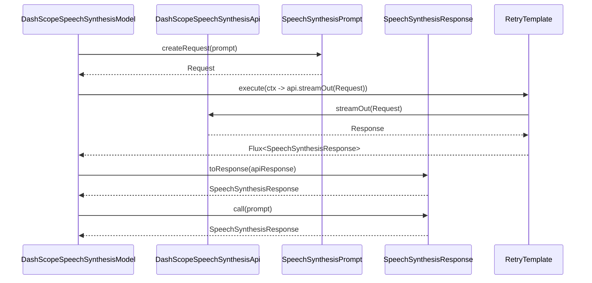

# 基础信息

|      |      |
|------|------|
| 名称 | DashScopeSpeechSynthesisModel |
| 编码语言 | .java |
| 代码路径 | spring-ai-alibaba/spring-ai-alibaba-core/src/main/java/com/alibaba/cloud/ai/dashscope/audio/DashScopeSpeechSynthesisModel.java |
| 包名 | com.alibaba.cloud.ai.dashscope.audio |
| 依赖项 | ['com.alibaba.cloud.ai.dashscope.api.DashScopeSpeechSynthesisApi', 'com.alibaba.cloud.ai.dashscope.audio.synthesis', 'org.slf4j.Logger', 'org.slf4j.LoggerFactory', 'org.springframework.ai.model.ModelOptionsUtils', 'org.springframework.ai.retry.RetryUtils', 'org.springframework.retry.support.RetryTemplate', 'reactor.core.publisher.Flux', 'java.nio.ByteBuffer', 'java.util.UUID'] |
| 概述说明 | DashScope语音合成模型类支持流式处理和重试机制。 |

# 说明

DashScope语音合成模型类是一个实现语音合成接口的工具，支持流式处理和重试机制。该模型类能够高效地将文本转换为语音，适用于需要实时语音输出的场景。流式处理功能允许在数据生成过程中逐步输出语音，提高响应速度。重试机制确保在出现网络波动或其他临时故障时，系统能够自动重试，增强鲁棒性。该模型类设计灵活，适用于多种应用场景，如语音助手、语音播报等。

# 类列表 Class Summary

| 名称   | 类型  | 说明 |
|-------|------|-------------|
| DashScopeSpeechSynthesisModel | class | DashScope语音合成模型类，实现语音合成接口，支持流式处理和重试机制。 |

## 类 DashScopeSpeechSynthesisModel

|      |      |
|------|------|
| 访问范围 | public |
| 类型 | class |
| 名称 | DashScopeSpeechSynthesisModel |
| 说明 | DashScope语音合成模型类，实现语音合成接口，支持流式处理和重试机制。 |

### UML类图

```mermaid
classDiagram
    class DashScopeSpeechSynthesisModel {
        -Logger logger
        -DashScopeSpeechSynthesisApi api
        -DashScopeSpeechSynthesisOptions options
        -RetryTemplate retryTemplate
        +DashScopeSpeechSynthesisModel(DashScopeSpeechSynthesisApi api)
        +DashScopeSpeechSynthesisModel(DashScopeSpeechSynthesisApi api, DashScopeSpeechSynthesisOptions options)
        +DashScopeSpeechSynthesisModel(DashScopeSpeechSynthesisApi api, DashScopeSpeechSynthesisOptions options, RetryTemplate retryTemplate)
        +SpeechSynthesisResponse call(SpeechSynthesisPrompt prompt)
        +Flux~SpeechSynthesisResponse~ stream(SpeechSynthesisPrompt prompt)
        +DashScopeSpeechSynthesisApi.Request createRequest(SpeechSynthesisPrompt prompt)
        -SpeechSynthesisResponse toResponse(DashScopeSpeechSynthesisApi.Response apiResponse)
    }

    class DashScopeSpeechSynthesisApi {
        <<Interface>>
        +Flux~SpeechSynthesisOutput~ streamOut(DashScopeSpeechSynthesisApi.Request request)
    }

    class DashScopeSpeechSynthesisOptions {
        +String model
        +int volume
        +String requestTextType
        +String voice
        +int sampleRate
        +int speed
        +String responseFormat
        +int pitch
        +boolean enablePhonemeTimestamp
        +boolean enableWordTimestamp
        +static Builder builder()
    }

    class RetryTemplate {
        +execute(RetryCallback~T, E~ retryCallback)
    }

    class SpeechSynthesisPrompt {
        +List~Instruction~ getInstructions()
        +SpeechSynthesisOptions getOptions()
    }

    class SpeechSynthesisResponse {
        +SpeechSynthesisResult getResult()
    }

    class SpeechSynthesisResult {
        +SpeechSynthesisOutput getOutput()
    }

    class SpeechSynthesisOutput {
        +ByteBuffer getAudio()
    }

    class Instruction {
        +String getText()
    }

    class SpeechSynthesisOptions {
        <<Interface>>
    }

    DashScopeSpeechSynthesisModel --> DashScopeSpeechSynthesisApi : 依赖
    DashScopeSpeechSynthesisModel --> DashScopeSpeechSynthesisOptions : 依赖
    DashScopeSpeechSynthesisModel --> RetryTemplate : 依赖
    DashScopeSpeechSynthesisModel --> SpeechSynthesisPrompt : 依赖
    DashScopeSpeechSynthesisModel --> SpeechSynthesisResponse : 依赖
    DashScopeSpeechSynthesisModel --> SpeechSynthesisResult : 依赖
    DashScopeSpeechSynthesisModel --> SpeechSynthesisOutput : 依赖
    DashScopeSpeechSynthesisModel --> Instruction : 依赖
    DashScopeSpeechSynthesisModel --> SpeechSynthesisOptions : 依赖
```

**描述**：`DashScopeSpeechSynthesisModel` 类实现了 `SpeechSynthesisModel` 接口，用于处理语音合成任务。它依赖于 `DashScopeSpeechSynthesisApi` 进行 API 调用，使用 `DashScopeSpeechSynthesisOptions` 配置合成参数，并通过 `RetryTemplate` 实现重试机制。该类提供了 `call` 和 `stream` 方法来执行语音合成，并生成 `SpeechSynthesisResponse` 响应。整个过程涉及多个辅助类，如 `SpeechSynthesisPrompt`、`SpeechSynthesisResult` 和 `SpeechSynthesisOutput`，用于封装输入、输出和结果数据。

### 内部方法调用关系图

```mermaid
graph TD
    A["类DashScopeSpeechSynthesisModel"]
    B["属性: Logger logger"]
    C["属性: DashScopeSpeechSynthesisApi api"]
    D["属性: DashScopeSpeechSynthesisOptions options"]
    E["属性: RetryTemplate retryTemplate"]
    F["构造方法: DashScopeSpeechSynthesisModel(DashScopeSpeechSynthesisApi api)"]
    G["构造方法: DashScopeSpeechSynthesisModel(DashScopeSpeechSynthesisApi api, DashScopeSpeechSynthesisOptions options)"]
    H["构造方法: DashScopeSpeechSynthesisModel(DashScopeSpeechSynthesisApi api, DashScopeSpeechSynthesisOptions options, RetryTemplate retryTemplate)"]
    I["方法: SpeechSynthesisResponse call(SpeechSynthesisPrompt prompt)"]
    J["方法: Flux<SpeechSynthesisResponse> stream(SpeechSynthesisPrompt prompt)"]
    K["方法: DashScopeSpeechSynthesisApi.Request createRequest(SpeechSynthesisPrompt prompt)"]
    L["方法: SpeechSynthesisResponse toResponse(DashScopeSpeechSynthesisApi.Response apiResponse)"]

    A --> B
    A --> C
    A --> D
    A --> E
    A --> F
    A --> G
    A --> H
    A --> I
    A --> J
    A --> K
    A --> L
```

**描述：**
`DashScopeSpeechSynthesisModel` 类用于处理语音合成任务，通过调用 `DashScopeSpeechSynthesisApi` 进行语音合成。类中包含多个构造方法，用于初始化不同的配置选项和重试模板。`call` 方法用于执行语音合成请求并返回响应，`stream` 方法则返回一个响应流。`createRequest` 方法用于创建请求对象，`toResponse` 方法将 API 响应转换为语音合成响应。整个流程通过重试模板确保请求的可靠性。

### 字段列表 Field List

| 名称  | 类型  | 说明 |
|-------|-------|------|
| retryTemplate | RetryTemplate | 私有且不可变的RetryTemplate实例。 |
| api | DashScopeSpeechSynthesisApi | 私有且不可变的DashScope语音合成API实例。 |
| options | DashScopeSpeechSynthesisOptions | 私有且不可变的DashScope语音合成选项对象。 |
| logger = LoggerFactory.getLogger(DashScopeSpeechSynthesisModel.class) | Logger | DashScopeSpeechSynthesisModel类中定义了一个私有的静态日志记录器。 |

### 方法列表 Method List

| 名称  | 类型  | 说明 |
|-------|-------|------|
| call | SpeechSynthesisResponse | 重写方法合并语音合成响应流并返回结果。 |
| stream | Flux<SpeechSynthesisResponse> | 重写方法stream，使用retryTemplate执行API流输出，生成语音合成响应。 |
| toResponse | SpeechSynthesisResponse | 将DashScope语音合成API响应转换为私有SpeechSynthesisResponse对象。 |
| createRequest | DashScopeSpeechSynthesisApi.Request | 创建语音合成请求，合并选项并生成请求头和有效载荷。 |

