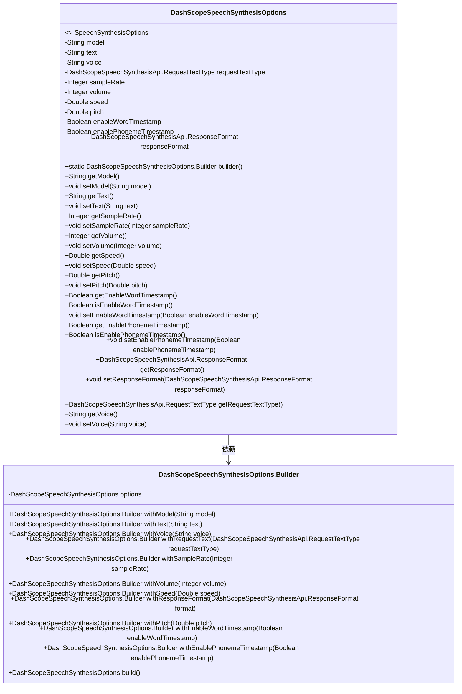

# 基础信息

|      |      |
|------|------|
| 名称 | DashScopeSpeechSynthesisOptions |
| 编码语言 | .java |
| 代码路径 | spring-ai-alibaba/spring-ai-alibaba-core/src/main/java/com/alibaba/cloud/ai/dashscope/audio/DashScopeSpeechSynthesisOptions.java |
| 包名 | com.alibaba.cloud.ai.dashscope.audio |
| 依赖项 | ['com.alibaba.cloud.ai.dashscope.api.DashScopeSpeechSynthesisApi', 'com.alibaba.cloud.ai.dashscope.audio.synthesis.SpeechSynthesisOptions', 'com.fasterxml.jackson.annotation.JsonInclude', 'com.fasterxml.jackson.annotation.JsonProperty'] |
| 概述说明 | DashScope语音合成类提供模型、文本、音量、语速等配置参数。 |

# 说明

DashScope语音合成选项类是一个用于配置语音合成功能的类，包含多个关键参数。这些参数包括模型选择，用于指定使用的语音合成模型；文本输入，用于提供需要合成的文本内容；音量调节，用于控制合成语音的音量大小；语速设置，用于调整合成语音的播放速度。通过这些参数，用户可以灵活地定制语音合成的输出效果，以满足不同的应用需求。

# 类列表 Class Summary

| 名称   | 类型  | 说明 |
|-------|------|-------------|
| DashScopeSpeechSynthesisOptions | class | DashScope语音合成选项类，包含模型、文本、音量、语速等参数。 |

## 类 DashScopeSpeechSynthesisOptions

|      |      |
|------|------|
| 访问范围 | @JsonInclude(JsonInclude.Include.NON_NULL);public |
| 类型 | class |
| 名称 | DashScopeSpeechSynthesisOptions |
| 说明 | DashScope语音合成选项类，包含模型、文本、音量、语速等参数。 |

### UML类图

**描述：**
`DashScopeSpeechSynthesisOptions` 类实现了 `SpeechSynthesisOptions` 接口，用于配置语音合成的各项参数，如音频模型、文本内容、音频采样率、音量、语速等。该类还包含一个内部 `Builder` 类，用于通过链式调用构建 `DashScopeSpeechSynthesisOptions` 对象。`Builder` 类提供了多个 `with` 方法，用于设置不同的参数，并最终通过 `build` 方法返回配置好的 `DashScopeSpeechSynthesisOptions` 实例。

### 内部方法调用关系图

```mermaid
graph TD
    A["类DashScopeSpeechSynthesisOptions"]
    B["属性: String model"]
    C["属性: String text"]
    D["属性: String voice"]
    E["属性: DashScopeSpeechSynthesisApi.RequestTextType requestTextType"]
    F["属性: Integer sampleRate"]
    G["属性: Integer volume"]
    H["属性: Double speed"]
    I["属性: Double pitch"]
    J["属性: Boolean enableWordTimestamp"]
    K["属性: Boolean enablePhonemeTimestamp"]
    L["属性: DashScopeSpeechSynthesisApi.ResponseFormat responseFormat"]
    M["方法: builder()"]
    N["方法: getModel()"]
    O["方法: setModel(String model)"]
    P["方法: getText()"]
    Q["方法: setText(String text)"]
    R["方法: getSampleRate()"]
    S["方法: setSampleRate(Integer sampleRate)"]
    T["方法: getVolume()"]
    U["方法: setVolume(Integer volume)"]
    V["方法: getSpeed()"]
    W["方法: setSpeed(Double speed)"]
    X["方法: getPitch()"]
    Y["方法: setPitch(Double pitch)"]
    Z["方法: getEnableWordTimestamp()"]
    AA["方法: isEnableWordTimestamp()"]
    AB["方法: setEnableWordTimestamp(Boolean enableWordTimestamp)"]
    AC["方法: getEnablePhonemeTimestamp()"]
    AD["方法: isEnablePhonemeTimestamp()"]
    AE["方法: setEnablePhonemeTimestamp(Boolean enablePhonemeTimestamp)"]
    AF["方法: getResponseFormat()"]
    AG["方法: setResponseFormat(DashScopeSpeechSynthesisApi.ResponseFormat responseFormat)"]
    AH["方法: getRequestTextType()"]
    AI["方法: getVoice()"]
    AJ["方法: setVoice(String voice)"]
    AK["类Builder"]
    AL["属性: DashScopeSpeechSynthesisOptions options"]
    AM["方法: withModel(String model)"]
    AN["方法: withText(String text)"]
    AO["方法: withVoice(String voice)"]
    AP["方法: withRequestText(DashScopeSpeechSynthesisApi.RequestTextType requestTextType)"]
    AQ["方法: withSampleRate(Integer sampleRate)"]
    AR["方法: withVolume(Integer volume)"]
    AS["方法: withSpeed(Double speed)"]
    AT["方法: withResponseFormat(DashScopeSpeechSynthesisApi.ResponseFormat format)"]
    AU["方法: withPitch(Double pitch)"]
    AV["方法: withEnableWordTimestamp(Boolean enableWordTimestamp)"]
    AW["方法: withEnablePhonemeTimestamp(Boolean enablePhonemeTimestamp)"]
    AX["方法: build()"]

    A --> B
    A --> C
    A --> D
    A --> E
    A --> F
    A --> G
    A --> H
    A --> I
    A --> J
    A --> K
    A --> L
    A --> M
    A --> N
    A --> O
    A --> P
    A --> Q
    A --> R
    A --> S
    A --> T
    A --> U
    A --> V
    A --> W
    A --> X
    A --> Y
    A --> Z
    A --> AA
    A --> AB
    A --> AC
    A --> AD
    A --> AE
    A --> AF
    A --> AG
    A --> AH
    A --> AI
    A --> AJ
    A -.-> AK
    AK --> AL
    AK --> AM
    AK --> AN
    AK --> AO
    AK --> AP
    AK --> AQ
    AK --> AR
    AK --> AS
    AK --> AT
    AK --> AU
    AK --> AV
    AK --> AW
    AK --> AX
```

这段代码定义了一个`DashScopeSpeechSynthesisOptions`类，用于配置语音合成的各种参数，如音频模型、文本内容、音调、速度等。类中包含多个属性和对应的getter/setter方法，以及一个内部类`Builder`用于构建`DashScopeSpeechSynthesisOptions`实例。`Builder`类提供了链式调用的方法来设置各个属性，并最终通过`build()`方法返回配置好的实例。

### 字段列表 Field List

| 名称  | 类型  | 说明 |
|-------|-------|------|
| model | String | JSON属性"model"映射到私有字符串变量model。 |
| pitch = 1.0 | Double | JSON属性"pitch"默认值为1.0。 |
| requestTextType = DashScopeSpeechSynthesisApi.RequestTextType.PLAIN_TEXT | DashScopeSpeechSynthesisApi.RequestTextType | 属性requestTextType默认设置为PLAIN_TEXT类型。 |
| responseFormat = DashScopeSpeechSynthesisApi.ResponseFormat.MP3 | DashScopeSpeechSynthesisApi.ResponseFormat | 属性responseFormat默认值为MP3格式。 |
| enableWordTimestamp = false | Boolean | 启用单词时间戳功能，默认关闭。 |
| voice = null | String | 定义私有字符串变量voice，初始值为null。 |
| enablePhonemeTimestamp = false | Boolean | 启用音素时间戳的布尔类型属性，默认值为false。 |
| sampleRate = 48000 | Integer | JSON属性"sample_rate"对应私有整型变量sampleRate，默认值为48000。 |
| text | String | 定义私有字符串变量text，使用JsonProperty注解。 |
| volume = 50 | Integer | 类中定义了一个名为volume的私有整型变量，默认值为50。 |
| speed = 1.0 | Double | 代码定义了一个名为speed的私有变量，类型为Double，默认值为1.0。 |

### 方法列表 Method List

| 名称  | 类型  | 说明 |
|-------|-------|------|
| getVolume | Integer | 获取整数类型的音量值。 |
| getRequestTextType | DashScopeSpeechSynthesisApi.RequestTextType | 获取请求文本类型的方法。 |
| setModel | void | 设置模型属性的方法。 |
| getSpeed | Double | 该方法返回速度值。 |
| setVoice | void | 设置声音属性的方法。 |
| getText | String | 方法返回字符串类型变量text。 |
| getVoice | String | 获取声音属性的方法。 |
| setEnableWordTimestamp | void | 设置单词时间戳启用状态的方法。 |
| getPitch | Double | 该方法返回双精度类型的pitch值。 |
| setPitch | void | 设置音高值的方法。 |
| builder | DashScopeSpeechSynthesisOptions.Builder | 静态方法返回DashScope语音合成选项构建器实例。 |
| getResponseFormat | DashScopeSpeechSynthesisApi.ResponseFormat | 获取DashScopeSpeechSynthesisApi的响应格式方法。 |
| isEnableWordTimestamp | Boolean | 检查并返回是否启用单词时间戳。 |
| setResponseFormat | void | 设置语音合成API的响应格式。 |
| getModel | String | 方法getModel返回model字符串。 |
| setVolume | void | 设置音量的方法，接收整数参数并赋值给内部变量。 |
| setText | void | 该方法用于设置文本属性。 |
| setSpeed | void | 设置速度的Java方法，接受双精度浮点数参数。 |
| isEnablePhonemeTimestamp | Boolean | 检查并返回音素时间戳是否启用的布尔值。 |
| setEnablePhonemeTimestamp | void | 设置音素时间戳启用状态的方法。 |
| setSampleRate | void | 设置采样率的方法，将输入值赋给类的采样率属性。 |
| getEnableWordTimestamp | Boolean | 方法返回布尔值，表示是否启用单词时间戳。 |
| getSampleRate | Integer | 获取采样率的方法，返回整型值sampleRate。 |
| getEnablePhonemeTimestamp | Boolean | 返回音素时间戳启用状态。 |

