# 基础信息

|      |      |
|------|------|
| 名称 | audio |
| 编码语言 | .java |
| 代码路径 | spring-ai-alibaba/spring-ai-alibaba-core/src/main/java/com/alibaba/cloud/ai/dashscope/audio |
| 包名 | spring-ai-alibaba.spring-ai-alibaba-core.src.main.java.com.alibaba.cloud.ai.dashscope.audio |
| 概述说明 | DashScope提供语音合成和音频转录功能，支持模型选择、音量调节、流式处理和重试机制，满足多样化应用需求。 |

# 说明

## 概述
该代码模块主要围绕语音合成和音频转录功能展开，提供了从文本输入到音频输出的完整处理流程，以及音频转录的异步处理和实时流处理能力。模块中的各个类分别负责不同的功能，包括语音合成的配置、音频转录的模型实现、结果封装与元数据处理等。通过这些类的协作，开发者可以方便地实现语音合成和音频转录功能，并高效地管理和操作生成的音频数据。

## 主要业务场景
1. **语音合成配置**：`DashScopeSpeechSynthesisOptions`类用于配置语音合成功能，支持模型选择、文本输入、音量调节和语速设置等参数，用户可以根据需求灵活定制语音合成的输出效果。
2. **语音合成模型实现**：`DashScopeSpeechSynthesisModel`类实现了语音合成接口，支持流式处理和重试机制，能够高效地将文本转换为语音，适用于需要实时语音输出的场景。
3. **音频转录模型实现**：`DashScopeAudioTranscriptionModel`类支持异步调用、任务获取、实时流处理及响应转换功能，能够处理大规模音频数据并生成转录文本，满足多样化的应用需求。
4. **音频转录配置**：`DashScopeAudioTranscriptionOptions`类提供了一系列配置参数，包括模型选择、词汇ID、短语ID、采样率、音频格式、声道ID以及语言提示等，用户可以根据音频文件特性和语言需求精确调整转录过程。
5. **结果封装与元数据处理**：`SpeechSynthesisResult`、`SpeechSynthesisResultMetadata`和`SpeechSynthesisResponseMetadata`等类用于封装语音合成和音频转录的结果及其元数据，提供结构化的数据存储和管理方式，支持对结果的状态和质量进行验证。

通过这些类的协作，该模块能够高效地处理语音合成和音频转录的各个环节，为开发者提供了一套完整的语音处理和转录解决方案。

### 包内部结构视图

```mermaid
graph TD
    audio --> DashScopeSpeechSynthesisOptions.java
    audio --> DashScopeAudioTranscriptionModel.java
    audio --> DashScopeSpeechSynthesisModel.java
    audio --> transcription
    audio --> DashScopeAudioTranscriptionOptions.java
    audio --> synthesis
    transcription --> AudioTranscriptionModel.java
    synthesis --> SpeechSynthesisOutput.java
    synthesis --> SpeechSynthesisPrompt.java
    synthesis --> SpeechSynthesisResult.java
    synthesis --> SpeechSynthesisMessage.java
    synthesis --> SpeechSynthesisOptions.java
    synthesis --> SpeechSynthesisResultMetadata.java
    synthesis --> SpeechSynthesisResponseMetadata.java
    synthesis --> SpeechSynthesisModel.java
    synthesis --> SpeechSynthesisResponse.java
```

该流程图展示了`audio`目录下的文件与子目录的层级关系。`audio`目录下包含多个Java文件以及两个子目录`transcription`和`synthesis`。`transcription`目录下有一个Java文件，而`synthesis`目录下则有多个与语音合成相关的Java文件。

# 文件列表 File List

| 名称   | 类型  | 说明 |
|-------|------|-------------|
| [DashScopeAudioTranscriptionOptions.java](DashScopeAudioTranscriptionOptions.md) | file | DashScope音频转录类提供模型、词汇、短语、采样率、格式、声道和语言提示等配置选项。 |
| [DashScopeSpeechSynthesisOptions.java](DashScopeSpeechSynthesisOptions.md) | file | DashScope语音合成类提供模型、文本、音量、语速等配置参数。 |
| [DashScopeSpeechSynthesisModel.java](DashScopeSpeechSynthesisModel.md) | file | DashScope语音合成模型类支持流式处理和重试机制。 |
| [DashScopeAudioTranscriptionModel.java](DashScopeAudioTranscriptionModel.md) | file | DashScope音频转录模型支持异步调用、任务获取、实时流处理和响应转换。 |
| [synthesis](synthesis/_module.md) | package | SpeechSynthesis类族管理语音合成数据，涵盖初始化、文本封装、结果存储及元数据处理，支持多样化语音合成需求。 |
| [transcription](transcription/_module.md) | package | 信息为空，无法生成概要描述。 |

