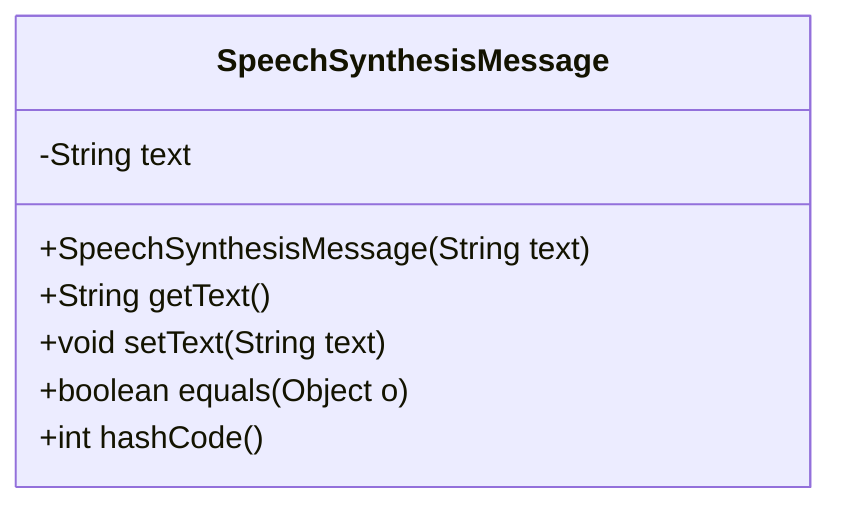
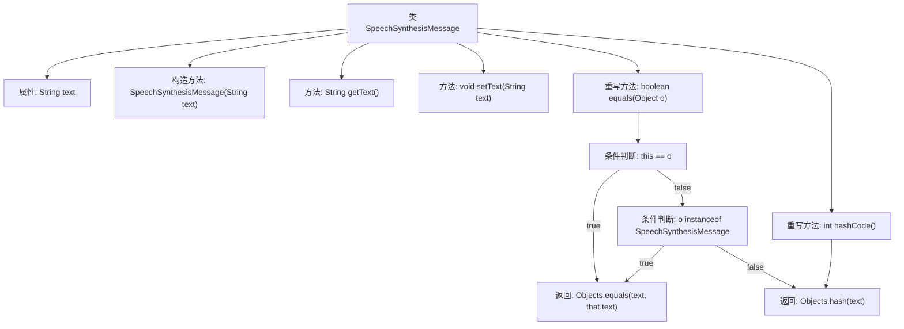

# 基础信息

|      |      |
|------|------|
| 名称 | SpeechSynthesisMessage |
| 编码语言 | .java |
| 代码路径 | spring-ai-alibaba/spring-ai-alibaba-core/src/main/java/com/alibaba/cloud/ai/dashscope/audio/synthesis/SpeechSynthesisMessage.java |
| 包名 | com.alibaba.cloud.ai.dashscope.audio.synthesis |
| 依赖项 | ['java.util.Objects'] |
| 概述说明 | SpeechSynthesisMessage类封装文本，支持构造、获取、设置及相等性检查。 |

# 说明

SpeechSynthesisMessage类是一个用于封装文本的类，提供了多种功能以方便操作和管理文本数据。该类支持文本的构造，允许用户创建新的文本实例。此外，它还提供了获取文本内容的功能，使用户能够读取已封装的文本。同时，用户可以通过该类设置或修改文本内容，以满足不同的需求。最后，该类还具备相等性检查功能，用于比较两个文本实例是否相同，确保在处理文本时能够进行有效的比较和验证。通过这些功能，SpeechSynthesisMessage类为文本操作提供了全面的支持。

# 类列表 Class Summary

| 名称   | 类型  | 说明 |
|-------|------|-------------|
| SpeechSynthesisMessage | class | SpeechSynthesisMessage类封装文本，提供构造、获取、设置及相等性检查功能。 |

## 类 SpeechSynthesisMessage

|      |      |
|------|------|
| 访问范围 | public |
| 类型 | class |
| 名称 | SpeechSynthesisMessage |
| 说明 | SpeechSynthesisMessage类封装文本，提供构造、获取、设置及相等性检查功能。 |

### UML类图

这段代码定义了一个 `SpeechSynthesisMessage` 类，用于封装需要转换为语音的文本信息。类中包含一个私有字符串类型的 `text` 属性，表示要转换为语音的文本。类提供了构造方法用于初始化 `text`，以及 `getText` 和 `setText` 方法用于获取和设置 `text`。此外，类还重写了 `equals` 和 `hashCode` 方法，以确保对象在比较和哈希计算时能够正确处理 `text` 属性。

### 内部方法调用关系图

这段代码定义了一个名为 `SpeechSynthesisMessage` 的类，用于处理语音合成消息。类中包含一个私有属性 `text`，用于存储要转换为语音的文本。类提供了构造方法、获取和设置文本的方法，并重写了 `equals` 和 `hashCode` 方法以确保对象的相等性和哈希值计算正确。`equals` 方法通过比较当前对象与传入对象的 `text` 属性来判断是否相等，而 `hashCode` 方法则基于 `text` 属性生成哈希值。

### 字段列表 Field List

| 名称  | 类型  | 说明 |
|-------|-------|------|
| text | String | 定义一个私有的字符串类型变量text。 |

### 方法列表 Method List

| 名称  | 类型  | 说明 |
|-------|-------|------|
| getText | String | 该方法返回字符串类型的变量text。 |
| hashCode | int | 重写hashCode方法，使用text字段生成哈希值。 |
| equals | boolean | 重写equals方法，比较对象是否相同或文本内容是否一致。 |
| setText | void | 设置文本内容的方法。 |

