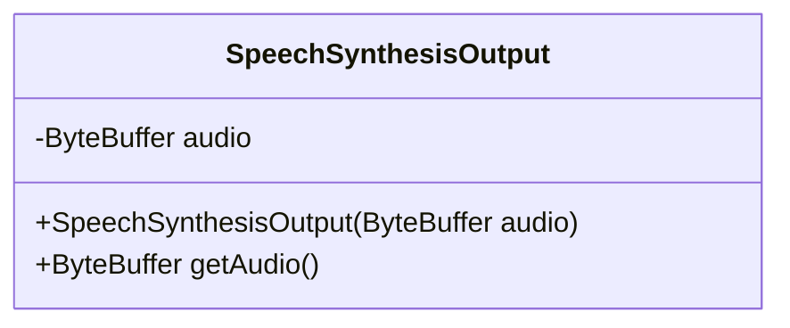
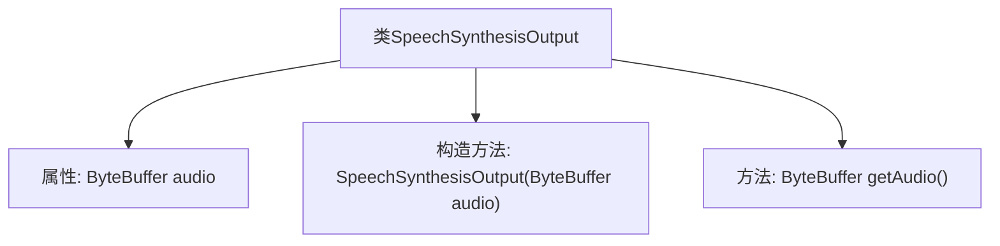

# 基础信息

|      |      |
|------|------|
| 名称 | SpeechSynthesisOutput |
| 编码语言 | .java |
| 代码路径 | spring-ai-alibaba/spring-ai-alibaba-core/src/main/java/com/alibaba/cloud/ai/dashscope/audio/synthesis/SpeechSynthesisOutput.java |
| 包名 | com.alibaba.cloud.ai.dashscope.audio.synthesis |
| 依赖项 | ['java.nio.ByteBuffer'] |
| 概述说明 | SpeechSynthesisOutput类管理音频数据，提供初始化与获取方法。 |

# 说明

SpeechSynthesisOutput类负责管理音频数据，其功能包括通过构造函数进行初始化，并提供专门的方法用于获取音频内容。该类设计用于处理和输出合成的音频数据，确保用户可以方便地访问和使用这些音频资源。

# 类列表 Class Summary

| 名称   | 类型  | 说明 |
|-------|------|-------------|
| SpeechSynthesisOutput | class | SpeechSynthesisOutput类包含音频数据，通过构造函数初始化并提供获取音频的方法。 |

## 类 SpeechSynthesisOutput

|      |      |
|------|------|
| 访问范围 | public |
| 类型 | class |
| 名称 | SpeechSynthesisOutput |
| 说明 | SpeechSynthesisOutput类包含音频数据，通过构造函数初始化并提供获取音频的方法。 |

### UML类图

这段代码定义了一个名为 `SpeechSynthesisOutput` 的类，用于封装语音合成的输出数据。该类包含一个私有的 `ByteBuffer` 类型的成员变量 `audio`，用于存储音频数据。类中提供了一个构造函数 `SpeechSynthesisOutput(ByteBuffer audio)`，用于初始化 `audio` 成员变量，并提供了一个公有方法 `getAudio()`，用于获取 `audio` 数据。该类的主要作用是封装和管理语音合成的输出数据，确保数据的封装性和安全性。

### 内部方法调用关系图

这段代码定义了一个名为 `SpeechSynthesisOutput` 的类，该类包含一个 `ByteBuffer` 类型的私有属性 `audio`。通过构造方法 `SpeechSynthesisOutput(ByteBuffer audio)` 初始化该属性，并通过 `getAudio()` 方法获取 `audio` 的值。代码结构简单，主要用于封装音频数据并提供访问接口。

### 字段列表 Field List

| 名称  | 类型  | 说明 |
|-------|-------|------|
| audio | ByteBuffer | 私有不可变的字节缓冲区存储音频数据。 |

### 方法列表 Method List

| 名称  | 类型  | 说明 |
|-------|-------|------|
| getAudio | ByteBuffer | 获取音频数据的ByteBuffer对象。 |

