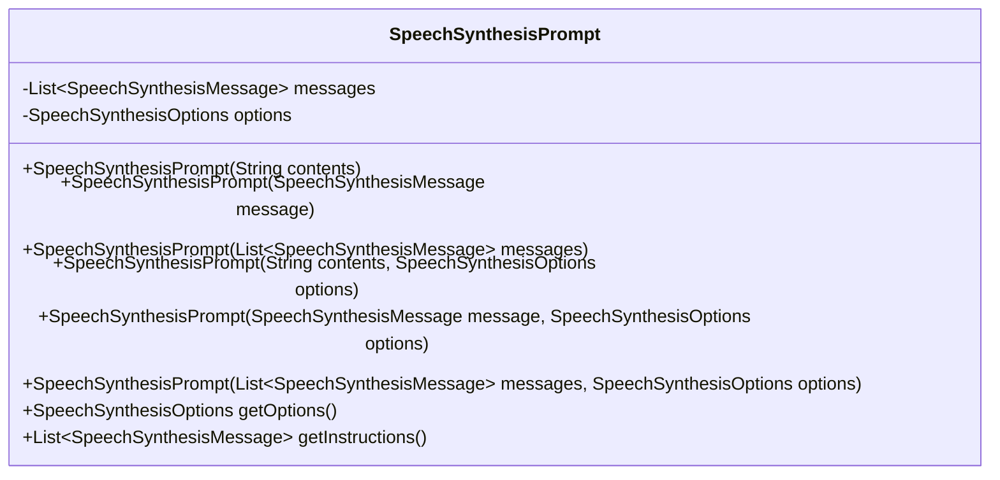

# 基础信息

|      |      |
|------|------|
| 名称 | SpeechSynthesisPrompt |
| 编码语言 | .java |
| 代码路径 | spring-ai-alibaba/spring-ai-alibaba-core/src/main/java/com/alibaba/cloud/ai/dashscope/audio/synthesis/SpeechSynthesisPrompt.java |
| 包名 | com.alibaba.cloud.ai.dashscope.audio.synthesis |
| 依赖项 | ['org.springframework.ai.model.ModelRequest', 'java.util.Collections', 'java.util.List'] |
| 概述说明 | SpeechSynthesisPrompt类用于语音合成，含消息列表和选项，支持多种构造。 |

# 说明

SpeechSynthesisPrompt类用于语音合成，包含消息列表和选项，支持多种构造方式。该类提供了灵活的方法来生成语音输出，能够处理不同的消息内容和配置选项，满足多样化的语音合成需求。

# 类列表 Class Summary

| 名称   | 类型  | 说明 |
|-------|------|-------------|
| SpeechSynthesisPrompt | class | SpeechSynthesisPrompt类用于合成语音，包含消息列表和选项，支持多种构造方式。 |

## 类 SpeechSynthesisPrompt

|      |      |
|------|------|
| 访问范围 | public |
| 类型 | class |
| 名称 | SpeechSynthesisPrompt |
| 说明 | SpeechSynthesisPrompt类用于合成语音，包含消息列表和选项，支持多种构造方式。 |

### UML类图

这段代码定义了一个名为 `SpeechSynthesisPrompt` 的类，该类用于封装语音合成请求。该类包含两个私有成员变量：`messages` 和 `options`，分别表示语音合成消息列表和语音合成选项。类中提供了多个构造函数，允许通过不同的方式初始化 `SpeechSynthesisPrompt` 对象。此外，类还提供了两个公有方法：`getOptions` 和 `getInstructions`，分别用于获取语音合成选项和语音合成消息列表。这些方法使得外部代码能够访问 `SpeechSynthesisPrompt` 对象的内部状态。

### 内部方法调用关系图

```mermaid
graph TD
    A["类SpeechSynthesisPrompt"]
    B["属性: List<SpeechSynthesisMessage> messages"]
    C["属性: SpeechSynthesisOptions options"]
    D["构造方法: SpeechSynthesisPrompt(String contents)"]
    E["构造方法: SpeechSynthesisPrompt(SpeechSynthesisMessage message)"]
    F["构造方法: SpeechSynthesisPrompt(List<SpeechSynthesisMessage> messages)"]
    G["构造方法: SpeechSynthesisPrompt(String contents, SpeechSynthesisOptions options)"]
    H["构造方法: SpeechSynthesisPrompt(SpeechSynthesisMessage message, SpeechSynthesisOptions options)"]
    I["构造方法: SpeechSynthesisPrompt(List<SpeechSynthesisMessage> messages, SpeechSynthesisOptions options)"]
    J["方法: SpeechSynthesisOptions getOptions()"]
    K["方法: List<SpeechSynthesisMessage> getInstructions()"]

    A --> B
    A --> C
    A --> D
    A --> E
    A --> F
    A --> G
    A --> H
    A --> I
    A --> J
    A --> K
```

该流程图展示了`SpeechSynthesisPrompt`类的结构，包括其属性和多个构造方法。每个构造方法通过不同的参数组合来初始化`messages`和`options`属性。类中还定义了两个方法`getOptions`和`getInstructions`，分别用于返回`options`和`messages`。通过这些构造方法，类可以灵活地处理不同类型的输入，并最终生成语音合成的提示信息。

### 字段列表 Field List

| 名称  | 类型  | 说明 |
|-------|-------|------|
| messages | List<SpeechSynthesisMessage> | 私有且不可变的语音合成消息列表。 |
| options | SpeechSynthesisOptions | 私有不可变的语音合成选项对象。 |

### 方法列表 Method List

| 名称  | 类型  | 说明 |
|-------|-------|------|
| getOptions | SpeechSynthesisOptions | 重写方法返回语音合成选项对象。 |
| getInstructions | List<SpeechSynthesisMessage> | 重写getInstructions方法，返回messages列表。 |

