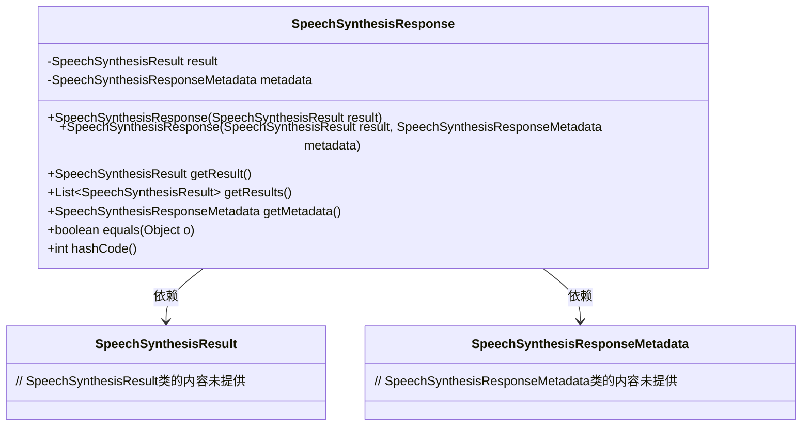
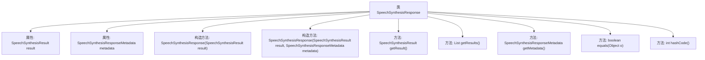

# 基础信息

|      |      |
|------|------|
| 名称 | SpeechSynthesisResponse |
| 编码语言 | .java |
| 代码路径 | spring-ai-alibaba/spring-ai-alibaba-core/src/main/java/com/alibaba/cloud/ai/dashscope/audio/synthesis/SpeechSynthesisResponse.java |
| 包名 | com.alibaba.cloud.ai.dashscope.audio.synthesis |
| 依赖项 | ['org.springframework.ai.model.ModelResponse', 'com.alibaba.cloud.ai.dashscope.audio.synthesis.SpeechSynthesisResult', 'com.alibaba.cloud.ai.dashscope.audio.synthesis.SpeechSynthesisResponseMetadata', 'java.util.Collections', 'java.util.List', 'java.util.Objects'] |
| 概述说明 | SpeechSynthesisResponse类封装合成结果和元数据，支持获取和比较功能。 |

# 说明

SpeechSynthesisResponse类是一个封装了语音合成结果及其元数据的类，它提供了获取合成结果和元数据的功能，同时还支持对合成结果进行比较操作。该类旨在简化对语音合成结果的处理和分析，使用户能够方便地访问和操作相关数据。

# 类列表 Class Summary

| 名称   | 类型  | 说明 |
|-------|------|-------------|
| SpeechSynthesisResponse | class | SpeechSynthesisResponse类封装合成结果和元数据，提供获取和比较功能。 |

## 类 SpeechSynthesisResponse

|      |      |
|------|------|
| 访问范围 | public |
| 类型 | class |
| 名称 | SpeechSynthesisResponse |
| 说明 | SpeechSynthesisResponse类封装合成结果和元数据，提供获取和比较功能。 |

### UML类图

这段代码定义了一个`SpeechSynthesisResponse`类，它实现了`ModelResponse<SpeechSynthesisResult>`接口。该类包含两个私有成员变量：`SpeechSynthesisResult`和`SpeechSynthesisResponseMetadata`，并提供了两个构造函数来初始化这些变量。类中还包含了获取结果、元数据、判断相等性和计算哈希值的方法。`SpeechSynthesisResponse`类依赖于`SpeechSynthesisResult`和`SpeechSynthesisResponseMetadata`类来完成其功能。

### 内部方法调用关系图

这段代码定义了一个名为 `SpeechSynthesisResponse` 的类，该类实现了 `ModelResponse<SpeechSynthesisResult>` 接口。类中包含两个私有属性 `result` 和 `metadata`，分别表示语音合成结果和元数据。类提供了两个构造方法，分别用于初始化 `result` 和 `metadata`。此外，类还重写了 `getResult`、`getResults`、`getMetadata`、`equals` 和 `hashCode` 方法，用于获取结果、元数据以及比较和哈希操作。流程图展示了类的属性和方法之间的调用关系。

### 字段列表 Field List

| 名称  | 类型  | 说明 |
|-------|-------|------|
| result | SpeechSynthesisResult | 私有最终语音合成结果变量。 |
| metadata | SpeechSynthesisResponseMetadata | 私有且不可变的语音合成响应元数据对象。 |

### 方法列表 Method List

| 名称  | 类型  | 说明 |
|-------|-------|------|
| equals | boolean | 重写equals方法，比较对象引用和字段值。 |
| hashCode | int | 重写hashCode方法，使用result和metadata生成哈希值。 |
| getMetadata | SpeechSynthesisResponseMetadata | 重写方法返回SpeechSynthesisResponseMetadata对象。 |
| getResults | List<SpeechSynthesisResult> | 重写getResults方法，返回包含单个结果的不可变列表。 |
| getResult | SpeechSynthesisResult | 该方法返回当前对象的语音合成结果。 |

