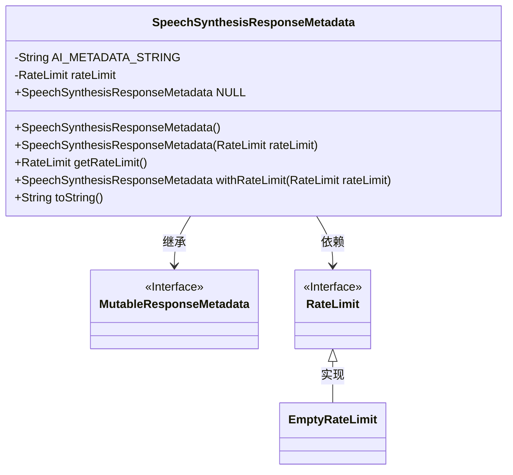
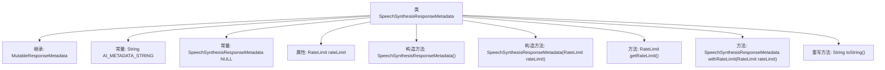

# 基础信息

|      |      |
|------|------|
| 名称 | SpeechSynthesisResponseMetadata |
| 编码语言 | .java |
| 代码路径 | spring-ai-alibaba/spring-ai-alibaba-core/src/main/java/com/alibaba/cloud/ai/dashscope/audio/synthesis/SpeechSynthesisResponseMetadata.java |
| 包名 | com.alibaba.cloud.ai.dashscope.audio.synthesis |
| 依赖项 | ['org.springframework.ai.chat.metadata.EmptyRateLimit', 'org.springframework.ai.chat.metadata.RateLimit', 'org.springframework.ai.model.MutableResponseMetadata', 'org.springframework.lang.Nullable'] |
| 概述说明 | SpeechSynthesisResponseMetadata类支持速率限制，可空实例和自定义，提供格式化输出。 |

# 说明

SpeechSynthesisResponseMetadata类具备速率限制功能，支持创建空实例和自定义速率限制设置，同时提供格式化字符串输出能力。

# 类列表 Class Summary

| 名称   | 类型  | 说明 |
|-------|------|-------------|
| SpeechSynthesisResponseMetadata | class | SpeechSynthesisResponseMetadata类包含速率限制功能，支持空实例和自定义速率限制，提供格式化字符串输出。 |

## 类 SpeechSynthesisResponseMetadata

|      |      |
|------|------|
| 访问范围 | public |
| 类型 | class |
| 名称 | SpeechSynthesisResponseMetadata |
| 说明 | SpeechSynthesisResponseMetadata类包含速率限制功能，支持空实例和自定义速率限制，提供格式化字符串输出。 |

### UML类图

**描述**：`SpeechSynthesisResponseMetadata` 类继承自 `MutableResponseMetadata` 接口，并包含一个可空的 `RateLimit` 对象。该类提供了构造方法、获取 `RateLimit` 的方法、设置 `RateLimit` 的方法以及重写的 `toString` 方法。`RateLimit` 是一个接口，`EmptyRateLimit` 是其实现类，用于在 `RateLimit` 为空时提供默认值。

### 内部方法调用关系图

这段代码定义了一个名为 `SpeechSynthesisResponseMetadata` 的类，继承自 `MutableResponseMetadata`。该类包含一个常量字符串 `AI_METADATA_STRING` 和一个常量 `NULL` 实例。类中有两个构造方法，分别用于初始化 `rateLimit` 属性。`getRateLimit` 方法用于获取 `rateLimit`，如果为空则返回 `EmptyRateLimit`。`withRateLimit` 方法用于设置 `rateLimit` 并返回当前实例。`toString` 方法重写了父类的方法，返回格式化后的字符串。

### 字段列表 Field List

| 名称  | 类型  | 说明 |
|-------|-------|------|
| AI_METADATA_STRING = "{ @type: %1$s, requestsLimit: %2$s }" | String | 定义受保护的静态常量字符串AI_METADATA_STRING，包含类型和请求限制。 |
| rateLimit | RateLimit | 可为空的私有变量rateLimit。 |
| NULL = new SpeechSynthesisResponseMetadata() {	} | SpeechSynthesisResponseMetadata | 定义静态不可变的空语音合成响应元数据对象。 |

### 方法列表 Method List

| 名称  | 类型  | 说明 |
|-------|-------|------|
| getRateLimit | RateLimit | 该方法返回速率限制对象，若为空则返回空速率限制实例。 |
| withRateLimit | SpeechSynthesisResponseMetadata | `public SpeechSynthesisResponseMetadata` 方法设置并返回 `rateLimit`。 |
| toString | String | 重写toString方法，返回格式化字符串，包含类名和限速信息。 |

