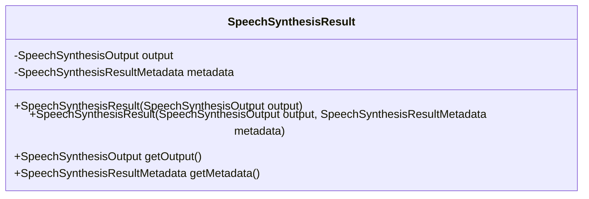
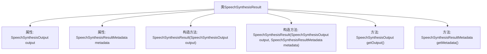

# 基础信息

|      |      |
|------|------|
| 名称 | SpeechSynthesisResult |
| 编码语言 | .java |
| 代码路径 | spring-ai-alibaba/spring-ai-alibaba-core/src/main/java/com/alibaba/cloud/ai/dashscope/audio/synthesis/SpeechSynthesisResult.java |
| 包名 | com.alibaba.cloud.ai.dashscope.audio.synthesis |
| 依赖项 | ['org.springframework.ai.model.ModelResult'] |
| 概述说明 | SpeechSynthesisResult类封装语音合成结果及其元数据。 |

# 说明

SpeechSynthesisResult类用于封装语音合成过程中生成的结果及其相关的元数据。该类提供了一种结构化的方式来存储和管理合成后的语音数据，包括音频内容、合成状态、持续时间、错误信息等关键信息。通过封装这些数据，开发者可以更方便地处理和操作语音合成结果，确保应用程序能够高效地使用合成后的语音内容。此外，该类还可能包含一些辅助方法，用于获取或验证合成结果的状态和质量，从而提升语音合成功能的可靠性和用户体验。

# 类列表 Class Summary

| 名称   | 类型  | 说明 |
|-------|------|-------------|
| SpeechSynthesisResult | class | SpeechSynthesisResult类封装语音合成结果及其元数据。 |

## 类 SpeechSynthesisResult

|      |      |
|------|------|
| 访问范围 | public |
| 类型 | class |
| 名称 | SpeechSynthesisResult |
| 说明 | SpeechSynthesisResult类封装语音合成结果及其元数据。 |

### UML类图

**描述：**  
`SpeechSynthesisResult` 类实现了 `ModelResult<SpeechSynthesisOutput>` 接口，用于封装语音合成结果及其元数据。该类包含两个私有成员变量：`output` 和 `metadata`，分别表示语音合成输出和结果元数据。类提供了两个构造函数，允许用户通过不同的方式初始化对象，并提供了获取 `output` 和 `metadata` 的公有方法。该类的主要作用是管理和提供语音合成结果的相关信息。

### 内部方法调用关系图

这段代码定义了一个名为 `SpeechSynthesisResult` 的类，该类实现了 `ModelResult<SpeechSynthesisOutput>` 接口。类中包含两个属性：`SpeechSynthesisOutput output` 和 `SpeechSynthesisResultMetadata metadata`，分别用于存储语音合成结果和元数据。类提供了两个构造方法，一个仅接受 `SpeechSynthesisOutput` 参数，另一个同时接受 `SpeechSynthesisOutput` 和 `SpeechSynthesisResultMetadata` 参数。此外，类还实现了两个方法：`getOutput()` 和 `getMetadata()`，分别用于获取输出和元数据。

### 字段列表 Field List

| 名称  | 类型  | 说明 |
|-------|-------|------|
| output | SpeechSynthesisOutput | 私有最终语音合成输出对象。 |
| metadata | SpeechSynthesisResultMetadata | 私有SpeechSynthesisResultMetadata元数据变量。 |

### 方法列表 Method List

| 名称  | 类型  | 说明 |
|-------|-------|------|
| getMetadata | SpeechSynthesisResultMetadata | 该方法返回SpeechSynthesisResultMetadata类型的元数据。 |
| getOutput | SpeechSynthesisOutput | 该方法返回当前语音合成输出对象。 |

