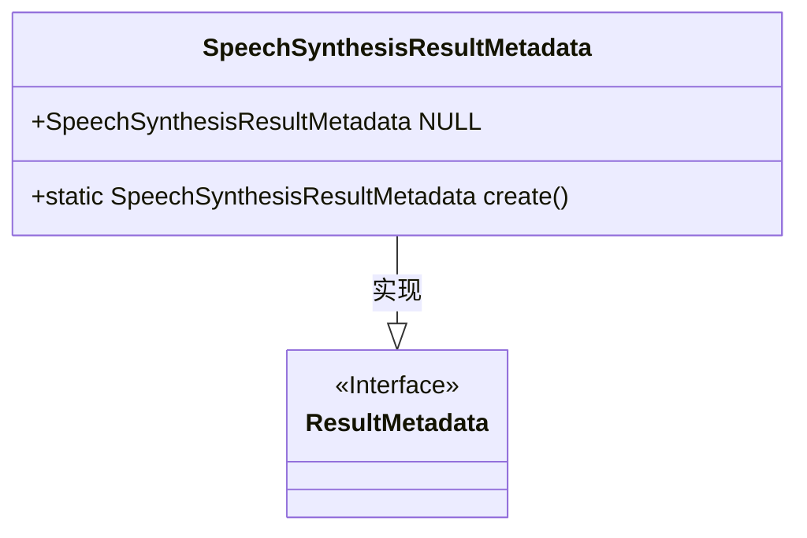
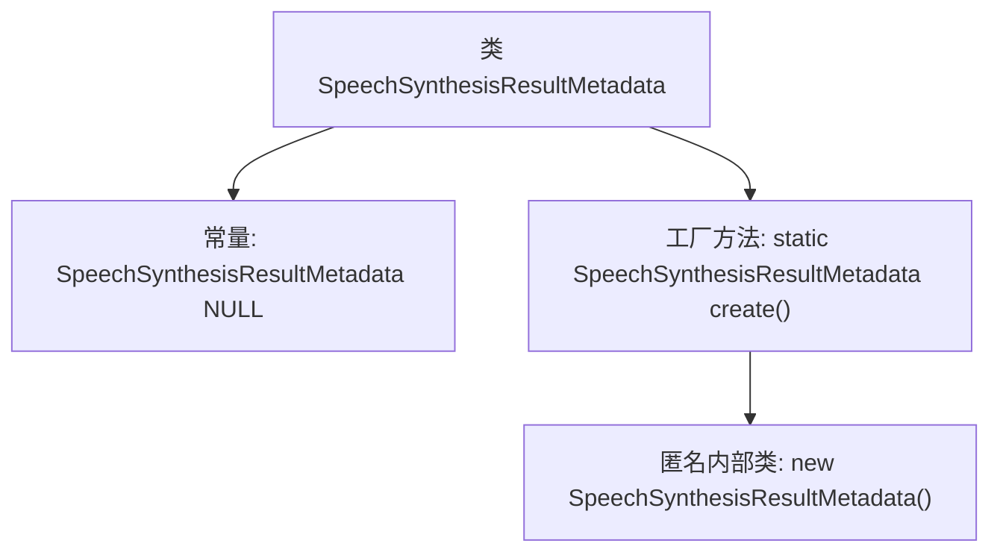

# 基础信息

|      |      |
|------|------|
| 名称 | SpeechSynthesisResultMetadata |
| 编码语言 | .java |
| 代码路径 | spring-ai-alibaba/spring-ai-alibaba-core/src/main/java/com/alibaba/cloud/ai/dashscope/audio/synthesis/SpeechSynthesisResultMetadata.java |
| 包名 | com.alibaba.cloud.ai.dashscope.audio.synthesis |
| 依赖项 | ['org.springframework.ai.model.ResultMetadata'] |
| 概述说明 | SpeechSynthesisResultMetadata类实现ResultMetadata接口，提供工厂方法。 |

# 说明

SpeechSynthesisResultMetadata类实现了ResultMetadata接口，并提供了用于创建实例的工厂方法。该类主要用于处理语音合成结果的元数据，通过实现接口确保与其他相关组件的兼容性，并通过工厂方法简化实例的创建过程。

# 类列表 Class Summary

| 名称   | 类型  | 说明 |
|-------|------|-------------|
| SpeechSynthesisResultMetadata | class | SpeechSynthesisResultMetadata类实现ResultMetadata接口，提供创建实例的工厂方法。 |

## 类 SpeechSynthesisResultMetadata

|      |      |
|------|------|
| 访问范围 | public |
| 类型 | class |
| 名称 | SpeechSynthesisResultMetadata |
| 说明 | SpeechSynthesisResultMetadata类实现ResultMetadata接口，提供创建实例的工厂方法。 |

### UML类图

这段代码定义了一个名为 `SpeechSynthesisResultMetadata` 的类，它实现了 `ResultMetadata` 接口。`SpeechSynthesisResultMetadata` 类包含一个公有的静态常量 `NULL`，它是一个 `SpeechSynthesisResultMetadata` 类型的实例。此外，`SpeechSynthesisResultMetadata` 类还提供了一个静态工厂方法 `create()`，用于创建并返回一个新的 `SpeechSynthesisResultMetadata` 实例。这个工厂方法返回的是一个匿名内部类的实例，该类继承自 `SpeechSynthesisResultMetadata`。

### 内部方法调用关系图

这段代码定义了一个名为 `SpeechSynthesisResultMetadata` 的类，该类实现了 `ResultMetadata` 接口。类中包含一个常量 `NULL`，它通过静态工厂方法 `create()` 初始化。`create()` 方法返回一个匿名内部类的实例，该实例是 `SpeechSynthesisResultMetadata` 的一个子类。流程图展示了类与常量、工厂方法以及匿名内部类之间的关系。

### 字段列表 Field List

| 名称  | 类型  | 说明 |
|-------|-------|------|
| NULL = SpeechSynthesisResultMetadata.create() | SpeechSynthesisResultMetadata | 定义静态常量NULL，类型为SpeechSynthesisResultMetadata，初始化为create()方法返回值。 |

### 方法列表 Method List

| 名称  | 类型  | 说明 |
|-------|-------|------|
| create | SpeechSynthesisResultMetadata | 创建SpeechSynthesisResultMetadata的静态方法。 |

