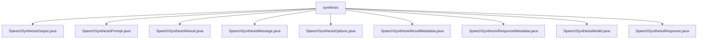

# 基础信息

|      |      |
|------|------|
| 名称 | synthesis |
| 编码语言 | .java |
| 代码路径 | spring-ai-alibaba/spring-ai-alibaba-core/src/main/java/com/alibaba/cloud/ai/dashscope/audio/synthesis |
| 包名 | spring-ai-alibaba.spring-ai-alibaba-core.src.main.java.com.alibaba.cloud.ai.dashscope.audio.synthesis |
| 概述说明 | SpeechSynthesis类族管理语音合成数据，涵盖初始化、文本封装、结果存储及元数据处理，支持多样化语音合成需求。 |

# 说明

## 概述
该代码模块主要围绕语音合成功能展开，提供了从文本输入到音频输出的完整处理流程。模块中的各个类分别负责不同的功能，包括文本的封装、语音合成的配置、音频数据的生成与管理、结果的封装与元数据处理等。通过这些类的协作，开发者可以方便地实现语音合成功能，并高效地管理和操作合成后的音频数据。

## 主要业务场景
1. **文本输入与封装**：`SpeechSynthesisMessage`类用于封装文本数据，支持文本的创建、读取、修改和比较操作，为语音合成提供基础输入。
2. **语音合成配置**：`SpeechSynthesisPrompt`类用于生成语音合成的提示信息，支持多种构造方式和灵活的配置选项，满足多样化的合成需求。
3. **音频数据生成与管理**：`SpeechSynthesisOutput`类负责管理生成的音频数据，提供初始化方法和音频内容的访问接口，确保用户可以方便地使用这些资源。
4. **合成结果封装**：`SpeechSynthesisResult`类用于封装语音合成的结果及其元数据，提供结构化的数据存储和管理方式，支持对合成结果的状态和质量进行验证。
5. **元数据处理**：`SpeechSynthesisResultMetadata`和`SpeechSynthesisResponseMetadata`类分别负责处理合成结果的元数据和响应元数据，确保数据的兼容性和操作的便捷性。
6. **响应结果处理**：`SpeechSynthesisResponse`类封装了语音合成结果及其元数据，提供获取和比较功能，简化对合成结果的处理和分析。

通过这些类的协作，该模块能够高效地处理语音合成的各个环节，为开发者提供了一套完整的语音合成解决方案。

### 包内部结构视图

该流程图展示了`spring-ai-alibaba`项目中`audio/synthesis`目录下的文件结构。`synthesis`作为根节点，包含了多个与语音合成相关的Java文件，如`SpeechSynthesisOutput.java`、`SpeechSynthesisPrompt.java`等。这些文件分别处理语音合成的不同方面，如输出、提示、结果、消息、选项、元数据、模型和响应等。

# 文件列表 File List

| 名称   | 类型  | 说明 |
|-------|------|-------------|
| [SpeechSynthesisResponse.java](SpeechSynthesisResponse.md) | file | SpeechSynthesisResponse类封装合成结果和元数据，支持获取和比较功能。 |
| [SpeechSynthesisResultMetadata.java](SpeechSynthesisResultMetadata.md) | file | SpeechSynthesisResultMetadata类实现ResultMetadata接口，提供工厂方法。 |
| [SpeechSynthesisOptions.java](SpeechSynthesisOptions.md) | file | 信息为空，无法生成概要描述。 |
| [SpeechSynthesisPrompt.java](SpeechSynthesisPrompt.md) | file | SpeechSynthesisPrompt类用于语音合成，含消息列表和选项，支持多种构造。 |
| [SpeechSynthesisResult.java](SpeechSynthesisResult.md) | file | SpeechSynthesisResult类封装语音合成结果及其元数据。 |
| [SpeechSynthesisOutput.java](SpeechSynthesisOutput.md) | file | SpeechSynthesisOutput类管理音频数据，提供初始化与获取方法。 |
| [SpeechSynthesisModel.java](SpeechSynthesisModel.md) | file | 输入为空，无法生成概要描述。 |
| [SpeechSynthesisResponseMetadata.java](SpeechSynthesisResponseMetadata.md) | file | SpeechSynthesisResponseMetadata类支持速率限制，可空实例和自定义，提供格式化输出。 |
| [SpeechSynthesisMessage.java](SpeechSynthesisMessage.md) | file | SpeechSynthesisMessage类封装文本，支持构造、获取、设置及相等性检查。 |

