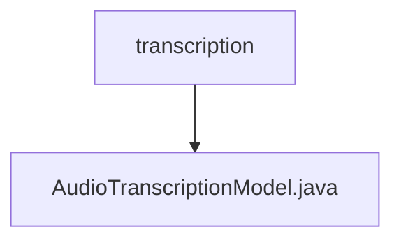

# 基础信息

|      |      |
|------|------|
| 名称 | transcription |
| 编码语言 | .java |
| 代码路径 | spring-ai-alibaba/spring-ai-alibaba-core/src/main/java/com/alibaba/cloud/ai/dashscope/audio/transcription |
| 包名 | spring-ai-alibaba.spring-ai-alibaba-core.src.main.java.com.alibaba.cloud.ai.dashscope.audio.transcription |
| 概述说明 | 信息为空，无法生成概要描述。 |

# 说明

由于提供的内容为空，无法进行总结描述。请提供具体内容以便进行详细分析和总结。

### 包内部结构视图

该流程图展示了`spring-ai-alibaba`项目中音频转录模块的层级关系。`transcription`文件夹是顶层节点，包含一个名为`AudioTranscriptionModel.java`的Java文件。该文件是音频转录功能的核心实现，位于`transcription`文件夹下，用于处理音频转录相关的逻辑。

# 文件列表 File List

| 名称   | 类型  | 说明 |
|-------|------|-------------|
| [AudioTranscriptionModel.java](AudioTranscriptionModel.md) | file | 信息为空，无法生成概要描述。 |

