# 基础信息

|      |      |
|------|------|
| 名称 | DashScopeChatModel |
| 编码语言 | .java |
| 代码路径 | spring-ai-alibaba/spring-ai-alibaba-core/src/main/java/com/alibaba/cloud/ai/dashscope/chat/DashScopeChatModel.java |
| 包名 | com.alibaba.cloud.ai.dashscope.chat |
| 依赖项 | ['java.util.ArrayList', 'java.util.Base64', 'java.util.HashSet', 'java.util.List', 'java.util.Map', 'java.util.Set', 'java.util.concurrent.ConcurrentHashMap', 'com.alibaba.cloud.ai.dashscope.api.DashScopeApi', 'com.alibaba.cloud.ai.dashscope.api.DashScopeApi.ChatCompletion', 'com.alibaba.cloud.ai.dashscope.api.DashScopeApi.ChatCompletionChunk', 'com.alibaba.cloud.ai.dashscope.api.DashScopeApi.ChatCompletionFinishReason', 'com.alibaba.cloud.ai.dashscope.api.DashScopeApi.ChatCompletionMessage', 'com.alibaba.cloud.ai.dashscope.api.DashScopeApi.ChatCompletionMessage.ChatCompletionFunction', 'com.alibaba.cloud.ai.dashscope.api.DashScopeApi.ChatCompletionMessage.MediaContent', 'com.alibaba.cloud.ai.dashscope.api.DashScopeApi.ChatCompletionMessage.ToolCall', 'com.alibaba.cloud.ai.dashscope.api.DashScopeApi.ChatCompletionOutput', 'com.alibaba.cloud.ai.dashscope.api.DashScopeApi.ChatCompletionOutput.Choice', 'com.alibaba.cloud.ai.dashscope.api.DashScopeApi.ChatCompletionRequest', 'com.alibaba.cloud.ai.dashscope.api.DashScopeApi.ChatCompletionRequestInput', 'com.alibaba.cloud.ai.dashscope.api.DashScopeApi.ChatCompletionRequestParameter', 'com.alibaba.cloud.ai.dashscope.api.DashScopeApi.FunctionTool', 'com.alibaba.cloud.ai.dashscope.chat.observation.DashScopeChatModelObservationConvention', 'com.alibaba.cloud.ai.dashscope.common.DashScopeApiConstants', 'com.alibaba.cloud.ai.dashscope.metadata.DashScopeAiUsage', 'io.micrometer.observation.Observation', 'io.micrometer.observation.ObservationRegistry', 'io.micrometer.observation.contextpropagation.ObservationThreadLocalAccessor', 'org.slf4j.Logger', 'org.slf4j.LoggerFactory', 'reactor.core.publisher.Flux', 'reactor.core.publisher.Mono', 'org.springframework.ai.chat.messages.AssistantMessage', 'org.springframework.ai.chat.messages.MessageType', 'org.springframework.ai.chat.messages.ToolResponseMessage', 'org.springframework.ai.chat.messages.UserMessage', 'org.springframework.ai.chat.metadata.ChatGenerationMetadata', 'org.springframework.ai.chat.metadata.ChatResponseMetadata', 'org.springframework.ai.chat.model.AbstractToolCallSupport', 'org.springframework.ai.chat.model.ChatModel', 'org.springframework.ai.chat.model.ChatResponse', 'org.springframework.ai.chat.model.Generation', 'org.springframework.ai.chat.model.MessageAggregator', 'org.springframework.ai.chat.observation.ChatModelObservationContext', 'org.springframework.ai.chat.observation.ChatModelObservationConvention', 'org.springframework.ai.chat.observation.ChatModelObservationDocumentation', 'org.springframework.ai.chat.prompt.ChatOptions', 'org.springframework.ai.chat.prompt.Prompt', 'org.springframework.ai.model.ModelOptionsUtils', 'org.springframework.ai.model.function.FunctionCallback', 'org.springframework.ai.model.function.FunctionCallbackResolver', 'org.springframework.ai.retry.RetryUtils', 'org.springframework.http.ResponseEntity', 'org.springframework.retry.support.RetryTemplate', 'org.springframework.util.Assert', 'org.springframework.util.CollectionUtils', 'org.springframework.util.MimeType', 'org.springframework.util.StringUtils'] |
| 概述说明 | DashScopeChatModel实现ChatModel接口，支持工具调用，含API访问、重试模板和观察注册表。 |

# 说明

DashScopeChatModel类实现了ChatModel接口，具备工具调用功能，提供聊天模型的核心能力。该类集成了DashScope API的访问机制，支持重试模板以确保请求的稳定性，并包含观察注册表用于监控和管理模型的状态。这些关键组件共同确保了聊天模型的高效运行和可扩展性。

# 类列表 Class Summary

| 名称   | 类型  | 说明 |
|-------|------|-------------|
| DashScopeChatModel | class | DashScopeChatModel类实现了ChatModel接口，支持工具调用，提供聊天模型功能，包含DashScope API访问、重试模板和观察注册表等关键组件。 |

## 类 DashScopeChatModel

|      |      |
|------|------|
| 访问范围 | public |
| 类型 | class |
| 名称 | DashScopeChatModel |
| 说明 | DashScopeChatModel类实现了ChatModel接口，支持工具调用，提供聊天模型功能，包含DashScope API访问、重试模板和观察注册表等关键组件。 |

### UML类图

```mermaid
classDiagram
    class DashScopeChatModel {
        -Logger logger
        -DashScopeApi dashscopeApi
        +RetryTemplate retryTemplate
        -ObservationRegistry observationRegistry
        -DashScopeChatOptions defaultOptions
        -ChatModelObservationConvention observationConvention
        +DashScopeChatModel(DashScopeApi dashscopeApi)
        +DashScopeChatModel(DashScopeApi dashscopeApi, DashScopeChatOptions options)
        +DashScopeChatModel(DashScopeApi dashscopeApi, DashScopeChatOptions options, FunctionCallbackResolver functionCallbackResolver, RetryTemplate retryTemplate)
        +DashScopeChatModel(DashScopeApi dashscopeApi, DashScopeChatOptions options, FunctionCallbackResolver functionCallbackResolver, List~FunctionCallback~ toolFunctionCallbacks, RetryTemplate retryTemplate)
        +DashScopeChatModel(DashScopeApi dashscopeApi, DashScopeChatOptions options, FunctionCallbackResolver functionCallbackResolver, List~FunctionCallback~ toolFunctionCallbacks, RetryTemplate retryTemplate, ObservationRegistry observationRegistry)
        +ChatResponse call(Prompt prompt)
        +ChatOptions getDefaultOptions()
        +Flux~ChatResponse~ stream(Prompt prompt)
        +DashScopeChatOptions getDashScopeChatOptions()
        +void setDashScopeChatOptions(DashScopeChatOptions options)
        -Generation buildGeneration(Choice choice, Map~String, Object~ metadata)
        -ChatCompletion chunkToChatCompletion(ChatCompletionChunk chunk)
        -ChatResponseMetadata from(ChatCompletion result)
        -ChatCompletionRequest createRequest(Prompt prompt, boolean stream)
        -List~MediaContent~ convertMediaContent(UserMessage message)
        -String fromMediaData(MimeType mimeType, Object mediaContentData)
        -List~FunctionTool~ getFunctionTools(Set~String~ functionNames)
        -ChatCompletionRequestParameter toDashScopeRequestParameter(DashScopeChatOptions options, boolean stream)
        +void setObservationConvention(ChatModelObservationConvention observationConvention)
    }

    class AbstractToolCallSupport {
        +AbstractToolCallSupport(FunctionCallbackResolver functionCallbackResolver, DashScopeChatOptions options, List~FunctionCallback~ toolFunctionCallbacks)
    }

    class ChatModel {
        <<Interface>>
        +ChatResponse call(Prompt prompt)
        +ChatOptions getDefaultOptions()
        +Flux~ChatResponse~ stream(Prompt prompt)
    }

    class DashScopeApi {
        +ResponseEntity~ChatCompletion~ chatCompletionEntity(ChatCompletionRequest request)
        +Flux~ChatCompletionChunk~ chatCompletionStream(ChatCompletionRequest request)
    }

    class RetryTemplate {
        +~T~ execute(RetryCallback~T~ retryCallback)
    }

    class ObservationRegistry {
        +ObservationRegistry NOOP
    }

    class DashScopeChatOptions {
        +DashScopeChatOptions builder()
        +DashScopeChatOptions fromOptions(DashScopeChatOptions options)
    }

    class ChatModelObservationConvention {
        <<Interface>>
    }

    class FunctionCallbackResolver {
    }

    class FunctionCallback {
    }

    class ChatResponse {
    }

    class Prompt {
    }

    class ChatCompletion {
    }

    class ChatCompletionChunk {
    }

    class ChatCompletionRequest {
    }

    class ChatCompletionRequestParameter {
    }

    class ChatCompletionMessage {
    }

    class MediaContent {
    }

    class FunctionTool {
    }

    class Choice {
    }

    class AssistantMessage {
    }

    class ToolResponseMessage {
    }

    class ChatModelObservationContext {
    }

    class ChatModelObservationDocumentation {
    }

    class ChatResponseMetadata {
    }

    class DashScopeAiUsage {
    }

    class ChatCompletionOutput {
    }

    class ChatCompletionFunction {
    }

    class ToolCall {
    }

    class Generation {
    }

    class ChatGenerationMetadata {
    }

    class UserMessage {
    }

    class MessageFormat {
    }

    class MimeType {
    }

    class Base64 {
    }

    class Flux~T~ {
    }

    class Mono~T~ {
    }

    class ConcurrentHashMap~K, V~ {
    }

    class Set~T~ {
    }

    class List~T~ {
    }

    class Map~K, V~ {
    }

    DashScopeChatModel --> AbstractToolCallSupport : 继承
    DashScopeChatModel --> ChatModel : 实现
    DashScopeChatModel --> DashScopeApi : 依赖
    DashScopeChatModel --> RetryTemplate : 依赖
    DashScopeChatModel --> ObservationRegistry : 依赖
    DashScopeChatModel --> DashScopeChatOptions : 依赖
    DashScopeChatModel --> ChatModelObservationConvention : 依赖
    DashScopeChatModel --> FunctionCallbackResolver : 依赖
    DashScopeChatModel --> FunctionCallback : 依赖
    DashScopeChatModel --> ChatResponse : 依赖
    DashScopeChatModel --> Prompt : 依赖
    DashScopeChatModel --> ChatCompletion : 依赖
    DashScopeChatModel --> ChatCompletionChunk : 依赖
    DashScopeChatModel --> ChatCompletionRequest : 依赖
    DashScopeChatModel --> ChatCompletionRequestParameter : 依赖
    DashScopeChatModel --> ChatCompletionMessage : 依赖
    DashScopeChatModel --> MediaContent : 依赖
    DashScopeChatModel --> FunctionTool : 依赖
    DashScopeChatModel --> Choice : 依赖
    DashScopeChatModel --> AssistantMessage : 依赖
    DashScopeChatModel --> ToolResponseMessage : 依赖
    DashScopeChatModel --> ChatModelObservationContext : 依赖
    DashScopeChatModel --> ChatModelObservationDocumentation : 依赖
    DashScopeChatModel --> ChatResponseMetadata : 依赖
    DashScopeChatModel --> DashScopeAiUsage : 依赖
    DashScopeChatModel --> ChatCompletionOutput : 依赖
    DashScopeChatModel --> ChatCompletionFunction : 依赖
    DashScopeChatModel --> ToolCall : 依赖
    DashScopeChatModel --> Generation : 依赖
    DashScopeChatModel --> ChatGenerationMetadata : 依赖
    DashScopeChatModel --> UserMessage : 依赖
    DashScopeChatModel --> MessageFormat : 依赖
    DashScopeChatModel --> MimeType : 依赖
    DashScopeChatModel --> Base64 : 依赖
    DashScopeChatModel --> Flux~T~ : 依赖
    DashScopeChatModel --> Mono~T~ : 依赖
    DashScopeChatModel --> ConcurrentHashMap~K, V~ : 依赖
    DashScopeChatModel --> Set~T~ : 依赖
    DashScopeChatModel --> List~T~ : 依赖
    DashScopeChatModel --> Map~K, V~ : 依赖
```

### 描述
`DashScopeChatModel` 是一个实现了 `ChatModel` 接口的类，用于处理与 DashScope API 的交互。它通过 `DashScopeApi` 进行低级别的 API 调用，并使用 `RetryTemplate` 实现重试机制。该类支持通过 `ObservationRegistry` 进行观测，并通过 `DashScopeChatOptions` 配置默认选项。`DashScopeChatModel` 还支持工具调用和流式响应，能够处理多种类型的消息格式，并生成相应的聊天响应。

### 内部方法调用关系图

```mermaid
graph TD
    A["类DashScopeChatModel"]
    B["属性: String MESSAGE_FORMAT"]
    C["属性: Logger logger"]
    D["属性: ChatModelObservationConvention DEFAULT_OBSERVATION_CONVENTION"]
    E["属性: DashScopeApi dashscopeApi"]
    F["属性: RetryTemplate retryTemplate"]
    G["属性: ObservationRegistry observationRegistry"]
    H["属性: DashScopeChatOptions defaultOptions"]
    I["属性: ChatModelObservationConvention observationConvention"]
    J["构造方法: DashScopeChatModel(DashScopeApi dashscopeApi)"]
    K["构造方法: DashScopeChatModel(DashScopeApi dashscopeApi, DashScopeChatOptions options)"]
    L["构造方法: DashScopeChatModel(DashScopeApi dashscopeApi, DashScopeChatOptions options, FunctionCallbackResolver functionCallbackResolver, RetryTemplate retryTemplate)"]
    M["构造方法: DashScopeChatModel(DashScopeApi dashscopeApi, DashScopeChatOptions options, FunctionCallbackResolver functionCallbackResolver, List<FunctionCallback> toolFunctionCallbacks, RetryTemplate retryTemplate)"]
    N["构造方法: DashScopeChatModel(DashScopeApi dashscopeApi, DashScopeChatOptions options, FunctionCallbackResolver functionCallbackResolver, List<FunctionCallback> toolFunctionCallbacks, RetryTemplate retryTemplate, ObservationRegistry observationRegistry)"]
    O["方法: ChatResponse call(Prompt prompt)"]
    P["方法: ChatOptions getDefaultOptions()"]
    Q["方法: Flux<ChatResponse> stream(Prompt prompt)"]
    R["方法: DashScopeChatOptions getDashScopeChatOptions()"]
    S["方法: void setDashScopeChatOptions(DashScopeChatOptions options)"]
    T["方法: Generation buildGeneration(Choice choice, Map<String, Object> metadata)"]
    U["方法: ChatCompletion chunkToChatCompletion(ChatCompletionChunk chunk)"]
    V["方法: ChatResponseMetadata from(ChatCompletion result)"]
    W["方法: ChatCompletionRequest createRequest(Prompt prompt, boolean stream)"]
    X["方法: List<MediaContent> convertMediaContent(UserMessage message)"]
    Y["方法: String fromMediaData(MimeType mimeType, Object mediaContentData)"]
    Z["方法: List<FunctionTool> getFunctionTools(Set<String> functionNames)"]
    AA["方法: ChatCompletionRequestParameter toDashScopeRequestParameter(DashScopeChatOptions options, boolean stream)"]
    AB["方法: void setObservationConvention(ChatModelObservationConvention observationConvention)"]

    A --> B
    A --> C
    A --> D
    A --> E
    A --> F
    A --> G
    A --> H
    A --> I
    A --> J
    A --> K
    A --> L
    A --> M
    A --> N
    A --> O
    A --> P
    A --> Q
    A --> R
    A --> S
    A --> T
    A --> U
    A --> V
    A --> W
    A --> X
    A --> Y
    A --> Z
    A --> AA
    A --> AB
```

**描述：**
`DashScopeChatModel` 类是一个用于处理聊天模型的类，提供了与 DashScope API 的交互功能。它包含多个构造方法和属性，用于初始化和管理聊天模型的各种配置。类中的方法包括处理聊天请求、生成响应、处理工具调用、转换媒体内容等。通过观察器（Observation）机制，类能够记录和处理聊天模型的执行过程，确保代码的可观测性和可调试性。

### 字段列表 Field List

| 名称  | 类型  | 说明 |
|-------|-------|------|
| logger = LoggerFactory.getLogger(DashScopeChatModel.class) | Logger | DashScopeChatModel类中定义了一个私有的静态日志记录器。 |
| observationRegistry | ObservationRegistry | 私有且不可变的观察注册表实例。 |
| retryTemplate | RetryTemplate | 定义了一个不可变的RetryTemplate实例。 |
| defaultOptions | DashScopeChatOptions | 定义私有DashScopeChatOptions默认选项。 |
| dashscopeApi | DashScopeApi | 私有变量dashscopeApi类型为DashScopeApi。 |
| observationConvention = DEFAULT_OBSERVATION_CONVENTION | ChatModelObservationConvention | 私有ChatModelObservationConvention变量observationConvention初始化为DEFAULT_OBSERVATION_CONVENTION。 |
| DEFAULT_OBSERVATION_CONVENTION = new DashScopeChatModelObservationConvention() | ChatModelObservationConvention | 默认观察约定为DashScopeChatModelObservationConvention实例。 |
| MESSAGE_FORMAT = "messageFormat" | String | MESSAGE_FORMAT为静态常量字符串，值为"messageFormat"。 |

### 方法列表 Method List

| 名称  | 类型  | 说明 |
|-------|-------|------|
| setDashScopeChatOptions | void | 设置默认的DashScope聊天选项。 |
| setObservationConvention | void | 设置观察约定，确保传入值非空。 |
| getDashScopeChatOptions | DashScopeChatOptions | 获取默认的DashScope聊天配置选项。 |
| getDefaultOptions | ChatOptions | 重写方法，返回默认聊天选项。 |
| convertMediaContent | List<MediaContent> | 将用户消息转换为媒体内容列表，支持视频和图片格式。 |
| getFunctionTools | List<FunctionTool> | 根据函数名集合生成函数工具列表，包含描述、名称和输入类型模式。 |
| chunkToChatCompletion | ChatCompletion | 将ChatCompletionChunk转换为ChatCompletion对象，包含请求ID、输出文本和用量信息。 |
| from | ChatResponseMetadata | 解析ChatCompletion结果，构建包含ID、使用情况和空模型的ChatResponseMetadata对象。 |
| toDashScopeRequestParameter | ChatCompletionRequestParameter | 将ChatCompletionRequest参数转换为DashScope请求参数，包含流式输出和配置选项。 |
| buildGeneration | Generation | 该方法构建生成对象，包含助手消息和生成元数据，处理工具调用和完成原因。 |
| stream | Flux<ChatResponse> | 方法stream处理聊天请求，验证提示非空，生成响应流，处理工具调用，并返回聚合结果。 |
| createRequest | ChatCompletionRequest | 创建ChatCompletionRequest，处理不同消息类型，合并选项，设置工具，生成请求。 |
| fromMediaData | String | 方法将字节数组或字符串转换为指定MIME类型的Base64编码或直接返回字符串。 |
| call | ChatResponse | 该方法处理聊天请求，验证输入，创建观察上下文，调用API生成响应，处理工具调用，并返回最终结果。 |

