# 基础信息

|      |      |
|------|------|
| 名称 | DashScopeChatOptions |
| 编码语言 | .java |
| 代码路径 | spring-ai-alibaba/spring-ai-alibaba-core/src/main/java/com/alibaba/cloud/ai/dashscope/chat/DashScopeChatOptions.java |
| 包名 | com.alibaba.cloud.ai.dashscope.chat |
| 依赖项 | ['java.util', 'com.alibaba.cloud.ai.dashscope.api.DashScopeApi', 'com.alibaba.cloud.ai.dashscope.api.DashScopeResponseFormat', 'com.fasterxml.jackson.annotation.JsonIgnore', 'com.fasterxml.jackson.annotation.JsonInclude', 'com.fasterxml.jackson.annotation.JsonProperty', 'org.springframework.ai.chat.prompt.ChatOptions', 'org.springframework.ai.model.ModelOptionsUtils', 'org.springframework.ai.model.function.FunctionCallback', 'org.springframework.ai.model.function.FunctionCallingOptions', 'org.springframework.util.Assert'] |
| 概述说明 | DashScopeChatOptions类配置聊天模型参数，含模型ID、温度、随机种子等。 |

# 说明

DashScopeChatOptions类用于配置聊天模型的各种参数，主要包括模型ID、温度设置、随机种子、采样阈值、停止条件、互联网搜索功能以及工具调用等。通过这些参数，用户可以精细调整聊天模型的行为和输出，以满足不同的应用场景和需求。

# 类列表 Class Summary

| 名称   | 类型  | 说明 |
|-------|------|-------------|
| DashScopeChatOptions | class | DashScopeChatOptions类用于配置聊天模型参数，包括模型ID、温度、随机种子、采样阈值、停止条件、互联网搜索、工具调用等。 |

## 类 DashScopeChatOptions

|      |      |
|------|------|
| 访问范围 | @JsonInclude(JsonInclude.Include.NON_NULL);public |
| 类型 | class |
| 名称 | DashScopeChatOptions |
| 说明 | DashScopeChatOptions类用于配置聊天模型参数，包括模型ID、温度、随机种子、采样阈值、停止条件、互联网搜索、工具调用等。 |

### UML类图

```mermaid
classDiagram
    class DashScopeChatOptions {
        <<Interface>> FunctionCallingOptions
        <<Interface>> ChatOptions
        -String model
        -Boolean stream
        -Double temperature
        -Integer seed
        -Double topP
        -Integer topK
        -List~Object~ stop
        -Boolean enableSearch
        -DashScopeResponseFormat responseFormat
        -Integer maxTokens
        -Boolean incrementalOutput
        -Double repetitionPenalty
        -List~DashScopeApi.FunctionTool~ tools
        -Object toolChoice
        -Boolean vlHighResolutionImages
        -List~FunctionCallback~ functionCallbacks
        -Set~String~ functions
        -Boolean multiModel
        -Boolean proxyToolCalls
        -Map~String, Object~ toolContext
        +String getModel()
        +Double getFrequencyPenalty()
        +Integer getMaxTokens()
        +Integer setMaxTokens()
        +Double getPresencePenalty()
        +List~String~ getStopSequences()
        +void setModel(String model)
        +Boolean getStream()
        +void setStream(Boolean stream)
        +Double getTemperature()
        +void setTemperature(Double temperature)
        +Double getTopP()
        +ChatOptions copy()
        +void setTopP(Double topP)
        +Integer getTopK()
        +void setTopK(Integer topK)
        +List~Object~ getStop()
        +void setStop(List~Object~ stop)
        +DashScopeResponseFormat getResponseFormat()
        +void setResponseFormat(DashScopeResponseFormat responseFormat)
        +Boolean getEnableSearch()
        +void setEnableSearch(Boolean enableSearch)
        +Double getRepetitionPenalty()
        +void setRepetitionPenalty(Double repetitionPenalty)
        +List~DashScopeApi.FunctionTool~ getTools()
        +void setTools(List~DashScopeApi.FunctionTool~ tools)
        +Object getToolChoice()
        +void setToolChoice(Object toolChoice)
        +Integer getSeed()
        +void setSeed(Integer seed)
        +Boolean getProxyToolCalls()
        +void setProxyToolCalls(Boolean proxyToolCalls)
        +List~FunctionCallback~ getFunctionCallbacks()
        +void setFunctionCallbacks(List~FunctionCallback~ functionCallbacks)
        +Set~String~ getFunctions()
        +void setFunctions(Set~String~ functions)
        +Map~String, Object~ getToolContext()
        +void setToolContext(Map~String, Object~ toolContext)
        +Boolean getIncrementalOutput()
        +void setIncrementalOutput(Boolean incrementalOutput)
        +Boolean getVlHighResolutionImages()
        +void setVlHighResolutionImages(Boolean vlHighResolutionImages)
        +Boolean getMultiModel()
        +void setMultiModel(Boolean multiModel)
        +static DashscopeChatOptionsBuilder builder()
        +static DashScopeChatOptions fromOptions(DashScopeChatOptions fromOptions)
        +boolean equals(Object o)
        +int hashCode()
        +String toString()
    }

    class DashscopeChatOptionsBuilder {
        -DashScopeChatOptions options
        +DashscopeChatOptionsBuilder()
        +DashscopeChatOptionsBuilder withModel(String model)
        +DashscopeChatOptionsBuilder withMaxToken(Integer maxTokens)
        +DashscopeChatOptionsBuilder withTemperature(Double temperature)
        +DashscopeChatOptionsBuilder withTopP(Double topP)
        +DashscopeChatOptionsBuilder withTopK(Integer topK)
        +DashscopeChatOptionsBuilder withStop(List~Object~ stop)
        +DashscopeChatOptionsBuilder withResponseFormat(DashScopeResponseFormat responseFormat)
        +DashscopeChatOptionsBuilder withEnableSearch(Boolean enableSearch)
        +DashscopeChatOptionsBuilder withRepetitionPenalty(Double repetitionPenalty)
        +DashscopeChatOptionsBuilder withTools(List~DashScopeApi.FunctionTool~ tools)
        +DashscopeChatOptionsBuilder withToolChoice(Object toolChoice)
        +DashscopeChatOptionsBuilder withStream(Boolean stream)
        +DashscopeChatOptionsBuilder withFunctionCallbacks(List~FunctionCallback~ functionCallbacks)
        +DashscopeChatOptionsBuilder withFunction(String functionName)
        +DashscopeChatOptionsBuilder withFunctions(Set~String~ functionNames)
        +DashscopeChatOptionsBuilder withProxyToolCalls(Boolean proxyToolCalls)
        +DashscopeChatOptionsBuilder withSeed(Integer seed)
        +DashscopeChatOptionsBuilder withIncrementalOutput(Boolean incrementalOutput)
        +DashscopeChatOptionsBuilder withToolContext(Map~String, Object~ toolContext)
        +DashscopeChatOptionsBuilder withVlHighResolutionImages(Boolean vlHighResolutionImages)
        +DashscopeChatOptionsBuilder withMultiModel(Boolean multiModel)
        +DashScopeChatOptions build()
    }

    DashScopeChatOptions --> DashscopeChatOptionsBuilder : 依赖
```

**描述**：`DashScopeChatOptions` 类实现了 `FunctionCallingOptions` 和 `ChatOptions` 接口，用于配置聊天模型的参数，如模型名称、温度、随机种子、采样策略等。它提供了丰富的属性和方法，允许开发者精细控制模型的行为。`DashscopeChatOptionsBuilder` 是一个构建器类，用于简化 `DashScopeChatOptions` 对象的创建和配置。两者之间存在依赖关系，构建器用于生成 `DashScopeChatOptions` 实例。

### 内部方法调用关系图

这段代码定义了一个名为 `DashScopeChatOptions` 的类，该类实现了 `FunctionCallingOptions` 和 `ChatOptions` 接口。类中包含多个属性，用于控制聊天生成的参数，如模型、温度、随机种子、核采样概率等。类中还包含多个 getter 和 setter 方法，用于获取和设置这些属性的值。此外，类中定义了一个内部类 `DashscopeChatOptionsBuilder`，用于构建 `DashScopeChatOptions` 对象。该类还提供了 `equals`、`hashCode` 和 `toString` 方法，用于对象的比较和字符串表示。

### 字段列表 Field List

| 名称  | 类型  | 说明 |
|-------|-------|------|
| seed | Integer | 私有属性seed，类型为Integer。 |
| multiModel = false | Boolean | 属性multiModel默认值为false。 |
| responseFormat | DashScopeResponseFormat | 私有属性responseFormat，类型为DashScopeResponseFormat。 |
| stop | List<Object> | 私有属性stop为List<Object>类型。 |
| topP | Double | 私有属性topP，类型为Double，使用JsonProperty注解。 |
| stream | Boolean | 忽略JSON序列化的私有布尔类型变量stream。 |
| incrementalOutput = true | Boolean | 私有属性incrementalOutput默认值为true。 |
| topK | Integer | 私有属性topK，类型为Integer，使用JsonProperty注解。 |
| functions = new HashSet<>() | Set<String> | 忽略JSON序列化的私有字符串集合变量functions。 |
| functionCallbacks = new ArrayList<>() | List<FunctionCallback> | 忽略JSON序列化的函数回调列表。 |
| tools | List<DashScopeApi.FunctionTool> | 私有属性tools，类型为DashScopeApi.FunctionTool列表。 |
| vlHighResolutionImages | Boolean | 私有布尔属性，用于高分辨率图像配置。 |
| maxTokens | Integer | 私有属性maxTokens，类型为Integer。 |
| toolContext | Map<String, Object> | 忽略序列化的工具上下文映射。 |
| proxyToolCalls | Boolean | 忽略JSON序列化中的proxyToolCalls字段。 |
| enableSearch = false | Boolean | 私有布尔变量enableSearch默认值为false。 |
| model | String | 该代码定义了私有字符串变量model，并使用JsonProperty注解进行序列化映射。 |
| repetitionPenalty | Double | 该代码定义了一个私有变量repetitionPenalty，类型为Double，使用JsonProperty注解进行序列化。 |
| temperature | Double | 私有属性temperature，类型为Double，使用JsonProperty注解。 |
| toolChoice | Object | 属性tool_choice定义为私有对象类型。 |

### 方法列表 Method List

| 名称  | 类型  | 说明 |
|-------|-------|------|
| setEnableSearch | void | 设置搜索功能启用状态的Java方法。 |
| setMaxTokens | Integer | 方法返回整数类型的maxTokens值。 |
| getTopP | Double | 该方法返回当前对象的topP值。 |
| setTopK | void | 设置topK参数值的方法。 |
| setSeed | void | 定义方法设置种子值为整数类型。 |
| getSeed | Integer | 获取种子值的方法。 |
| setMultiModel | void | 设置多模型属性的布尔值。 |
| setIncrementalOutput | void | 设置增量输出属性值。 |
| getFrequencyPenalty | Double | 该方法返回空值，未实现频率惩罚功能。 |
| getMaxTokens | Integer | 方法getMaxTokens返回空值。 |
| setFunctionCallbacks | void | 重写方法，设置函数回调列表。 |
| getVlHighResolutionImages | Boolean | 该方法返回高分辨率图像的布尔值。 |
| getTopK | Integer | 重写getTopK方法，返回topK值。 |
| getIncrementalOutput | Boolean | 方法返回布尔值，表示是否启用增量输出。 |
| getTemperature | Double | 重写getTemperature方法，返回当前温度值。 |
| setProxyToolCalls | void | 设置代理工具调用的布尔值。 |
| getRepetitionPenalty | Double | 该方法返回重复惩罚值。 |
| setStream | void | 设置流媒体状态的方法。 |
| setFunctions | void | 重写setFunctions方法，用于设置函数集合。 |
| setVlHighResolutionImages | void | 设置高分辨率图像属性的方法。 |
| getFunctionCallbacks | List<FunctionCallback> | 该方法返回当前对象的函数回调列表。 |
| getFunctions | Set<String> | 重写getFunctions方法，返回当前对象的functions集合。 |
| setTemperature | void | 设置温度值的方法。 |
| getToolChoice | Object | 该方法返回toolChoice对象。 |
| getResponseFormat | DashScopeResponseFormat | 获取DashScope响应格式的方法。 |
| builder | DashscopeChatOptionsBuilder | 创建并返回DashscopeChatOptionsBuilder实例。 |
| copy | ChatOptions | 重写ChatOptions的copy方法，返回DashScopeChatOptions实例。 |
| equals | boolean | equals方法比较DashScopeChatOptions对象的所有属性是否相等。 |
| getPresencePenalty | Double | 该方法返回null，表示未设置存在惩罚值。 |
| getStopSequences | List<String> | 该方法重写getStopSequences，返回空列表。 |
| hashCode | int | 重写hashCode方法，返回多个参数的哈希值。 |
| setToolChoice | void | 设置工具选择属性，更新当前对象工具选择值。 |
| getTools | List<DashScopeApi.FunctionTool> | 该方法返回一个包含DashScopeApi.FunctionTool对象的列表。 |
| getStream | Boolean | 该方法返回布尔类型的stream值。 |
| getProxyToolCalls | Boolean | 重写方法返回代理工具调用布尔值。 |
| getToolContext | Map<String,Object> | 重写getToolContext方法，返回toolContext对象。 |
| setToolContext | void | 重写方法，设置工具上下文为传入的映射。 |
| getStop | List<Object> | 返回名为stop的列表对象。 |
| setTools | void | 设置工具列表方法，接受函数工具列表参数。 |
| fromOptions | DashScopeChatOptions | 静态方法创建DashScopeChatOptions对象，复制所有属性值。 |
| toString | String | DashScopeChatOptions的toString方法返回对象JSON字符串。 |
| getModel | String | 重写getModel方法，返回model变量。 |
| setTopP | void | 设置topP属性值为指定Double类型参数。 |
| setModel | void | 该方法用于设置模型属性，将传入的字符串赋值给类的成员变量model。 |
| getEnableSearch | Boolean | 该方法返回布尔值，表示搜索功能是否启用。 |
| setResponseFormat | void | 设置响应格式的方法，接受DashScopeResponseFormat参数。 |
| setStop | void | 该方法用于设置对象的停止列表。 |
| setRepetitionPenalty | void | 设置重复惩罚值方法。 |
| getMultiModel | Boolean | 该方法返回布尔值multiModel。 |

