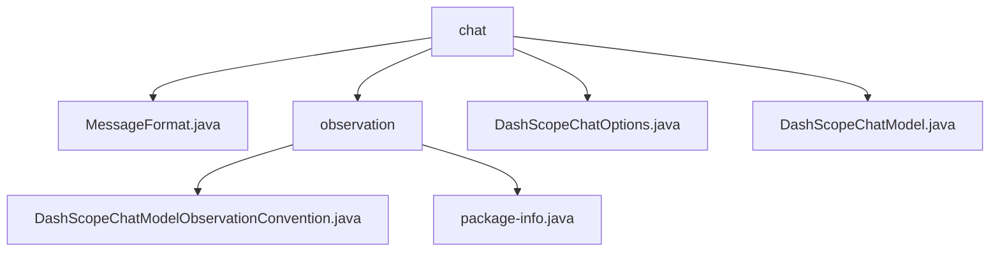

# 基础信息

|      |      |
|------|------|
| 名称 | chat |
| 编码语言 | .java |
| 代码路径 | spring-ai-alibaba/spring-ai-alibaba-core/src/main/java/com/alibaba/cloud/ai/dashscope/chat |
| 包名 | spring-ai-alibaba.spring-ai-alibaba-core.src.main.java.com.alibaba.cloud.ai.dashscope.chat |
| 概述说明 | 该代码模块优化聊天模型请求处理，增强复杂对话管理和任务控制，提升灵活性和可靠性。 |

# 说明

## 概述
该代码模块主要围绕阿里云DashScope聊天模型的实现和优化展开，涵盖了聊天模型的配置、核心功能实现以及观察约定的扩展。通过引入`DashScopeChatModelObservationConvention`类，模块增强了默认的聊天模型观察约定，使其能够在特定条件下更有效地管理和终止请求序列。此外，`DashScopeChatOptions`类提供了丰富的配置选项，允许用户精细调整聊天模型的行为和输出。`DashScopeChatModel`类则实现了聊天模型的核心功能，集成了DashScope API的访问机制，并支持工具调用和重试模板，确保了模型的高效运行和可扩展性。

## 主要业务场景
- **复杂对话管理**：在处理多轮对话或复杂任务时，`DashScopeChatModelObservationConvention`类能够根据预设条件自动终止请求序列，避免不必要的资源消耗和错误响应。
- **任务控制**：在需要精确控制任务执行流程的场景中，该模块通过增强的观察约定，确保模型能够按照预期路径执行任务，减少意外行为的发生。
- **灵活性和可靠性**：通过扩展默认的观察约定和提供丰富的配置选项，该模块使得模型能够更好地适应各种应用场景，提升整体系统的稳定性和用户体验。
- **工具调用和重试机制**：`DashScopeChatModel`类支持工具调用和重试模板，确保了在复杂场景下模型请求的稳定性和可靠性。

### 包内部结构视图

该流程图展示了`spring-ai-alibaba-core`项目中`chat`目录下的文件结构。`chat`目录包含多个文件和子目录，其中`observation`子目录下有两个文件，分别是`DashScopeChatModelObservationConvention.java`和`package-info.java`。`chat`目录下还有`MessageFormat.java`、`DashScopeChatOptions.java`和`DashScopeChatModel.java`三个文件。

# 文件列表 File List

| 名称   | 类型  | 说明 |
|-------|------|-------------|
| [DashScopeChatOptions.java](DashScopeChatOptions.md) | file | DashScopeChatOptions类配置聊天模型参数，含模型ID、温度、随机种子等。 |
| [MessageFormat.java](MessageFormat.md) | file | 信息为空，无法生成概要描述。 |
| [DashScopeChatModel.java](DashScopeChatModel.md) | file | DashScopeChatModel实现ChatModel接口，支持工具调用，含API访问、重试模板和观察注册表。 |
| [observation](observation/_module.md) | package | DashScopeChatModelObservationConvention类扩展默认聊天模型，增强请求停止序列管理，提升对话控制能力。 |

