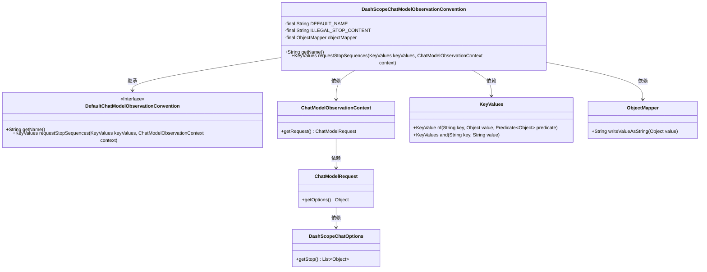
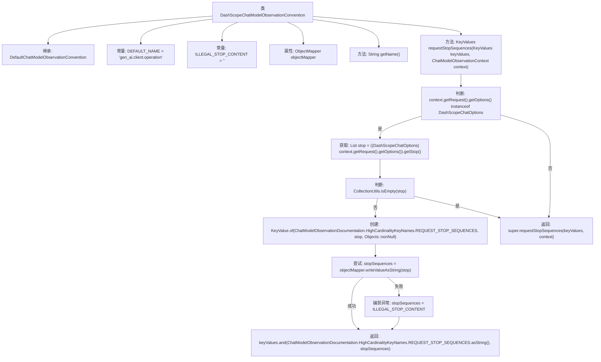

# 基础信息

|      |      |
|------|------|
| 名称 | DashScopeChatModelObservationConvention |
| 编码语言 | .java |
| 代码路径 | spring-ai-alibaba/spring-ai-alibaba-core/src/main/java/com/alibaba/cloud/ai/dashscope/chat/observation/DashScopeChatModelObservationConvention.java |
| 包名 | com.alibaba.cloud.ai.dashscope.chat.observation |
| 依赖项 | ['java.util.List', 'java.util.Objects', 'com.alibaba.cloud.ai.dashscope.chat.DashScopeChatOptions', 'com.fasterxml.jackson.databind.ObjectMapper', 'io.micrometer.common.KeyValue', 'io.micrometer.common.KeyValues', 'org.springframework.ai.chat.observation.ChatModelObservationContext', 'org.springframework.ai.chat.observation.ChatModelObservationDocumentation', 'org.springframework.ai.chat.observation.DefaultChatModelObservationConvention', 'org.springframework.util.CollectionUtils'] |
| 概述说明 | DashScopeChatModelObservationConvention类扩展默认聊天模型，处理请求停止序列。 |

# 说明

DashScopeChatModelObservationConvention类是对默认聊天模型观察约定的扩展，主要用于处理请求停止序列。该类通过增强默认功能，确保在特定条件下能够有效管理和终止请求序列，从而提升模型在处理复杂对话或任务时的控制能力。这一扩展使得模型在应对各种场景时更加灵活和可靠。

# 类列表 Class Summary

| 名称   | 类型  | 说明 |
|-------|------|-------------|
| DashScopeChatModelObservationConvention | class | DashScopeChatModelObservationConvention类扩展默认聊天模型观察约定，处理请求停止序列。 |

## 类 DashScopeChatModelObservationConvention

|      |      |
|------|------|
| 访问范围 | public |
| 类型 | class |
| 名称 | DashScopeChatModelObservationConvention |
| 说明 | DashScopeChatModelObservationConvention类扩展默认聊天模型观察约定，处理请求停止序列。 |

### UML类图

### 描述
`DashScopeChatModelObservationConvention` 类继承自 `DefaultChatModelObservationConvention` 接口，主要用于处理聊天模型观察的约定。它包含一个默认名称和非法停止内容的常量，并使用 `ObjectMapper` 进行 JSON 序列化。该类重写了 `getName` 和 `requestStopSequences` 方法，后者根据 `ChatModelObservationContext` 中的请求选项（`DashScopeChatOptions`）生成停止序列的键值对。该类依赖于多个其他类，如 `ChatModelObservationContext`、`ChatModelRequest`、`DashScopeChatOptions`、`KeyValues` 和 `ObjectMapper`，以实现其功能。

### 内部方法调用关系图

这段代码定义了一个名为 `DashScopeChatModelObservationConvention` 的类，它继承自 `DefaultChatModelObservationConvention`。该类主要用于处理聊天模型观察的请求，特别是处理停止序列的逻辑。代码首先检查请求选项是否为 `DashScopeChatOptions` 类型，如果是，则获取停止序列列表并尝试将其转换为 JSON 字符串。如果转换失败，则返回预定义的非法停止内容。最后，返回包含停止序列的 `KeyValues` 对象。如果请求选项不是 `DashScopeChatOptions` 类型，则调用父类的处理方法。

### 字段列表 Field List

| 名称  | 类型  | 说明 |
|-------|-------|------|
| objectMapper = new ObjectMapper() | ObjectMapper | 创建私有ObjectMapper实例用于JSON处理。 |
| ILLEGAL_STOP_CONTENT = "<illegal_stop_content>" | String | 定义常量字符串，标识非法停止内容。 |
| DEFAULT_NAME = "gen_ai.client.operation" | String | 定义常量DEFAULT_NAME，值为"gen_ai.client.operation"。 |

### 方法列表 Method List

| 名称  | 类型  | 说明 |
|-------|-------|------|
| getName | String | 重写getName方法，返回默认名称DEFAULT_NAME。 |
| requestStopSequences | KeyValues | 方法检查DashScopeChatOptions的停止序列，若存在则转换为字符串并返回，否则调用父类方法。 |

