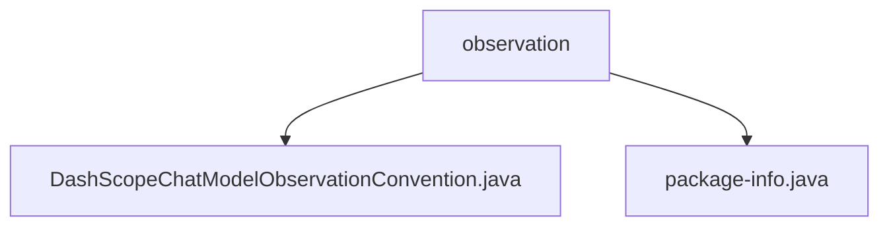

# 基础信息

|      |      |
|------|------|
| 名称 | observation |
| 编码语言 | .java |
| 代码路径 | spring-ai-alibaba/spring-ai-alibaba-core/src/main/java/com/alibaba/cloud/ai/dashscope/chat/observation |
| 包名 | spring-ai-alibaba.spring-ai-alibaba-core.src.main.java.com.alibaba.cloud.ai.dashscope.chat.observation |
| 概述说明 | DashScopeChatModelObservationConvention类扩展默认聊天模型，增强请求停止序列管理，提升对话控制能力。 |

# 说明

## 概述
该代码模块主要围绕聊天模型的观察约定进行扩展和优化，特别是针对请求停止序列的处理。通过引入`DashScopeChatModelObservationConvention`类，模块增强了默认的聊天模型观察约定，使其能够在特定条件下更有效地管理和终止请求序列。这一扩展不仅提升了模型在处理复杂对话或任务时的控制能力，还增加了模型在各种应用场景中的灵活性和可靠性。

## 主要业务场景
- **复杂对话管理**：在处理多轮对话或复杂任务时，`DashScopeChatModelObservationConvention`类能够根据预设条件自动终止请求序列，避免不必要的资源消耗和错误响应。
- **任务控制**：在需要精确控制任务执行流程的场景中，该模块通过增强的观察约定，确保模型能够按照预期路径执行任务，减少意外行为的发生。
- **灵活性和可靠性**：通过扩展默认的观察约定，该模块使得模型能够更好地适应各种应用场景，提升整体系统的稳定性和用户体验。

### 包内部结构视图

该流程图展示了`observation`文件夹下的两个文件：`DashScopeChatModelObservationConvention.java`和`package-info.java`。这两个文件都位于`spring-ai-alibaba/spring-ai-alibaba-core/src/main/java/com/alibaba/cloud/ai/dashscope/chat/observation`路径下，且直接隶属于`observation`文件夹。

# 文件列表 File List

| 名称   | 类型  | 说明 |
|-------|------|-------------|
| [package-info.java](package-info.md) | file | 无内容可总结。 |
| [DashScopeChatModelObservationConvention.java](DashScopeChatModelObservationConvention.md) | file | DashScopeChatModelObservationConvention类扩展默认聊天模型，处理请求停止序列。 |

