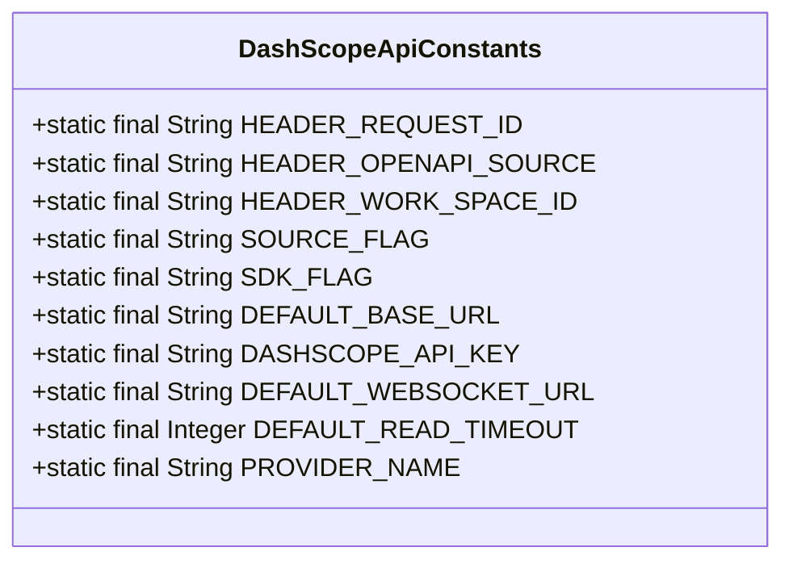
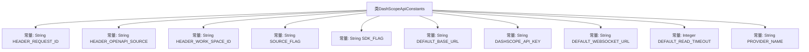

# 基础信息

|      |      |
|------|------|
| 名称 | DashScopeApiConstants |
| 编码语言 | .java |
| 代码路径 | spring-ai-alibaba/spring-ai-alibaba-core/src/main/java/com/alibaba/cloud/ai/dashscope/common/DashScopeApiConstants.java |
| 包名 | com.alibaba.cloud.ai.dashscope.common |
| 依赖项 | ['com.alibaba.cloud.ai.dashscope.observation.conventions.AiProvider'] |
| 概述说明 | DashScope API常量定义包含请求头、标识、默认URL和超时设置。 |

# 说明

DashScope API常量定义涵盖了请求头、标识、默认URL和超时设置等关键信息。请求头部分定义了API调用所需的HTTP头部信息，如认证令牌和内容类型。标识部分包括API版本号和客户端标识符，用于区分不同API版本和调用来源。默认URL部分提供了API服务的基础地址，确保所有请求都指向正确的服务器。超时设置部分定义了API调用的最大等待时间，防止请求因网络或服务器问题而无限挂起。这些常量定义确保了API调用的统一性和可靠性。

# 类列表 Class Summary

| 名称   | 类型  | 说明 |
|-------|------|-------------|
| DashScopeApiConstants | class | DashScope API常量定义，包括请求头、标识、默认URL和超时设置。 |

## 类 DashScopeApiConstants

|      |      |
|------|------|
| 访问范围 | public final |
| 类型 | class |
| 名称 | DashScopeApiConstants |
| 说明 | DashScope API常量定义，包括请求头、标识、默认URL和超时设置。 |

### UML类图

这段代码定义了一个名为 `DashScopeApiConstants` 的类，该类包含了一系列静态常量，用于存储与 DashScope API 相关的配置信息。这些常量包括请求头标识、API 密钥、默认的 API 和 WebSocket 地址、读取超时时间以及提供者名称等。这些常量在整个应用程序中可以被多次引用，避免了硬编码，提高了代码的可维护性和可读性。

### 内部方法调用关系图

该流程图展示了 `DashScopeApiConstants` 类中的常量定义及其与类的关系。每个常量都被明确地映射到类中，并通过箭头表示其层级关系。这些常量主要用于定义 API 请求的头部信息、默认 URL、超时设置等，帮助开发者在使用 DashScope API 时保持一致性和可配置性。

### 字段列表 Field List

| 名称  | 类型  | 说明 |
|-------|-------|------|
| SOURCE_FLAG = "CloudSDK" | String | SOURCE_FLAG常量值为"CloudSDK"。 |
| DEFAULT_READ_TIMEOUT = 60 | Integer | 默认读取超时时间为60秒。 |
| HEADER_REQUEST_ID = "X-Request-Id" | String | 定义静态常量HEADER_REQUEST_ID为"X-Request-Id"。 |
| SDK_FLAG = "SpringAiAlibaba" | String | SpringAiAlibaba SDK标识常量定义。 |
| DEFAULT_BASE_URL = "https://dashscope.aliyuncs.com" | String | 定义默认基础URL为阿里云DashScope服务地址。 |
| DEFAULT_WEBSOCKET_URL = "wss://dashscope.aliyuncs.com/api-ws/v1/inference/" | String | 默认WebSocket URL为阿里云DashScope推理API地址。 |
| HEADER_WORK_SPACE_ID = "X-DashScope-Workspace" | String | 定义常量HEADER_WORK_SPACE_ID，值为"X-DashScope-Workspace"。 |
| DASHSCOPE_API_KEY = "AI_DASHSCOPE_API_KEY" | String | 定义常量DASHSCOPE_API_KEY，值为AI_DASHSCOPE_API_KEY。 |
| PROVIDER_NAME = AiProvider.DASHSCOPE.value() | String | 定义常量PROVIDER_NAME，值为AiProvider.DASHSCOPE。 |
| HEADER_OPENAPI_SOURCE = "X-DashScope-OpenAPISource" | String | 定义静态常量HEADER_OPENAPI_SOURCE，值为"X-DashScope-OpenAPISource"。 |

### 方法列表 Method List

| 名称  | 类型  | 说明 |
|-------|-------|------|

