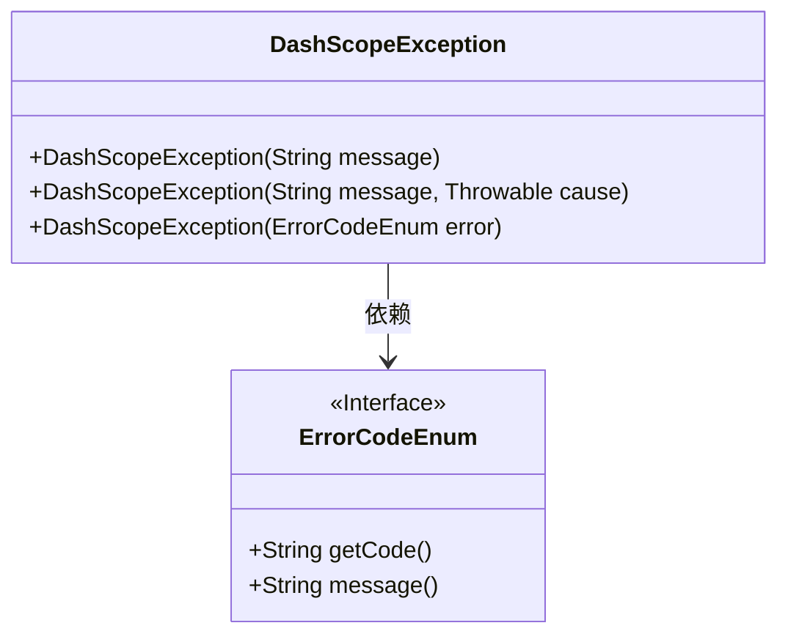
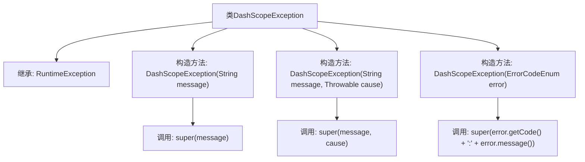

# 基础信息

|      |      |
|------|------|
| 名称 | DashScopeException |
| 编码语言 | .java |
| 代码路径 | spring-ai-alibaba/spring-ai-alibaba-core/src/main/java/com/alibaba/cloud/ai/dashscope/common/DashScopeException.java |
| 包名 | com.alibaba.cloud.ai.dashscope.common |
| 依赖项 | [] |
| 概述说明 | DashScopeException继承RuntimeException，支持错误信息和原因构造。 |

# 说明

DashScopeException继承自RuntimeException，支持通过错误信息和原因进行构造。该异常类用于在运行时捕获和处理特定错误，提供了灵活的构造方式，便于开发者传递详细的错误信息和根本原因，从而更好地进行错误诊断和处理。

# 类列表 Class Summary

| 名称   | 类型  | 说明 |
|-------|------|-------------|
| DashScopeException | class | DashScopeException继承RuntimeException，支持错误信息和原因构造。 |

## 类 DashScopeException

|      |      |
|------|------|
| 访问范围 | public |
| 类型 | class |
| 名称 | DashScopeException |
| 说明 | DashScopeException继承RuntimeException，支持错误信息和原因构造。 |

### UML类图

**描述：**  
`DashScopeException` 是一个自定义的运行时异常类，继承自 `RuntimeException`。它提供了三种构造方法：第一种接受一个字符串消息，第二种接受字符串消息和异常原因，第三种接受一个 `ErrorCodeEnum` 类型的错误码，并将错误码和消息组合成异常信息。`ErrorCodeEnum` 是一个接口，定义了获取错误码和消息的方法。`DashScopeException` 依赖于 `ErrorCodeEnum` 来获取错误信息。

### 内部方法调用关系图

这段代码定义了一个名为 `DashScopeException` 的类，它继承自 `RuntimeException`。该类提供了三个构造方法，分别用于处理不同的异常情况：第一个构造方法接收一个字符串消息并调用父类的构造方法；第二个构造方法接收一个字符串消息和一个 `Throwable` 对象，并调用父类的构造方法；第三个构造方法接收一个 `ErrorCodeEnum` 对象，将其代码和消息拼接后调用父类的构造方法。流程图展示了类的继承关系和构造方法之间的调用关系。

### 字段列表 Field List

| 名称  | 类型  | 说明 |
|-------|-------|------|

### 方法列表 Method List

| 名称  | 类型  | 说明 |
|-------|-------|------|

