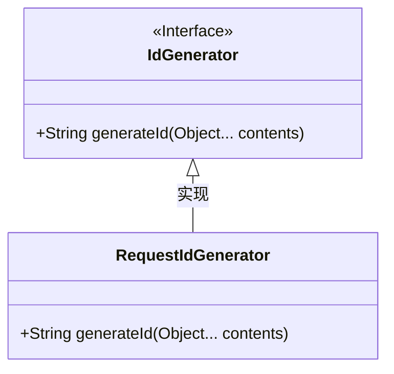
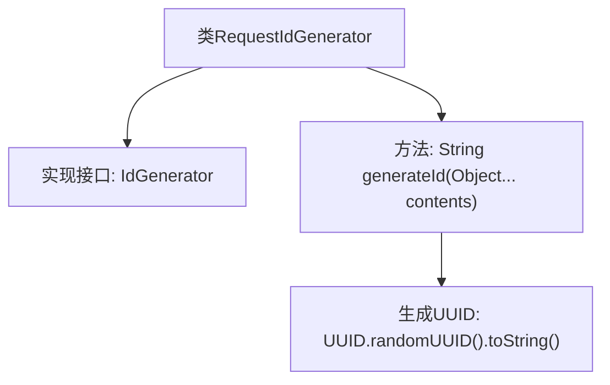

# 基础信息

|      |      |
|------|------|
| 名称 | RequestIdGenerator |
| 编码语言 | .java |
| 代码路径 | spring-ai-alibaba/spring-ai-alibaba-core/src/main/java/com/alibaba/cloud/ai/dashscope/common/RequestIdGenerator.java |
| 包名 | com.alibaba.cloud.ai.dashscope.common |
| 依赖项 | ['java.util.UUID'] |
| 概述说明 | RequestIdGenerator类通过UUID实现IdGenerator接口，生成唯一ID。 |

# 说明

RequestIdGenerator类实现了IdGenerator接口，其主要功能是生成唯一ID。该类通过使用UUID（通用唯一识别码）来确保生成的ID具有全局唯一性。UUID是一种标准化的方法，能够在分布式系统中生成几乎不可能重复的标识符。RequestIdGenerator类通过实现IdGenerator接口，提供了一种统一的方式来生成唯一ID，适用于需要唯一标识符的各种应用场景。

# 类列表 Class Summary

| 名称   | 类型  | 说明 |
|-------|------|-------------|
| RequestIdGenerator | class | 实现IdGenerator接口的RequestIdGenerator类，使用UUID生成唯一ID。 |

## 类 RequestIdGenerator

|      |      |
|------|------|
| 访问范围 | public |
| 类型 | class |
| 名称 | RequestIdGenerator |
| 说明 | 实现IdGenerator接口的RequestIdGenerator类，使用UUID生成唯一ID。 |

### UML类图

这段代码定义了一个 `RequestIdGenerator` 类，该类实现了 `IdGenerator` 接口。`IdGenerator` 接口包含一个 `generateId` 方法，用于生成唯一的标识符。`RequestIdGenerator` 类通过重写 `generateId` 方法，使用 `UUID.randomUUID().toString()` 生成一个随机的 UUID 字符串作为标识符。这种设计模式允许在需要生成唯一标识符时，灵活地替换不同的实现类。

### 内部方法调用关系图

这段代码定义了一个名为 `RequestIdGenerator` 的类，该类实现了 `IdGenerator` 接口。`RequestIdGenerator` 类中包含一个 `generateId` 方法，该方法接受可变数量的 `Object` 参数，并返回一个由 `UUID.randomUUID().toString()` 生成的随机 UUID 字符串。流程图展示了类的结构及其方法之间的关系，清晰地描述了代码的执行流程。

### 字段列表 Field List

| 名称  | 类型  | 说明 |
|-------|-------|------|

### 方法列表 Method List

| 名称  | 类型  | 说明 |
|-------|-------|------|
| generateId | String | 生成随机UUID作为唯一标识符。 |

