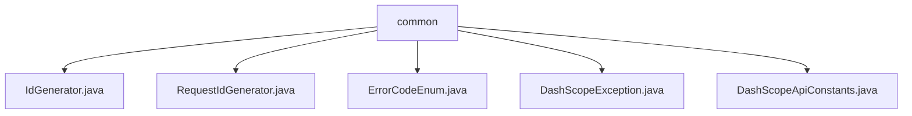

# 基础信息

|      |      |
|------|------|
| 名称 | common |
| 编码语言 | .java |
| 代码路径 | spring-ai-alibaba/spring-ai-alibaba-core/src/main/java/com/alibaba/cloud/ai/dashscope/common |
| 包名 | spring-ai-alibaba.spring-ai-alibaba-core.src.main.java.com.alibaba.cloud.ai.dashscope.common |
| 概述说明 | RequestIdGenerator类通过UUID生成唯一ID，DashScopeException用于捕获运行时错误，DashScopeApiConstants定义API关键信息。 |

# 说明

## 概述
该代码模块是`spring-ai-alibaba`项目的一部分，具体位于`spring-ai-alibaba-core`模块中。它主要提供了一些核心功能，包括唯一ID生成、异常处理以及API常量的定义。这些功能为分布式系统中的请求处理、错误管理和API调用提供了基础支持。模块通过使用UUID生成唯一ID，确保在分布式环境中生成的ID具有全局唯一性；通过自定义异常类`DashScopeException`，提供了灵活的错误处理机制；同时，通过`DashScopeApiConstants`类，定义了API调用所需的常量信息，确保了API调用的统一性和可靠性。

## 主要业务场景
1. **唯一ID生成**：`RequestIdGenerator`类通过实现`IdGenerator`接口，使用UUID生成全局唯一ID。该功能适用于需要唯一标识符的各种应用场景，如请求跟踪、日志记录、分布式锁等。
2. **异常处理**：`DashScopeException`类继承自`RuntimeException`，支持通过错误信息和原因进行构造。该异常类用于在运行时捕获和处理特定错误，便于开发者传递详细的错误信息和根本原因，从而更好地进行错误诊断和处理。
3. **API常量定义**：`DashScopeApiConstants`类定义了API调用所需的常量信息，包括请求头、标识、默认URL和超时设置等。这些常量确保了API调用的统一性和可靠性，适用于所有需要调用DashScope API的场景。

### 包内部结构视图

该流程图展示了`common`文件夹下的文件层级关系。`common`作为根节点，包含了`IdGenerator.java`、`RequestIdGenerator.java`、`ErrorCodeEnum.java`、`DashScopeException.java`和`DashScopeApiConstants.java`五个文件。这些文件均位于`common`目录下，且没有进一步的子目录结构。

# 文件列表 File List

| 名称   | 类型  | 说明 |
|-------|------|-------------|
| [IdGenerator.java](IdGenerator.md) | file | 无内容提供，无法生成概要描述。 |
| [DashScopeApiConstants.java](DashScopeApiConstants.md) | file | DashScope API常量定义包含请求头、标识、默认URL和超时设置。 |
| [DashScopeException.java](DashScopeException.md) | file | DashScopeException继承RuntimeException，支持错误信息和原因构造。 |
| [ErrorCodeEnum.java](ErrorCodeEnum.md) | file | 内容为空，无法生成概要描述。 |
| [RequestIdGenerator.java](RequestIdGenerator.md) | file | RequestIdGenerator类通过UUID实现IdGenerator接口，生成唯一ID。 |

