# 基础信息

|      |      |
|------|------|
| 名称 | DashScopeEmbeddingModel |
| 编码语言 | .java |
| 代码路径 | spring-ai-alibaba/spring-ai-alibaba-core/src/main/java/com/alibaba/cloud/ai/dashscope/embedding/DashScopeEmbeddingModel.java |
| 包名 | com.alibaba.cloud.ai.dashscope.embedding |
| 依赖项 | ['java.util.HashMap', 'java.util.List', 'java.util.Map', 'com.alibaba.cloud.ai.dashscope.api.DashScopeApi', 'com.alibaba.cloud.ai.dashscope.common.DashScopeApiConstants', 'io.micrometer.observation.ObservationRegistry', 'org.slf4j.Logger', 'org.slf4j.LoggerFactory', 'org.springframework.ai.document.Document', 'org.springframework.ai.document.MetadataMode', 'org.springframework.ai.embedding', 'org.springframework.ai.embedding.observation.DefaultEmbeddingModelObservationConvention', 'org.springframework.ai.embedding.observation.EmbeddingModelObservationContext', 'org.springframework.ai.embedding.observation.EmbeddingModelObservationConvention', 'org.springframework.ai.embedding.observation.EmbeddingModelObservationDocumentation', 'org.springframework.ai.model.ModelOptionsUtils', 'org.springframework.ai.retry.RetryUtils', 'org.springframework.lang.Nullable', 'org.springframework.retry.support.RetryTemplate', 'org.springframework.util.Assert'] |
| 概述说明 | DashScopeEmbeddingModel继承AbstractEmbeddingModel，提供嵌入和调用功能，包含默认选项、重试模板、API接口、元数据模式和观察注册表。 |

# 说明

DashScopeEmbeddingModel类继承自AbstractEmbeddingModel，具备多种功能和特性。该类包含默认选项，用于配置模型的基本参数；重试模板，用于处理请求失败时的重试策略；API接口，提供与外部服务交互的能力；元数据模式，用于定义和管理数据的结构；以及观察注册表，用于监控和记录模型的行为。此外，该类还提供嵌入功能，用于将数据转换为向量表示，以及调用功能，用于执行模型的操作和推理。这些特性共同使DashScopeEmbeddingModel成为一个功能全面且灵活的嵌入模型实现。

# 类列表 Class Summary

| 名称   | 类型  | 说明 |
|-------|------|-------------|
| DashScopeEmbeddingModel | class | DashScopeEmbeddingModel类继承AbstractEmbeddingModel，包含默认选项、重试模板、API接口、元数据模式和观察注册表，提供嵌入和调用功能。 |

## 类 DashScopeEmbeddingModel

|      |      |
|------|------|
| 访问范围 | public |
| 类型 | class |
| 名称 | DashScopeEmbeddingModel |
| 说明 | DashScopeEmbeddingModel类继承AbstractEmbeddingModel，包含默认选项、重试模板、API接口、元数据模式和观察注册表，提供嵌入和调用功能。 |

### UML类图

```mermaid
classDiagram
    class DashScopeEmbeddingModel {
        -Logger logger
        -EmbeddingModelObservationConvention DEFAULT_OBSERVATION_CONVENTION
        -DashScopeEmbeddingOptions defaultOptions
        -RetryTemplate retryTemplate
        -DashScopeApi dashScopeApi
        -MetadataMode metadataMode
        -ObservationRegistry observationRegistry
        -EmbeddingModelObservationConvention observationConvention
        +DashScopeEmbeddingModel(DashScopeApi dashScopeApi)
        +DashScopeEmbeddingModel(DashScopeApi dashScopeApi, MetadataMode metadataMode)
        +DashScopeEmbeddingModel(DashScopeApi dashScopeApi, MetadataMode metadataMode, DashScopeEmbeddingOptions dashScopeEmbeddingOptions)
        +DashScopeEmbeddingModel(DashScopeApi dashScopeApi, MetadataMode metadataMode, DashScopeEmbeddingOptions dashScopeEmbeddingOptions, RetryTemplate retryTemplate)
        +DashScopeEmbeddingModel(DashScopeApi dashScopeApi, MetadataMode metadataMode, DashScopeEmbeddingOptions options, RetryTemplate retryTemplate, ObservationRegistry observationRegistry)
        +float[] embed(Document document)
        +EmbeddingResponse call(EmbeddingRequest request)
        -DashScopeApi.EmbeddingRequest createRequest(EmbeddingRequest request, DashScopeEmbeddingOptions requestOptions)
        -DashScopeEmbeddingOptions mergeOptions(EmbeddingOptions runtimeOptions, DashScopeEmbeddingOptions defaultOptions)
        -EmbeddingResponseMetadata generateResponseMetadata(String model, DashScopeApi.EmbeddingUsage usage)
        +void setObservationConvention(EmbeddingModelObservationConvention observationConvention)
    }

    class AbstractEmbeddingModel {
        <<Abstract>>
    }

    class DashScopeApi {
        +EmbeddingList embeddings(EmbeddingRequest request)
    }

    class EmbeddingModelObservationConvention {
        <<Interface>>
    }

    class DefaultEmbeddingModelObservationConvention {
        <<Interface>>
    }

    class DashScopeEmbeddingOptions {
        +String getModel()
        +String getTextType()
        +int getDimensions()
        +Builder builder()
    }

    class RetryTemplate {
        +R~T~ execute(Function~Context, R~ function)
    }

    class ObservationRegistry {
        +ObservationRegistry NOOP
    }

    class EmbeddingResponse {
        +List~Embedding~ getEmbeddings()
        +EmbeddingResponseMetadata getMetadata()
    }

    class Embedding {
        +float[] getEmbedding()
        +int getTextIndex()
    }

    class EmbeddingResponseMetadata {
        +String getModel()
        +DashScopeApi.EmbeddingUsage getUsage()
        +Map~String, Object~ getMetadataMap()
    }

    class DashScopeApi.EmbeddingRequest {
        +String getInstructions()
        +String getModel()
        +String getTextType()
    }

    class DashScopeApi.EmbeddingList {
        +String message()
        +int code()
        +List~Embedding~ output()
        +DashScopeApi.EmbeddingUsage usage()
    }

    class DashScopeApi.EmbeddingUsage {
        +int totalTokens()
    }

    class Document {
        +String getFormattedContent(MetadataMode metadataMode)
    }

    class EmbeddingRequest {
        +String getInstructions()
        +EmbeddingOptions getOptions()
    }

    class EmbeddingOptions {
        +String getModel()
        +int getDimensions()
    }

    class MetadataMode {
        <<Enum>>
        +EMBED
    }

    AbstractEmbeddingModel <|-- DashScopeEmbeddingModel
    EmbeddingModelObservationConvention <|.. DefaultEmbeddingModelObservationConvention
    DashScopeEmbeddingModel --> DashScopeApi : 依赖
    DashScopeEmbeddingModel --> DashScopeEmbeddingOptions : 依赖
    DashScopeEmbeddingModel --> RetryTemplate : 依赖
    DashScopeEmbeddingModel --> ObservationRegistry : 依赖
    DashScopeEmbeddingModel --> EmbeddingModelObservationConvention : 依赖
    DashScopeEmbeddingModel --> Document : 依赖
    DashScopeEmbeddingModel --> EmbeddingRequest : 依赖
    DashScopeEmbeddingModel --> EmbeddingResponse : 依赖
    DashScopeEmbeddingModel --> EmbeddingResponseMetadata : 依赖
    DashScopeEmbeddingModel --> DashScopeApi.EmbeddingRequest : 依赖
    DashScopeEmbeddingModel --> DashScopeApi.EmbeddingList : 依赖
    DashScopeEmbeddingModel --> DashScopeApi.EmbeddingUsage : 依赖
    EmbeddingResponse --> Embedding : 依赖
    EmbeddingResponse --> EmbeddingResponseMetadata : 依赖
    EmbeddingRequest --> EmbeddingOptions : 依赖
    DashScopeApi.EmbeddingList --> DashScopeApi.EmbeddingUsage : 依赖
```

这段代码定义了一个名为 `DashScopeEmbeddingModel` 的类，它继承自 `AbstractEmbeddingModel`。该类主要用于处理嵌入模型的请求和响应，包含了对 `DashScopeApi` 的依赖，用于执行嵌入请求。代码中还定义了多个构造函数，允许在创建对象时传入不同的配置选项，如 `DashScopeEmbeddingOptions`、`RetryTemplate` 和 `ObservationRegistry`。此外，该类还提供了 `embed` 和 `call` 方法，用于处理文档嵌入和请求调用，并生成相应的嵌入响应。整个类图展示了 `DashScopeEmbeddingModel` 与其他类之间的依赖关系，以及它的继承和实现关系。

### 内部方法调用关系图

```mermaid
graph TD
    A["类DashScopeEmbeddingModel"]
    B["属性: Logger logger"]
    C["属性: EmbeddingModelObservationConvention DEFAULT_OBSERVATION_CONVENTION"]
    D["属性: DashScopeEmbeddingOptions defaultOptions"]
    E["属性: RetryTemplate retryTemplate"]
    F["属性: DashScopeApi dashScopeApi"]
    G["属性: MetadataMode metadataMode"]
    H["属性: ObservationRegistry observationRegistry"]
    I["属性: EmbeddingModelObservationConvention observationConvention"]
    J["构造方法: DashScopeEmbeddingModel(DashScopeApi dashScopeApi)"]
    K["构造方法: DashScopeEmbeddingModel(DashScopeApi dashScopeApi, MetadataMode metadataMode)"]
    L["构造方法: DashScopeEmbeddingModel(DashScopeApi dashScopeApi, MetadataMode metadataMode, DashScopeEmbeddingOptions dashScopeEmbeddingOptions)"]
    M["构造方法: DashScopeEmbeddingModel(DashScopeApi dashScopeApi, MetadataMode metadataMode, DashScopeEmbeddingOptions dashScopeEmbeddingOptions, RetryTemplate retryTemplate)"]
    N["构造方法: DashScopeEmbeddingModel(DashScopeApi dashScopeApi, MetadataMode metadataMode, DashScopeEmbeddingOptions options, RetryTemplate retryTemplate, ObservationRegistry observationRegistry)"]
    O["方法: float[] embed(Document document)"]
    P["方法: EmbeddingResponse call(EmbeddingRequest request)"]
    Q["方法: DashScopeApi.EmbeddingRequest createRequest(EmbeddingRequest request, DashScopeEmbeddingOptions requestOptions)"]
    R["方法: DashScopeEmbeddingOptions mergeOptions(EmbeddingOptions runtimeOptions, DashScopeEmbeddingOptions defaultOptions)"]
    S["方法: EmbeddingResponseMetadata generateResponseMetadata(String model, DashScopeApi.EmbeddingUsage usage)"]
    T["方法: void setObservationConvention(EmbeddingModelObservationConvention observationConvention)"]

    A --> B
    A --> C
    A --> D
    A --> E
    A --> F
    A --> G
    A --> H
    A --> I
    A --> J
    A --> K
    A --> L
    A --> M
    A --> N
    A --> O
    A --> P
    P --> Q
    P --> R
    P --> S
    A --> T
```

该流程图展示了`DashScopeEmbeddingModel`类的结构和主要方法调用关系。类中包含多个构造方法和公共方法，如`embed`、`call`、`createRequest`、`mergeOptions`、`generateResponseMetadata`和`setObservationConvention`。这些方法用于处理嵌入模型的请求和响应，并支持重试机制和观察记录。通过流程图可以清晰地看到各个方法之间的调用关系及其在类中的位置。

### 字段列表 Field List

| 名称  | 类型  | 说明 |
|-------|-------|------|
| retryTemplate | RetryTemplate | 私有且不可变的RetryTemplate实例。 |
| observationRegistry | ObservationRegistry | 私有且不可变的观察注册表实例。 |
| metadataMode | MetadataMode | 私有常量metadataMode，类型为MetadataMode。 |
| defaultOptions | DashScopeEmbeddingOptions | 私有常量默认嵌入选项 |
| logger = LoggerFactory.getLogger(DashScopeEmbeddingModel.class) | Logger | DashScopeEmbeddingModel类中定义了一个私有的静态日志记录器。 |
| dashScopeApi | DashScopeApi | 私有且不可变的DashScopeApi实例。 |
| DEFAULT_OBSERVATION_CONVENTION = new DefaultEmbeddingModelObservationConvention() | EmbeddingModelObservationConvention | 定义默认嵌入模型观察约定为DefaultEmbeddingModelObservationConvention实例。 |
| observationConvention = DEFAULT_OBSERVATION_CONVENTION | EmbeddingModelObservationConvention | 私有嵌入模型观察约定设置为默认观察约定。 |

### 方法列表 Method List

| 名称  | 类型  | 说明 |
|-------|-------|------|
| generateResponseMetadata | EmbeddingResponseMetadata | 生成包含模型和总令牌数的嵌入响应元数据。 |
| setObservationConvention | void | 设置观察约定，确保非空并赋值。 |
| createRequest | DashScopeApi.EmbeddingRequest | 创建DashScope嵌入请求，包含指令、模型和文本类型。 |
| embed | float[] | 该方法用于生成文档的嵌入向量，确保文档非空后调用嵌入方法。 |
| mergeOptions | DashScopeEmbeddingOptions | 合并DashScope嵌入选项，优先使用运行时选项，否则返回默认选项。 |
| call | EmbeddingResponse | 处理嵌入请求，合并选项，调用API，处理响应并返回结果。 |

