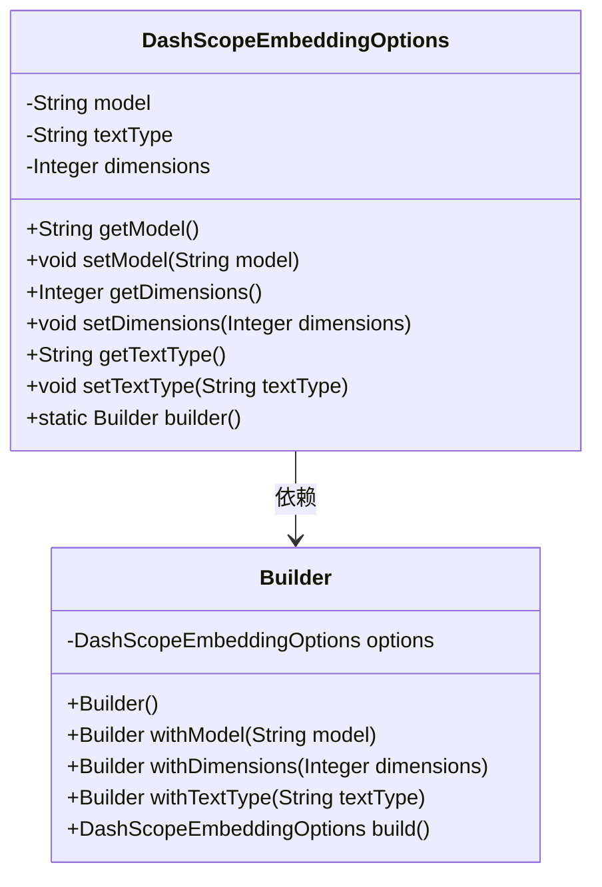
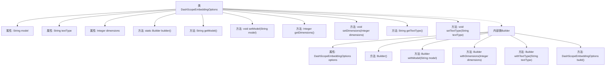

# 基础信息

|      |      |
|------|------|
| 名称 | DashScopeEmbeddingOptions |
| 编码语言 | .java |
| 代码路径 | spring-ai-alibaba/spring-ai-alibaba-core/src/main/java/com/alibaba/cloud/ai/dashscope/embedding/DashScopeEmbeddingOptions.java |
| 包名 | com.alibaba.cloud.ai.dashscope.embedding |
| 依赖项 | ['com.fasterxml.jackson.annotation.JsonInclude', 'com.fasterxml.jackson.annotation.JsonProperty', 'org.springframework.ai.embedding.EmbeddingOptions'] |
| 概述说明 | DashScopeEmbeddingOptions类含模型、文本类型、维度属性，支持构建器模式。 |

# 说明

DashScopeEmbeddingOptions类是一个用于配置嵌入模型选项的工具，包含模型、文本类型和维度三个关键属性。该类支持构建器模式，允许用户通过链式调用灵活设置这些属性，从而方便地创建和定制嵌入模型配置。

# 类列表 Class Summary

| 名称   | 类型  | 说明 |
|-------|------|-------------|
| DashScopeEmbeddingOptions | class | DashScopeEmbeddingOptions类包含模型、文本类型和维度属性，支持构建器模式。 |

## 类 DashScopeEmbeddingOptions

|      |      |
|------|------|
| 访问范围 | @JsonInclude(JsonInclude.Include.NON_NULL);public |
| 类型 | class |
| 名称 | DashScopeEmbeddingOptions |
| 说明 | DashScopeEmbeddingOptions类包含模型、文本类型和维度属性，支持构建器模式。 |

### UML类图

**描述：**  
`DashScopeEmbeddingOptions` 类用于定义嵌入选项，包含模型名称、文本类型和维度等属性，并提供了相应的getter和setter方法。`Builder` 类作为 `DashScopeEmbeddingOptions` 的构建器，提供了链式调用的方式来设置这些属性，并通过 `build` 方法返回最终的 `DashScopeEmbeddingOptions` 实例。这种设计模式使得对象的创建更加灵活和可读。

### 内部方法调用关系图

这段代码定义了一个名为`DashScopeEmbeddingOptions`的类，用于表示嵌入选项的配置。类中包含三个属性：`model`、`textType`和`dimensions`，并提供了相应的getter和setter方法。此外，类中还定义了一个内部类`Builder`，用于构建`DashScopeEmbeddingOptions`对象。`Builder`类提供了链式调用的方法，允许用户逐步设置属性值，并通过`build`方法返回最终的配置对象。这种设计模式使得对象的创建更加灵活和可读。

### 字段列表 Field List

| 名称  | 类型  | 说明 |
|-------|-------|------|
| model | String | 定义私有字符串属性model，使用JsonProperty注解。 |
| textType | String | 私有字符串属性textType，使用JsonProperty注解。 |
| dimensions | Integer | 属性dimensions为Integer类型，使用JsonProperty注解标记。 |

### 方法列表 Method List

| 名称  | 类型  | 说明 |
|-------|-------|------|
| setModel | void | 设置模型属性的方法。 |
| setDimensions | void | 设置维度属性的方法。 |
| getDimensions | Integer | 该方法返回对象的维度值。 |
| getModel | String | 获取模型属性的方法。 |
| getTextType | String | 该方法返回当前对象的文本类型属性。 |
| setTextType | void | 设置文本类型的Java方法。 |
| builder | Builder | 静态方法`builder()`返回`Builder`类的新实例。 |

