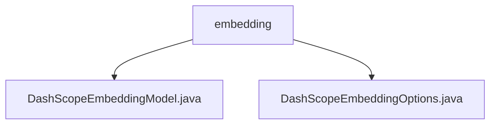

# 基础信息

|      |      |
|------|------|
| 名称 | embedding |
| 编码语言 | .java |
| 代码路径 | spring-ai-alibaba/spring-ai-alibaba-core/src/main/java/com/alibaba/cloud/ai/dashscope/embedding |
| 包名 | spring-ai-alibaba.spring-ai-alibaba-core.src.main.java.com.alibaba.cloud.ai.dashscope.embedding |
| 概述说明 | DashScopeEmbeddingModel继承AbstractEmbeddingModel，具备配置、重试、API、元数据、监控和嵌入功能。DashScopeEmbeddingOptions用于配置模型选项，支持链式调用。 |

# 说明

## 概述
该代码模块主要围绕`DashScopeEmbeddingModel`和`DashScopeEmbeddingOptions`两个类展开，提供了嵌入模型的核心功能和配置选项。`DashScopeEmbeddingModel`继承自`AbstractEmbeddingModel`，具备丰富的功能特性，包括默认选项配置、重试策略、API接口、元数据管理、观察注册表、嵌入功能和调用功能。`DashScopeEmbeddingOptions`则用于配置嵌入模型的关键属性，支持构建器模式，提供了灵活的设置方式。这两个类共同构成了一个功能全面且灵活的嵌入模型实现。

## 主要业务场景
1. **嵌入模型配置**：通过`DashScopeEmbeddingOptions`类，用户可以灵活配置嵌入模型的属性，如模型类型、文本类型和维度，满足不同场景下的需求。
2. **嵌入功能实现**：`DashScopeEmbeddingModel`类提供了将数据转换为向量表示的嵌入功能，支持多种数据类型的处理。
3. **模型操作与推理**：通过`DashScopeEmbeddingModel`的调用功能，用户可以执行模型的操作和推理，实现数据的深度分析和处理。
4. **请求重试与监控**：`DashScopeEmbeddingModel`内置了重试模板和观察注册表，确保在请求失败时能够自动重试，并实时监控和记录模型的行为。
5. **API交互**：`DashScopeEmbeddingModel`提供了与外部服务交互的API接口，支持与其他系统的无缝集成。

### 包内部结构视图

该流程图展示了`embedding`文件夹下的两个文件：`DashScopeEmbeddingModel.java`和`DashScopeEmbeddingOptions.java`。这两个文件均位于`embedding`目录下，表明它们属于同一层级，且都直接依赖于`embedding`文件夹。这种结构常用于组织相关的类文件，便于代码管理和维护。

# 文件列表 File List

| 名称   | 类型  | 说明 |
|-------|------|-------------|
| [DashScopeEmbeddingOptions.java](DashScopeEmbeddingOptions.md) | file | DashScopeEmbeddingOptions类含模型、文本类型、维度属性，支持构建器模式。 |
| [DashScopeEmbeddingModel.java](DashScopeEmbeddingModel.md) | file | DashScopeEmbeddingModel继承AbstractEmbeddingModel，提供嵌入和调用功能，包含默认选项、重试模板、API接口、元数据模式和观察注册表。 |

