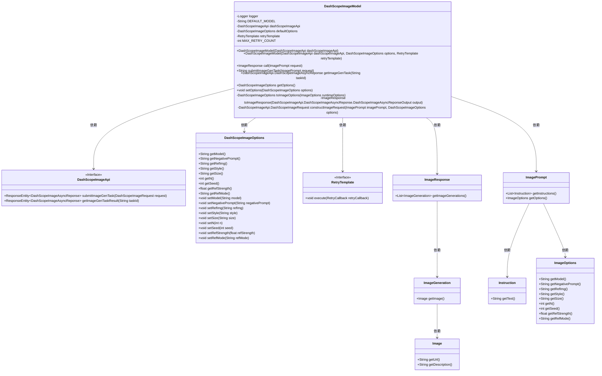

# 基础信息

|      |      |
|------|------|
| 名称 | DashScopeImageModel |
| 编码语言 | .java |
| 代码路径 | spring-ai-alibaba/spring-ai-alibaba-core/src/main/java/com/alibaba/cloud/ai/dashscope/image/DashScopeImageModel.java |
| 包名 | com.alibaba.cloud.ai.dashscope.image |
| 依赖项 | ['java.util.List', 'java.util.Objects', 'com.alibaba.cloud.ai.dashscope.api.DashScopeImageApi', 'org.slf4j.Logger', 'org.slf4j.LoggerFactory', 'org.springframework.ai.image.Image', 'org.springframework.ai.image.ImageGeneration', 'org.springframework.ai.image.ImageModel', 'org.springframework.ai.image.ImageOptions', 'org.springframework.ai.image.ImagePrompt', 'org.springframework.ai.image.ImageResponse', 'org.springframework.ai.model.ModelOptionsUtils', 'org.springframework.ai.retry.RetryUtils', 'org.springframework.http.ResponseEntity', 'org.springframework.retry.support.RetryTemplate', 'org.springframework.util.Assert', 'org.springframework.util.CollectionUtils'] |
| 概述说明 | DashScopeImageModel类提供图像生成功能，支持默认模型、API调用、重试机制和响应处理。 |

# 说明

DashScopeImageModel类是一个用于实现图像生成功能的类，主要包含默认模型设置、API调用、重试机制和图像响应处理等核心功能。默认模型用于指定生成图像的基础模型，API调用负责与外部服务进行交互以生成图像，重试机制确保在调用失败时能够自动重试，图像响应处理则用于解析和处理从API返回的图像数据。这些功能共同协作，确保图像生成过程的稳定性和可靠性。

# 类列表 Class Summary

| 名称   | 类型  | 说明 |
|-------|------|-------------|
| DashScopeImageModel | class | DashScopeImageModel类实现图像生成功能，包含默认模型、API调用、重试机制和图像响应处理。 |

## 类 DashScopeImageModel

|      |      |
|------|------|
| 访问范围 | public |
| 类型 | class |
| 名称 | DashScopeImageModel |
| 说明 | DashScopeImageModel类实现图像生成功能，包含默认模型、API调用、重试机制和图像响应处理。 |

### UML类图

**描述：**  
`DashScopeImageModel` 类是一个用于处理图像生成请求的模型类，它依赖于 `DashScopeImageApi` 接口来提交和获取图像生成任务的结果。该类通过 `RetryTemplate` 实现重试机制，确保在任务失败时能够自动重试。`DashScopeImageOptions` 类用于配置图像生成的参数，如模型、样式、大小等。`ImagePrompt` 类包含生成图像的指令和选项，而 `ImageResponse` 类则用于返回生成的图像结果。整个类图展示了图像生成任务的处理流程及其相关依赖关系。

### 内部方法调用关系图

```mermaid
graph TD
    A["类DashScopeImageModel"]
    B["属性: Logger logger"]
    C["属性: String DEFAULT_MODEL"]
    D["属性: DashScopeImageApi dashScopeImageApi"]
    E["属性: DashScopeImageOptions defaultOptions"]
    F["属性: RetryTemplate retryTemplate"]
    G["属性: int MAX_RETRY_COUNT"]
    H["构造方法: DashScopeImageModel(DashScopeImageApi dashScopeImageApi)"]
    I["构造方法: DashScopeImageModel(DashScopeImageApi dashScopeImageApi, DashScopeImageOptions options, RetryTemplate retryTemplate)"]
    J["方法: ImageResponse call(ImagePrompt request)"]
    K["方法: String submitImageGenTask(ImagePrompt request)"]
    L["方法: DashScopeImageOptions toImageOptions(ImageOptions runtimeOptions)"]
    M["方法: DashScopeImageApi.DashScopeImageAsyncReponse getImageGenTask(String taskId)"]
    N["方法: DashScopeImageOptions getOptions()"]
    O["方法: void setOptions(DashScopeImageOptions options)"]
    P["方法: ImageResponse toImageResponse(DashScopeImageApi.DashScopeImageAsyncReponse.DashScopeImageAsyncReponseOutput output)"]
    Q["方法: DashScopeImageApi.DashScopeImageRequest constructImageRequest(ImagePrompt imagePrompt, DashScopeImageOptions options)"]

    A --> B
    A --> C
    A --> D
    A --> E
    A --> F
    A --> G
    A --> H
    A --> I
    A --> J
    A --> K
    A --> L
    A --> M
    A --> N
    A --> O
    A --> P
    A --> Q
```

该流程图展示了 `DashScopeImageModel` 类的结构及其内部方法之间的关系。类中包含多个属性，如 `logger`、`DEFAULT_MODEL`、`dashScopeImageApi` 等，以及多个构造方法和方法，如 `call`、`submitImageGenTask`、`toImageOptions` 等。这些方法主要用于处理图像生成任务的提交、获取任务结果、合并图像选项等操作。流程图清晰地展示了类中各个方法之间的调用关系，帮助理解代码的逻辑结构。

### 字段列表 Field List

| 名称  | 类型  | 说明 |
|-------|-------|------|
| DEFAULT_MODEL = "wanx-v1" | String | 默认模型设置为"wanx-v1"。 |
| dashScopeImageApi | DashScopeImageApi | 私有不可变的DashScopeImageApi实例。 |
| logger = LoggerFactory.getLogger(DashScopeImageModel.class) | Logger | DashScopeImageModel类中定义了私有静态日志记录器logger。 |
| retryTemplate | RetryTemplate | 私有且不可变的RetryTemplate实例。 |
| MAX_RETRY_COUNT = 10 | int | 定义最大重试次数为10的静态常量。 |
| defaultOptions | DashScopeImageOptions | 私有变量defaultOptions存储DashScopeImageOptions默认配置。 |

### 方法列表 Method List

| 名称  | 类型  | 说明 |
|-------|-------|------|
| setOptions | void | 设置默认图像选项。 |
| getOptions | DashScopeImageOptions | 获取默认图像选项的方法。 |
| submitImageGenTask | String | 提交图像生成任务并返回任务ID。 |
| toImageOptions | DashScopeImageOptions | 将ImageOptions转换为DashScopeImageOptions，默认使用DEFAULT_MODEL，合并默认选项。 |
| toImageResponse | ImageResponse | 将DashScopeImageAsyncReponseOutput转换为ImageResponse，包含图像URL列表。 |
| constructImageRequest | DashScopeImageApi.DashScopeImageRequest | 构建DashScopeImageRequest对象，包含模型、输入和参数配置。 |
| getImageGenTask | DashScopeImageApi.DashScopeImageAsyncReponse | 通过任务ID获取图像生成任务结果，若无响应则返回空。 |
| call | ImageResponse | 方法处理图像生成请求，验证输入后提交任务，轮询任务状态，成功返回结果，失败或超时返回空。 |

