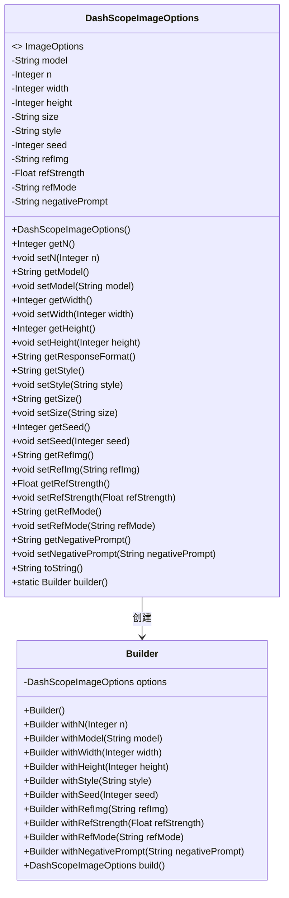

# 基础信息

|      |      |
|------|------|
| 名称 | DashScopeImageOptions |
| 编码语言 | .java |
| 代码路径 | spring-ai-alibaba/spring-ai-alibaba-core/src/main/java/com/alibaba/cloud/ai/dashscope/image/DashScopeImageOptions.java |
| 包名 | com.alibaba.cloud.ai.dashscope.image |
| 依赖项 | ['com.fasterxml.jackson.annotation.JsonInclude', 'com.fasterxml.jackson.annotation.JsonProperty', 'org.springframework.ai.image.ImageOptions'] |
| 概述说明 | DashScopeImageOptions类配置图像生成参数，如模型、数量、尺寸、风格等。 |

# 说明

DashScopeImageOptions类是一个用于配置图像生成参数的类，它允许用户定义多种参数以控制图像生成过程。这些参数包括选择的模型、生成图像的数量、图像的尺寸、艺术风格、随机种子、参考图像以及参考图像的强度等。通过这些配置，用户可以精确控制生成图像的特性和效果，满足不同的需求和偏好。

# 类列表 Class Summary

| 名称   | 类型  | 说明 |
|-------|------|-------------|
| DashScopeImageOptions | class | DashScopeImageOptions类用于配置图像生成参数，包括模型、数量、尺寸、风格、随机种子、参考图像及强度等。 |

## 类 DashScopeImageOptions

|      |      |
|------|------|
| 访问范围 | @JsonInclude(JsonInclude.Include.NON_NULL);public |
| 类型 | class |
| 名称 | DashScopeImageOptions |
| 说明 | DashScopeImageOptions类用于配置图像生成参数，包括模型、数量、尺寸、风格、随机种子、参考图像及强度等。 |

### UML类图

这段代码定义了一个 `DashScopeImageOptions` 类，该类实现了 `ImageOptions` 接口，用于配置图像生成的参数。类中包含多个私有字段，如模型、生成图像的数量、宽度、高度、样式等，并提供了相应的 getter 和 setter 方法。此外，类中还定义了一个静态内部类 `Builder`，用于以链式调用的方式构建 `DashScopeImageOptions` 对象。这种设计模式使得对象的创建过程更加灵活和可读。

### 内部方法调用关系图

```mermaid
graph TD
    A["类DashScopeImageOptions"]
    B["属性: String model"]
    C["属性: Integer n"]
    D["属性: Integer width"]
    E["属性: Integer height"]
    F["属性: String size"]
    G["属性: String style"]
    H["属性: Integer seed"]
    I["属性: String refImg"]
    J["属性: Float refStrength"]
    K["属性: String refMode"]
    L["属性: String negativePrompt"]
    M["方法: static Builder builder()"]
    N["方法: Integer getN()"]
    O["方法: void setN(Integer n)"]
    P["方法: String getModel()"]
    Q["方法: void setModel(String model)"]
    R["方法: Integer getWidth()"]
    S["方法: void setWidth(Integer width)"]
    T["方法: Integer getHeight()"]
    U["方法: void setHeight(Integer height)"]
    V["方法: String getResponseFormat()"]
    W["方法: String getStyle()"]
    X["方法: void setStyle(String style)"]
    Y["方法: String getSize()"]
    Z["方法: void setSize(String size)"]
    AA["方法: Integer getSeed()"]
    AB["方法: void setSeed(Integer seed)"]
    AC["方法: String getRefImg()"]
    AD["方法: void setRefImg(String refImg)"]
    AE["方法: Float getRefStrength()"]
    AF["方法: void setRefStrength(Float refStrength)"]
    AG["方法: String getRefMode()"]
    AH["方法: void setRefMode(String refMode)"]
    AI["方法: String getNegativePrompt()"]
    AJ["方法: void setNegativePrompt(String negativePrompt)"]
    AK["方法: String toString()"]
    AL["类Builder"]
    AM["属性: DashScopeImageOptions options"]
    AN["方法: Builder withN(Integer n)"]
    AO["方法: Builder withModel(String model)"]
    AP["方法: Builder withWidth(Integer width)"]
    AQ["方法: Builder withHeight(Integer height)"]
    AR["方法: Builder withStyle(String style)"]
    AS["方法: Builder withSeed(Integer seed)"]
    AT["方法: Builder withRefImg(String refImg)"]
    AU["方法: Builder withRefStrength(Float refStrength)"]
    AV["方法: Builder withRefMode(String refMode)"]
    AW["方法: Builder withNegativePrompt(String negativePrompt)"]
    AX["方法: DashScopeImageOptions build()"]
    
    A --> B
    A --> C
    A --> D
    A --> E
    A --> F
    A --> G
    A --> H
    A --> I
    A --> J
    A --> K
    A --> L
    A --> M
    A --> N
    A --> O
    A --> P
    A --> Q
    A --> R
    A --> S
    A --> T
    A --> U
    A --> V
    A --> W
    A --> X
    A --> Y
    A --> Z
    A --> AA
    A --> AB
    A --> AC
    A --> AD
    A --> AE
    A --> AF
    A --> AG
    A --> AH
    A --> AI
    A --> AJ
    A --> AK
    A -.-> AL
    AL --> AM
    AL --> AN
    AL --> AO
    AL --> AP
    AL --> AQ
    AL --> AR
    AL --> AS
    AL --> AT
    AL --> AU
    AL --> AV
    AL --> AW
    AL --> AX
```

该流程图展示了`DashScopeImageOptions`类及其内部类`Builder`的结构和关系。`DashScopeImageOptions`类包含多个属性，如`model`、`n`、`width`、`height`等，并提供了相应的getter和setter方法。`Builder`类用于构建`DashScopeImageOptions`对象，提供了链式调用的方法，如`withN`、`withModel`等，最后通过`build`方法返回构建好的对象。整个流程清晰地展示了类的属性和方法之间的调用关系。

### 字段列表 Field List

| 名称  | 类型  | 说明 |
|-------|-------|------|
| negativePrompt | String | JSON属性negativePrompt的私有字符串声明。 |
| model | String | 定义私有字符串变量model，使用JsonProperty注解进行JSON映射。 |
| size | String | 属性size使用JsonProperty注解映射JSON字段。 |
| seed | Integer | JSON属性映射种子值为整数类型。 |
| refStrength | Float | 定义了一个私有浮点型变量refStrength，使用JsonProperty注解。 |
| height | Integer | 属性height映射JSON字段size_height。 |
| n | Integer | 属性n使用JsonProperty注解映射为JSON字段"n"。 |
| style | String | 属性"style"使用JsonProperty注解进行JSON序列化映射。 |
| refMode | String | 属性refMode使用JsonProperty注解映射JSON字段。 |
| width | Integer | 定义了一个私有整型变量width，使用JsonProperty注解标记为size_width。 |
| refImg | String | JSON属性映射引用图片字段。 |

### 方法列表 Method List

| 名称  | 类型  | 说明 |
|-------|-------|------|
| setN | void | 设置整数变量n的值。 |
| setModel | void | 设置模型属性的方法。 |
| getStyle | String | 该方法返回当前对象的样式属性。 |
| builder | Builder | 静态方法返回新的Builder实例。 |
| setSeed | void | 设置整数类型的种子值。 |
| getSeed | Integer | 获取并返回整型种子值。 |
| setHeight | void | 设置高度并更新尺寸为宽度加高度。 |
| setStyle | void | 设置对象样式属性的方法。 |
| getHeight | Integer | 重写getHeight方法，返回当前对象的高度值。 |
| getRefMode | String | 获取refMode字符串值的方法。 |
| getNegativePrompt | String | 获取负向提示字符串的方法。 |
| getRefImg | String | 获取引用图像的方法。 |
| setRefStrength | void | 设置引用强度的Java方法。 |
| setSize | void | 设置对象尺寸的方法。 |
| getN | Integer | 重写getN方法，返回当前对象的n值。 |
| setNegativePrompt | void | 设置负面提示的方法，用于更新负面提示内容。 |
| getModel | String | 重写getModel方法，返回当前对象的model属性。 |
| getRefStrength | Float | 获取refStrength的浮点数值。 |
| getWidth | Integer | 重写getWidth方法，返回当前对象的宽度值。 |
| getSize | String | 方法返回尺寸，优先返回size，否则返回宽高组合。 |
| setRefImg | void | 设置引用图像的方法，将输入参数赋给类变量。 |
| setRefMode | void | 设置引用模式的Java方法。 |
| toString | String | DashScopeImageOptions类toString方法返回图像选项的字符串表示。 |
| getResponseFormat | String | 重写getResponseFormat方法，返回值为null。 |
| setWidth | void | 设置宽度并更新尺寸为“宽*高”格式。 |

