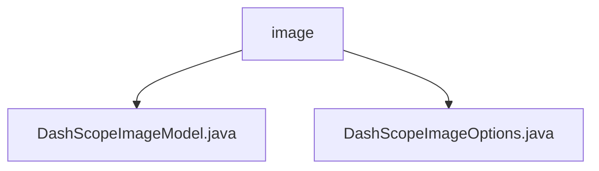

# 基础信息

|      |      |
|------|------|
| 名称 | image |
| 编码语言 | .java |
| 代码路径 | spring-ai-alibaba/spring-ai-alibaba-core/src/main/java/com/alibaba/cloud/ai/dashscope/image |
| 包名 | spring-ai-alibaba.spring-ai-alibaba-core.src.main.java.com.alibaba.cloud.ai.dashscope.image |
| 概述说明 | DashScopeImageModel类实现图像生成，包含默认模型、API调用、重试和响应处理。DashScopeImageOptions类配置生成参数，控制图像特性。 |

# 说明

## 概述
该代码模块主要实现了一个图像生成功能，核心功能包括默认模型设置、API调用、重试机制和图像响应处理。通过`DashScopeImageModel`类，模块能够与外部服务进行交互以生成图像，并确保生成过程的稳定性和可靠性。`DashScopeImageOptions`类则提供了图像生成参数的配置功能，允许用户精确控制生成图像的特性和效果。

## 主要业务场景
1. **图像生成**：通过调用外部API生成图像，支持多种参数配置，如模型选择、图像数量、尺寸、艺术风格等。
2. **参数配置**：用户可以通过`DashScopeImageOptions`类自定义图像生成参数，以满足不同的需求和偏好。
3. **稳定性保障**：模块内置重试机制，确保在API调用失败时能够自动重试，提高系统的鲁棒性。
4. **图像处理**：模块能够解析和处理从API返回的图像数据，确保生成图像的质量和可用性。

### 包内部结构视图

该流程图展示了`spring-ai-alibaba`项目中`image`目录下的文件结构。`image`作为根节点，包含两个子节点：`DashScopeImageModel.java`和`DashScopeImageOptions.java`。这两个文件分别表示图像模型和图像选项的实现类，清晰地反映了该模块的核心文件组织方式。

# 文件列表 File List

| 名称   | 类型  | 说明 |
|-------|------|-------------|
| [DashScopeImageOptions.java](DashScopeImageOptions.md) | file | DashScopeImageOptions类配置图像生成参数，如模型、数量、尺寸、风格等。 |
| [DashScopeImageModel.java](DashScopeImageModel.md) | file | DashScopeImageModel类提供图像生成功能，支持默认模型、API调用、重试机制和响应处理。 |

