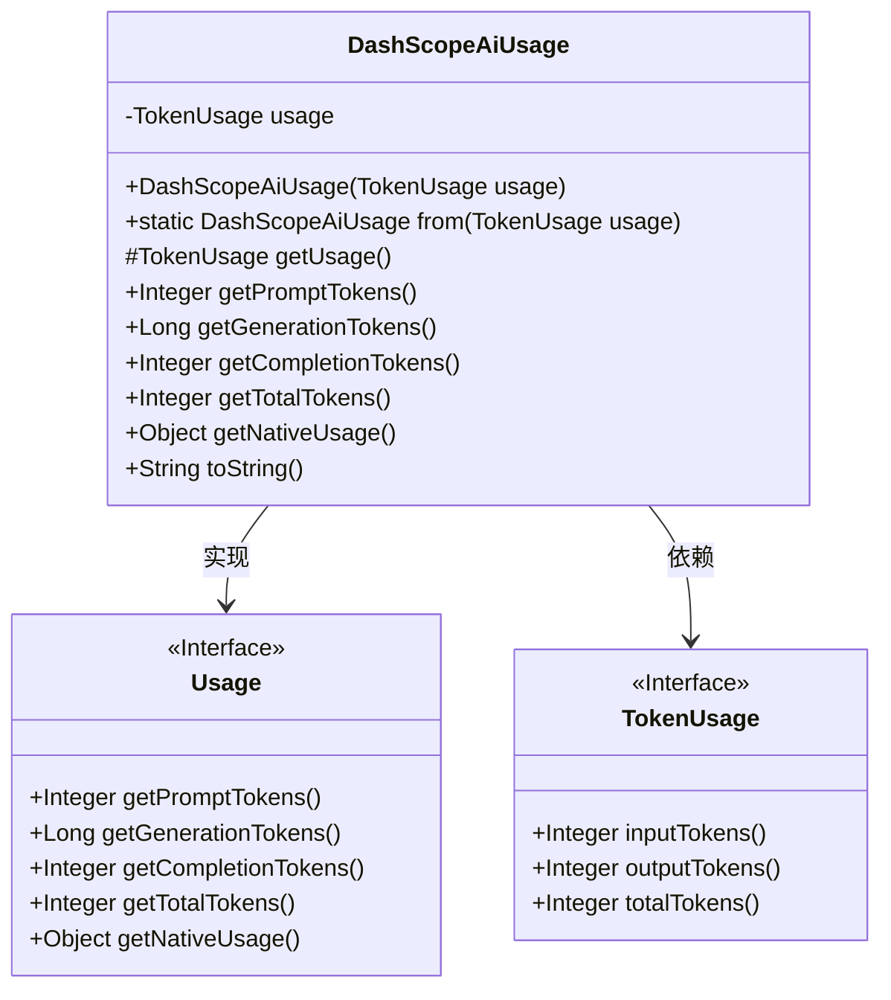
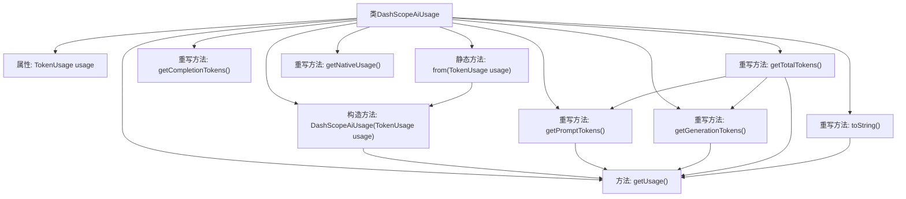

# 基础信息

|      |      |
|------|------|
| 名称 | DashScopeAiUsage |
| 编码语言 | .java |
| 代码路径 | spring-ai-alibaba/spring-ai-alibaba-core/src/main/java/com/alibaba/cloud/ai/dashscope/metadata/DashScopeAiUsage.java |
| 包名 | com.alibaba.cloud.ai.dashscope.metadata |
| 依赖项 | ['com.alibaba.cloud.ai.dashscope.api.DashScopeApi.TokenUsage', 'org.springframework.ai.chat.metadata.Usage', 'org.springframework.util.Assert'] |
| 概述说明 | DashScopeAiUsage类封装TokenUsage，提供输入、输出和总令牌数的方法。 |

# 说明

DashScopeAiUsage类封装了TokenUsage，提供了获取输入令牌数、输出令牌数以及总令牌数的方法。通过这些方法，用户可以方便地监控和管理API调用中的令牌使用情况，确保资源的高效利用。

# 类列表 Class Summary

| 名称   | 类型  | 说明 |
|-------|------|-------------|
| DashScopeAiUsage | class | DashScopeAiUsage类封装TokenUsage，提供输入、输出和总令牌数的方法。 |

## 类 DashScopeAiUsage

|      |      |
|------|------|
| 访问范围 | public |
| 类型 | class |
| 名称 | DashScopeAiUsage |
| 说明 | DashScopeAiUsage类封装TokenUsage，提供输入、输出和总令牌数的方法。 |

### UML类图

这段代码定义了一个 `DashScopeAiUsage` 类，该类实现了 `Usage` 接口，并依赖于 `TokenUsage` 接口。`DashScopeAiUsage` 类通过 `TokenUsage` 接口获取输入、输出和总令牌数，并提供了这些信息的具体实现。`Usage` 接口定义了获取令牌数的方法，而 `TokenUsage` 接口则提供了具体的令牌数计算逻辑。`DashScopeAiUsage` 类通过 `TokenUsage` 接口的实现来完成令牌数的计算和返回。

### 内部方法调用关系图

这段代码定义了一个名为`DashScopeAiUsage`的类，它实现了`Usage`接口。该类包含一个`TokenUsage`类型的属性`usage`，并通过构造方法进行初始化。类中提供了多个重写方法，用于获取提示令牌、生成令牌、完成令牌和总令牌数等信息。此外，还包含一个静态方法`from`用于创建`DashScopeAiUsage`实例，以及一个`toString`方法返回`usage`的字符串表示。流程图展示了类的结构及其方法之间的调用关系。

### 字段列表 Field List

| 名称  | 类型  | 说明 |
|-------|-------|------|
| usage | TokenUsage | 私有不可变的TokenUsage实例变量。 |

### 方法列表 Method List

| 名称  | 类型  | 说明 |
|-------|-------|------|
| getNativeUsage | Object | 该方法重写并返回空值。 |
| getPromptTokens | Integer | 重写方法，返回输入标记数。 |
| getGenerationTokens | Long | 重写方法获取输出令牌数并返回长整型值。 |
| getUsage | TokenUsage | 该方法返回受保护的TokenUsage对象实例。 |
| from | DashScopeAiUsage | 静态方法将TokenUsage转换为DashScopeAiUsage对象。 |
| getTotalTokens | Integer | 重写getTotalTokens方法，返回总令牌数或提示与生成令牌之和。 |
| toString | String | 重写toString方法，返回getUsage()的字符串表示。 |
| getCompletionTokens | Integer | 重写方法返回完成标记数为0。 |

