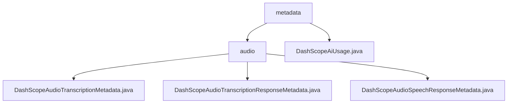

# 基础信息

|      |      |
|------|------|
| 名称 | metadata |
| 编码语言 | .java |
| 代码路径 | spring-ai-alibaba/spring-ai-alibaba-core/src/main/java/com/alibaba/cloud/ai/dashscope/metadata |
| 包名 | spring-ai-alibaba.spring-ai-alibaba-core.src.main.java.com.alibaba.cloud.ai.dashscope.metadata |
| 概述说明 | 该模块管理音频转录和语音合成的元数据，支持速率限制和字符串格式化，适用于语音识别和合成系统。 |

# 说明

## 概述

该代码模块专注于音频处理的核心功能，提供了对音频转录和语音合成响应的元数据管理。模块中的类专门设计用于处理音频转录和语音合成的响应数据，并具备对速率限制的管理功能，确保系统在高效运行的同时避免过载。此外，模块还提供了字符串格式化功能，提升数据的可读性和实用性。

## 主要业务场景

1. **音频转录响应管理**：`DashScopeAudioTranscriptionMetadata` 类用于处理音频转录响应的元数据，管理转录过程中的速率限制，并提供字符串格式化功能，确保转录后的文本能够根据需求进行格式调整。

2. **语音合成响应管理**：`DashScopeAudioSpeechResponseMetadata` 类专门用于处理语音合成响应的元数据，支持对速率限制的操作，确保语音合成过程的高效运行。

3. **API令牌使用管理**：`DashScopeAiUsage` 类封装了 `TokenUsage`，提供了获取输入令牌数、输出令牌数以及总令牌数的方法。通过这些方法，用户可以方便地监控和管理API调用中的令牌使用情况，确保资源的高效利用。

这些类共同构成了一个完整的音频处理模块，适用于需要高效处理音频转录和语音合成响应的业务场景，如语音识别、语音合成系统等。

### 包内部结构视图

该流程图展示了`spring-ai-alibaba`项目中`metadata`目录及其子目录`audio`的文件结构。`metadata`目录包含`DashScopeAiUsage.java`文件，而`audio`目录下则包含三个与音频处理相关的元数据文件。

# 文件列表 File List

| 名称   | 类型  | 说明 |
|-------|------|-------------|
| [DashScopeAiUsage.java](DashScopeAiUsage.md) | file | DashScopeAiUsage类封装TokenUsage，提供输入、输出和总令牌数的方法。 |
| [audio](audio/_module.md) | package | DashScope音频转录元数据类管理速率限制和字符串格式化，提升转录效率和可读性。 |

