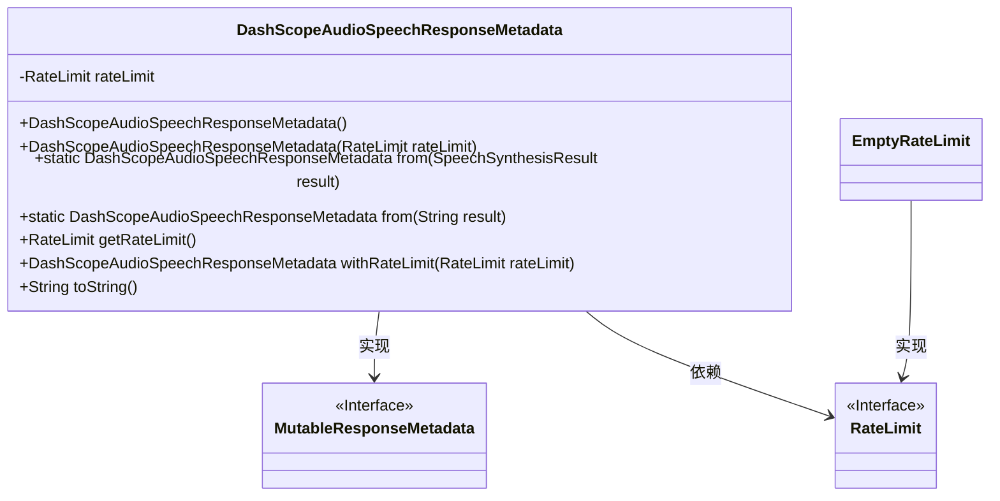
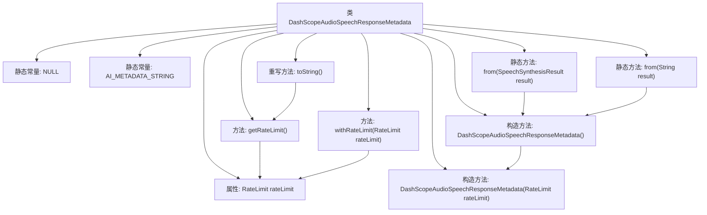

# 基础信息

|      |      |
|------|------|
| 名称 | DashScopeAudioSpeechResponseMetadata |
| 编码语言 | .java |
| 代码路径 | spring-ai-alibaba/spring-ai-alibaba-core/src/main/java/com/alibaba/cloud/ai/dashscope/metadata/audio/DashScopeAudioSpeechResponseMetadata.java |
| 包名 | com.alibaba.cloud.ai.dashscope.metadata.audio |
| 依赖项 | ['com.alibaba.cloud.ai.dashscope.audio.synthesis.SpeechSynthesisResult', 'org.springframework.ai.chat.metadata.EmptyRateLimit', 'org.springframework.ai.chat.metadata.RateLimit', 'org.springframework.ai.model.MutableResponseMetadata', 'org.springframework.lang.Nullable', 'org.springframework.util.Assert'] |
| 概述说明 | DashScopeAudioSpeechResponseMetadata类管理语音合成响应元数据，支持限速操作。 |

# 说明

DashScopeAudioSpeechResponseMetadata类专门用于处理语音合成响应的元数据，并具备对速率限制操作的支持。

# 类列表 Class Summary

| 名称   | 类型  | 说明 |
|-------|------|-------------|
| DashScopeAudioSpeechResponseMetadata | class | DashScopeAudioSpeechResponseMetadata类处理语音合成响应元数据，支持速率限制操作。 |

## 类 DashScopeAudioSpeechResponseMetadata

|      |      |
|------|------|
| 访问范围 | public |
| 类型 | class |
| 名称 | DashScopeAudioSpeechResponseMetadata |
| 说明 | DashScopeAudioSpeechResponseMetadata类处理语音合成响应元数据，支持速率限制操作。 |

### UML类图

这段代码定义了一个名为 `DashScopeAudioSpeechResponseMetadata` 的类，该类实现了 `MutableResponseMetadata` 接口。该类主要用于处理与音频语音响应相关的元数据，包含了对 `RateLimit` 的处理和获取方法。代码中通过 `from` 方法从 `SpeechSynthesisResult` 或 `String` 创建 `DashScopeAudioSpeechResponseMetadata` 实例，并提供了 `withRateLimit` 方法来设置 `RateLimit`。`toString` 方法用于格式化输出元数据信息。`EmptyRateLimit` 是 `RateLimit` 的一个实现类，用于处理空 `RateLimit` 的情况。

### 内部方法调用关系图

这段代码定义了一个名为 `DashScopeAudioSpeechResponseMetadata` 的类，该类继承自 `MutableResponseMetadata`。类中包含两个静态常量 `NULL` 和 `AI_METADATA_STRING`，以及一个可空的 `RateLimit` 属性。类提供了两个构造方法，分别用于初始化 `rateLimit` 属性。此外，类还提供了两个静态工厂方法 `from`，用于从 `SpeechSynthesisResult` 或 `String` 创建 `DashScopeAudioSpeechResponseMetadata` 实例。类中还包含获取和设置 `rateLimit` 的方法 `getRateLimit` 和 `withRateLimit`，以及重写的 `toString` 方法，用于格式化输出类信息。

### 字段列表 Field List

| 名称  | 类型  | 说明 |
|-------|-------|------|
| NULL = new DashScopeAudioSpeechResponseMetadata() {	} | DashScopeAudioSpeechResponseMetadata | 定义了一个静态不可变的DashScopeAudioSpeechResponseMetadata空实例。 |
| rateLimit | RateLimit | 可空私有变量rateLimit，类型为RateLimit。 |
| AI_METADATA_STRING = "{ @type: %1$s, requestsLimit: %2$s }" | String | 定义常量字符串，包含类型和请求限制的元数据格式。 |

### 方法列表 Method List

| 名称  | 类型  | 说明 |
|-------|-------|------|
| getRateLimit | RateLimit | 获取速率限制，若为空则返回空速率限制对象。 |
| from | DashScopeAudioSpeechResponseMetadata | 静态方法从字符串创建DashScope音频语音响应元数据对象。 |
| from | DashScopeAudioSpeechResponseMetadata | 静态方法从语音合成结果创建DashScope音频响应元数据对象。 |
| withRateLimit | DashScopeAudioSpeechResponseMetadata | 方法`public DashScopeAudioSpeechResponseMetadata withRateLimit`设置速率限制并返回当前对象。 |
| toString | String | 重写toString方法，返回类名和速率限制的格式化字符串。 |

