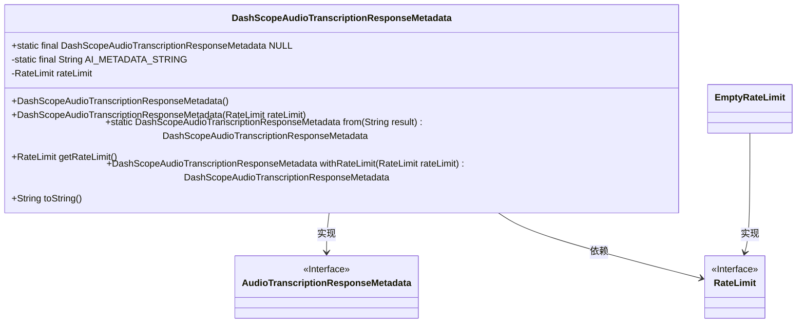
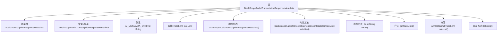

# 基础信息

|      |      |
|------|------|
| 名称 | DashScopeAudioTranscriptionResponseMetadata |
| 编码语言 | .java |
| 代码路径 | spring-ai-alibaba/spring-ai-alibaba-core/src/main/java/com/alibaba/cloud/ai/dashscope/metadata/audio/DashScopeAudioTranscriptionResponseMetadata.java |
| 包名 | com.alibaba.cloud.ai.dashscope.metadata.audio |
| 依赖项 | ['org.springframework.ai.audio.transcription.AudioTranscriptionResponseMetadata', 'org.springframework.ai.chat.metadata.EmptyRateLimit', 'org.springframework.ai.chat.metadata.RateLimit', 'org.springframework.lang.Nullable', 'org.springframework.util.Assert'] |
| 概述说明 | DashScope音频转录响应元数据类，支持速率限制处理和字符串格式化。 |

# 说明

DashScope音频转录响应元数据类是一个专门设计用于处理音频转录响应的工具，具备速率限制管理和字符串格式化功能。该类能够有效管理转录过程中的速率限制，确保系统在高效运行的同时避免过载。此外，它还提供了字符串格式化功能，使得转录后的文本能够根据需求进行格式调整，提升数据的可读性和实用性。

# 类列表 Class Summary

| 名称   | 类型  | 说明 |
|-------|------|-------------|
| DashScopeAudioTranscriptionResponseMetadata | class | DashScope音频转录响应元数据类，包含速率限制处理与字符串格式化功能。 |

## 类 DashScopeAudioTranscriptionResponseMetadata

|      |      |
|------|------|
| 访问范围 | public |
| 类型 | class |
| 名称 | DashScopeAudioTranscriptionResponseMetadata |
| 说明 | DashScope音频转录响应元数据类，包含速率限制处理与字符串格式化功能。 |

### UML类图

这段代码定义了一个名为 `DashScopeAudioTranscriptionResponseMetadata` 的类，该类实现了 `AudioTranscriptionResponseMetadata` 接口。该类包含一个静态常量 `NULL`，用于表示一个空的 `DashScopeAudioTranscriptionResponseMetadata` 实例。类中还包含一个 `RateLimit` 类型的私有成员变量 `rateLimit`，用于存储速率限制信息。`DashScopeAudioTranscriptionResponseMetadata` 类提供了多个构造函数、一个静态工厂方法 `from`、一个获取 `RateLimit` 的方法 `getRateLimit`、一个设置 `RateLimit` 的方法 `withRateLimit`，以及一个重写的 `toString` 方法。`RateLimit` 是一个接口，`EmptyRateLimit` 是其实现类，用于表示空的速率限制。

### 内部方法调用关系图

这段代码定义了一个名为`DashScopeAudioTranscriptionResponseMetadata`的类，继承自`AudioTranscriptionResponseMetadata`。该类包含一个常量`NULL`和一个格式化字符串`AI_METADATA_STRING`，以及一个可空的`RateLimit`属性。类提供了两个构造方法，一个静态方法`from`用于创建实例，以及`getRateLimit`、`withRateLimit`和`toString`方法。`toString`方法返回格式化后的元数据字符串。

### 字段列表 Field List

| 名称  | 类型  | 说明 |
|-------|-------|------|
| AI_METADATA_STRING = "{ @type: %1$s, rateLimit: %2$s }" | String | AI元数据字符串格式：类型和速率限制。 |
| NULL = new DashScopeAudioTranscriptionResponseMetadata() {	} | DashScopeAudioTranscriptionResponseMetadata | 定义静态常量NULL为DashScopeAudioTranscriptionResponseMetadata的空实例。 |
| rateLimit | RateLimit | 可空的私有变量RateLimit。 |

### 方法列表 Method List

| 名称  | 类型  | 说明 |
|-------|-------|------|
| withRateLimit | DashScopeAudioTranscriptionResponseMetadata | 公开方法DashScopeAudioTranscriptionResponseMetadata设置速率限制并返回当前对象。 |
| from | DashScopeAudioTranscriptionResponseMetadata | 静态方法转换音频转录结果元数据，确保结果非空。 |
| toString | String | 重写toString方法，返回格式化后的类名和速率限制信息。 |
| getRateLimit | RateLimit | 获取速率限制对象，若为空则返回空限制实例。 |

