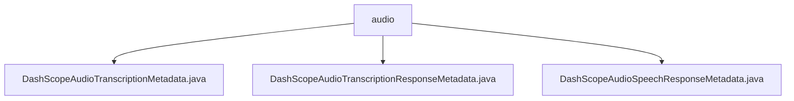

# 基础信息

|      |      |
|------|------|
| 名称 | audio |
| 编码语言 | .java |
| 代码路径 | spring-ai-alibaba/spring-ai-alibaba-core/src/main/java/com/alibaba/cloud/ai/dashscope/metadata/audio |
| 包名 | spring-ai-alibaba.spring-ai-alibaba-core.src.main.java.com.alibaba.cloud.ai.dashscope.metadata.audio |
| 概述说明 | DashScope音频转录元数据类管理速率限制和字符串格式化，提升转录效率和可读性。 |

# 说明

## 概述

该代码模块主要围绕音频处理的核心功能展开，提供了对音频转录和语音合成响应的元数据管理。模块中的类专门设计用于处理音频转录和语音合成的响应数据，并具备对速率限制的管理功能，确保系统在高效运行的同时避免过载。此外，模块还提供了字符串格式化功能，提升数据的可读性和实用性。

## 主要业务场景

1. **音频转录响应管理**：`DashScopeAudioTranscriptionMetadata` 类用于处理音频转录响应的元数据，管理转录过程中的速率限制，并提供字符串格式化功能，确保转录后的文本能够根据需求进行格式调整。

2. **语音合成响应管理**：`DashScopeAudioSpeechResponseMetadata` 类专门用于处理语音合成响应的元数据，支持对速率限制的操作，确保语音合成过程的高效运行。

这些类共同构成了一个完整的音频处理模块，适用于需要高效处理音频转录和语音合成响应的业务场景，如语音识别、语音合成系统等。

### 包内部结构视图

该流程图展示了`audio`文件夹下的三个Java文件：`DashScopeAudioTranscriptionMetadata.java`、`DashScopeAudioTranscriptionResponseMetadata.java`和`DashScopeAudioSpeechResponseMetadata.java`。这些文件均位于`audio`目录中，表示它们属于同一层级，且都与音频处理相关的元数据有关。

# 文件列表 File List

| 名称   | 类型  | 说明 |
|-------|------|-------------|
| [DashScopeAudioSpeechResponseMetadata.java](DashScopeAudioSpeechResponseMetadata.md) | file | DashScopeAudioSpeechResponseMetadata类管理语音合成响应元数据，支持限速操作。 |
| [DashScopeAudioTranscriptionResponseMetadata.java](DashScopeAudioTranscriptionResponseMetadata.md) | file | DashScope音频转录响应元数据类，支持速率限制处理和字符串格式化。 |
| [DashScopeAudioTranscriptionMetadata.java](DashScopeAudioTranscriptionMetadata.md) | file | 信息为空，无法生成概要描述。 |

