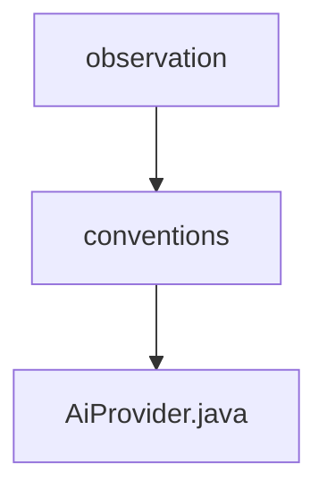

# 基础信息

|      |      |
|------|------|
| 名称 | observation |
| 编码语言 | .java |
| 代码路径 | spring-ai-alibaba/spring-ai-alibaba-core/src/main/java/com/alibaba/cloud/ai/dashscope/observation |
| 包名 | spring-ai-alibaba.spring-ai-alibaba-core.src.main.java.com.alibaba.cloud.ai.dashscope.observation |
| 概述说明 | 信息为空，无法生成概要描述。 |

# 说明

给定的内容为空，无法进行总结描述。请提供具体内容以便生成全面详尽的描述。

### 包内部结构视图

该流程图展示了路径的层级关系，从`observation`文件夹开始，进入`conventions`子文件夹，最终指向`AiProvider.java`文件。这种结构清晰地表示了文件在项目中的组织方式，便于理解和管理。

# 文件列表 File List

| 名称   | 类型  | 说明 |
|-------|------|-------------|
| [conventions](conventions/_module.md) | package | 信息为空，无法生成概要描述。 |

